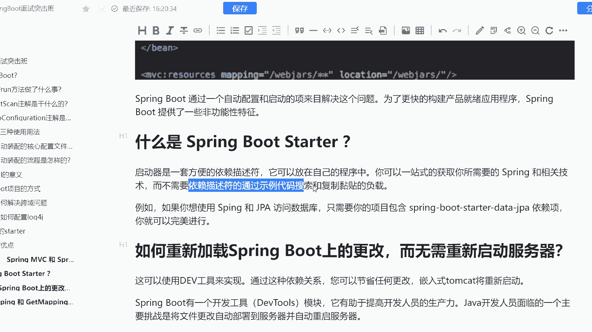
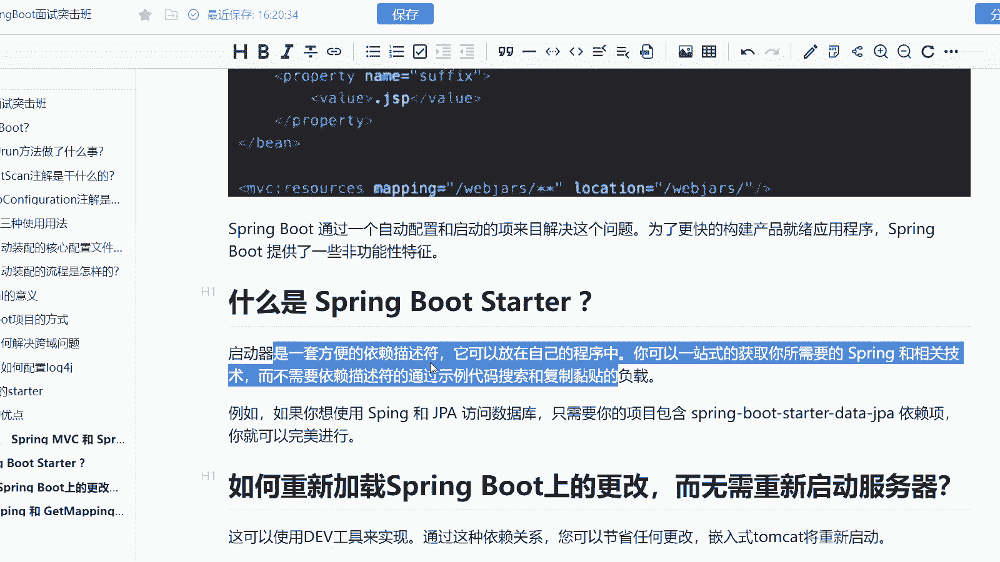
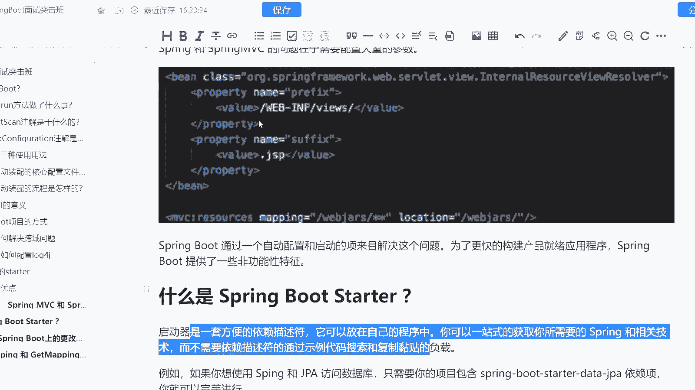
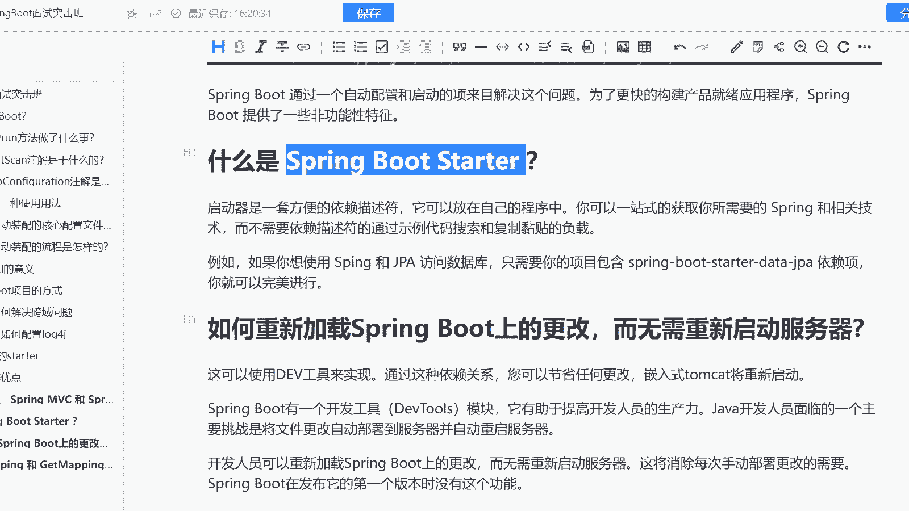

# 系列 6：P193：什么是 Spring Boot Starter ？ - 马士兵学堂 - BV1RY4y1Q7DL

题呢是来自于阿里9月份的一道面试题啊，说是什么呢？什么是spring boot的一个star解释一下这道面试题主要考察的是你对于spring boot的一个基础理解啊。

而这道面试题在面试中高级java开发工程师的时候会问到啊，对应的薪资是15到25K这样的一个区间。那么首先我们可以来看一下啊，spring boot start，它是什么呢？

其实它是我们spring boot的一个启动器啊。而启动器，它的定义是一套方便依赖的一套方便的依赖描述服务。O也就是说其实它的本质是一个依赖描述服。而且它可以放在自己的程序中。

你可以一站式的获取你所需要的一个spring和相关的一些技术。而不需要依赖描述服通过视例代码的搜索以及复制粘贴的负载。啥意思呢？就是说我可以通过引入这个依赖的描述服，或者说呃说简单一点。

我可以通过加这个依赖，去一站式的搞定你引入一个组件所需要的所有东西，而不需要比如说像以前一样加配置加注解这样的一个方式。所以呢我现在只需要去引入这样的一个依赖就O了。

比如啊你想使用spGPA去访问数据库。那么这个时候你只需要项目包含spring boot杠star杠d杠GPA这样的一个依赖，你就可以完美的进行，它所有的工作都会在这个依赖项自动装配进行一个注入。

知道吧？所以这就是为什么需要sring boot start的一个原因。

O。😊。

