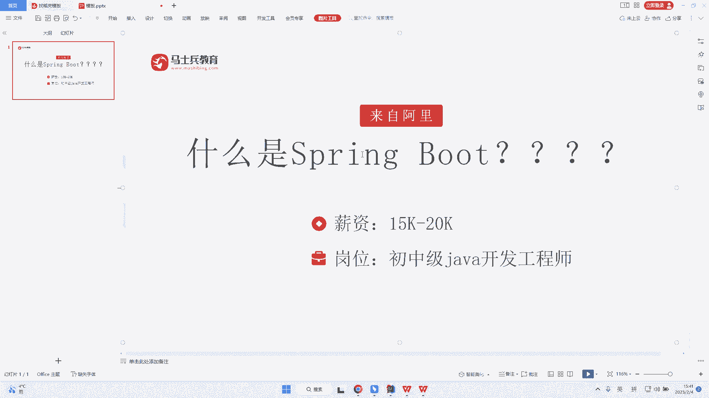
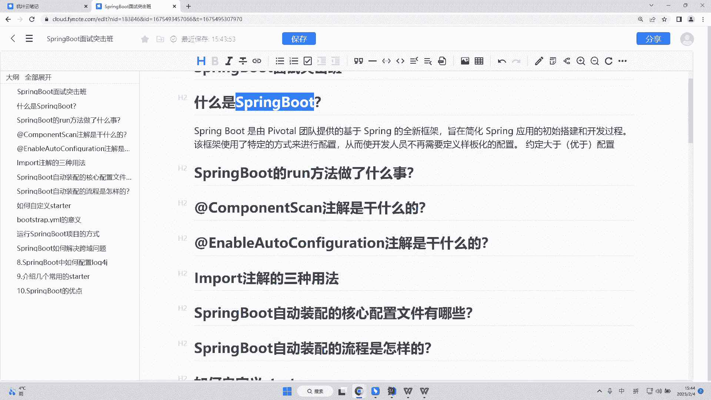

# 系列 6：P194：什么是SpringBoot - 马士兵学堂 - BV1RY4y1Q7DL

来自于阿里巴巴的一道就是说年底啊，就是阿里巴巴招聘的一道面试题，也说是就是咱们的一个spring boot到底是什么。其实呢这道题呢是针对于咱们应届生的一道题目啊。

这道题主要考察的是你对于spring boot的一个理解，包括甚至如果可以的话，你能聊一聊spring cloud，这是最好的。呃，这道题呢在面试初中级java开发工程师的时候会面到啊。

当然呃对于高级的这样的一个java工程师，它肯定开头不是说什么是spring boot。

它是会让你去聊一聊你对于spring boot的一个理解。包括spring boot什么是它的一个自动装配呀，包括spring boot它的一个就是说特性也不能聊出来啊。

那么接下来呢我们就来看一下这道面试题它的一个解析。那么我们来看一下spring boot它是有我们的一个spring的一个开发团队提供的一个基于spring的一个全新框架。那么意味着什么呢？

意味着我们spring的一些特性。比如说IOCIOP它都是继承下来的。而它的一个目的是为了干嘛呢？它是为了去简化我们spring应用的一个初始搭建以及开发的过程。并且这个框架使用了特定的方式来进行配置。

什么叫特定的方式呢？这个就是我们spring的一个核心啊，就是自动装配。并且由于咱们原先用MVC的时候，实际上我们会用到各种各样的一个配置吧，对吧？比较繁琐，包括我们依赖的一个。

构建包括我们依赖的一个拉取，对吧？而此时我们的一个spring boot，他的开发团队就想到了一个问题，我们为什么不把就是我们spring当中繁琐的配置预先去在框架当中去进行加载呢。

这个也是我们spring boot非常重要的一个特性，叫做约定大于配置，或者说叫做约定优于配置一个意思啊，一个意思。所以这道题你只要聊到约定大于配置或者约定优于配置，基本上就OK了。

就相当于本来你要干的事情，既然每个人他都要这样干，那我干脆比如说我去先帮你把这样的一个工作去做了，让你的开发人员不不需要再去定义什么样板化的这样的一个配置。比如说d source的一个加入啊等等等等。

这样的一些东西，对吧？我先帮你把事情做了，这就是我们spring boot，他所去干的这样的一件事情啊，OK那么这是我们的第一道题，什么是spring boot。

