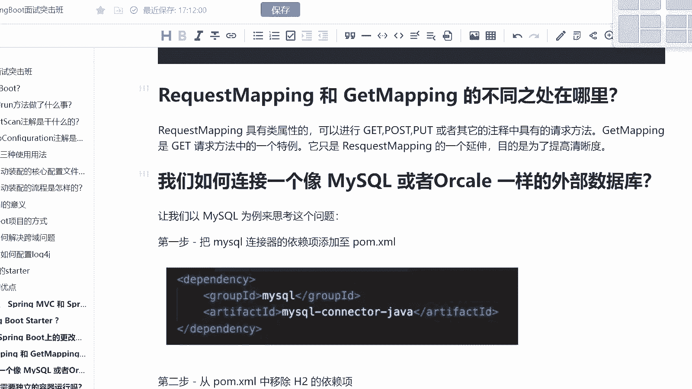
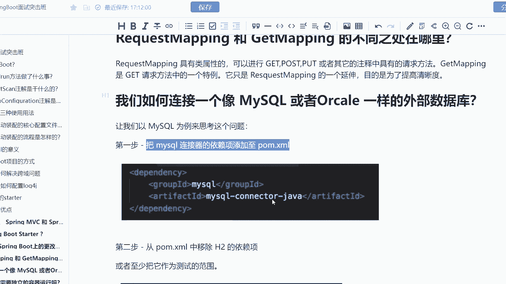
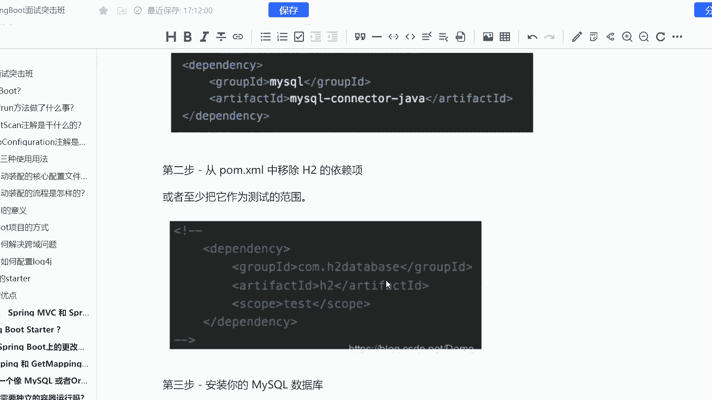
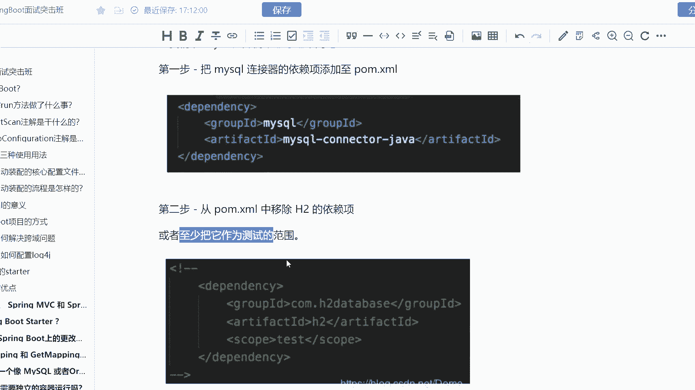
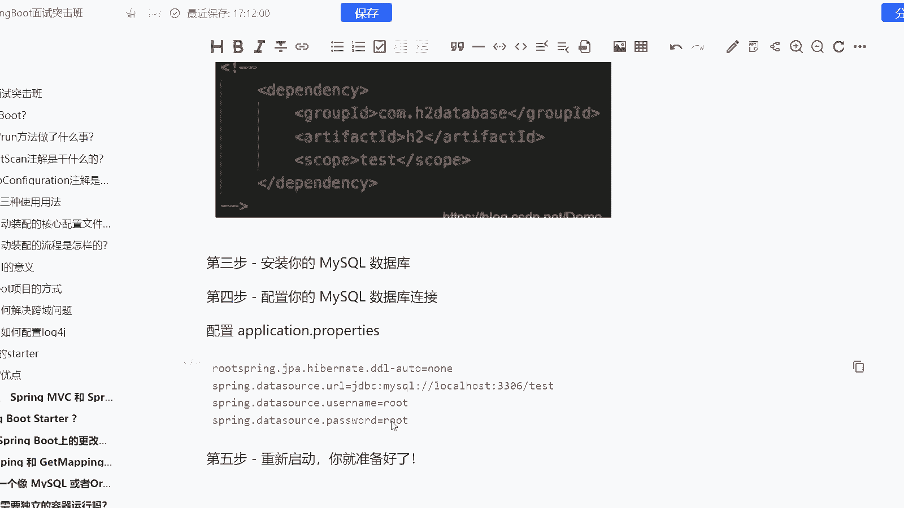
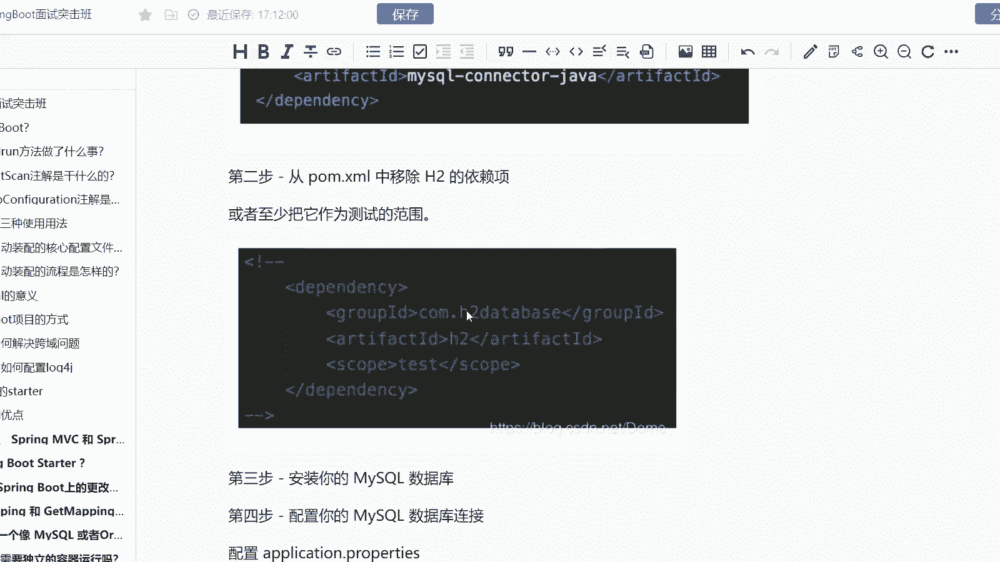
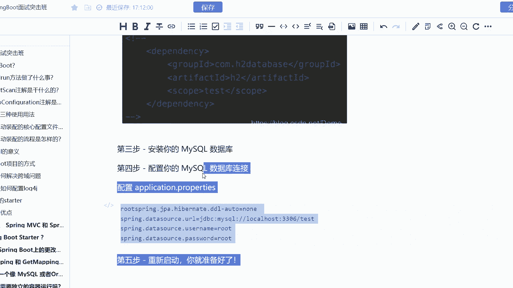
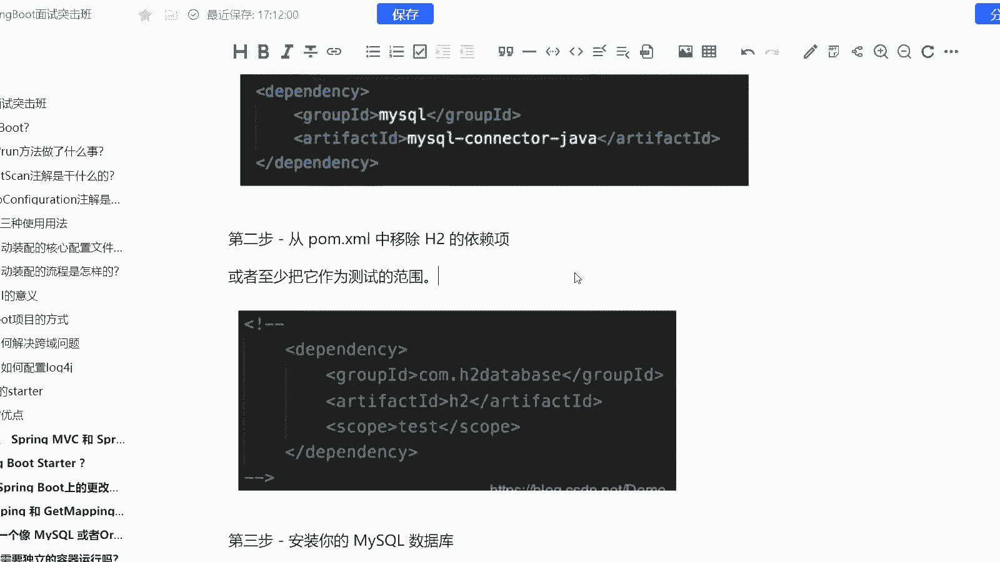
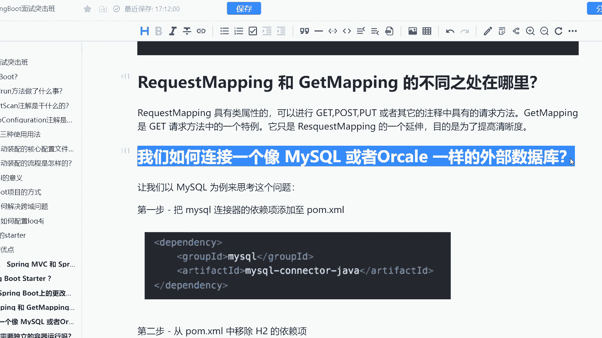

# 系列 6：P195：我们如何连接一个像 MySQL 或者Orcale 一样的外部数据库？ - 马士兵学堂 - BV1RY4y1Q7DL

那是来自于阿里的一道比较简单的校招题啊。他说呃我们如何连接一个像mysical或者说orac一样的外部数据库呢？OK而这道题考察的是什么？考察的是你的一个应用的一个操作能力啊。

那么实际上呢我们去连接一个外部的数据库一定会有相关的依赖配置。然后呢，我去使用它的时候，一定会有相关的注解。所有的第三方组件都是这三个步骤啊，但是我们去聊的时候呢，肯定他不能这样去聊啊。

而这这道题目是对应的终极java开发工程师，薪资范围是15到20K的这样的一个范畴啊。首先我们以myscle为例来考虑这个问题啊，第一步我要干嘛？我要去加依赖，对吧？

所以我们要把mycyclcle连接器的依赖添加这个文件，比如说mycle杠connection杠java，对吧？而此时其实我们是要去干嘛移除掉HQ的一个依赖下，或者说把它作为测试的范围的。

比如说我去加一个test，为什么要移除它呢？

因为如果我连上了HQ的话，那么我HQ跟q肯定就冲突了，对吧？第三步安装你的q的数据库，第四步配置你q数据库的连接，而配置的话。

实际上就是通过我们的plication点pro这样的一个配置文件去进行配置啊。比如说我们当前将我们的DL自动的DL设置为然后呢，它的地址是怎样的3306杠t账号密码。此时其实加了依赖加了配置。

如果你只仅仅只是想连接上数据库到这里其实就差不多了，而使用的话，我们还要需要去使用到一些注解。然后呢比如说从数据库获取到一些数据所有的组件所有的中间件都是依赖配置注解这三步啊O。

所以呢这道题是我们的一个操作题。

