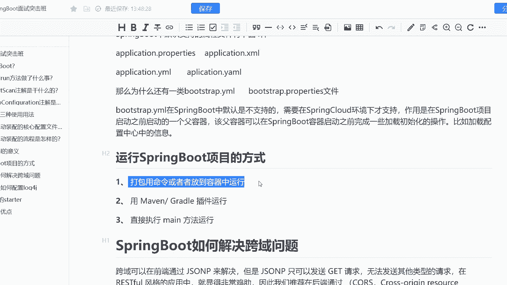
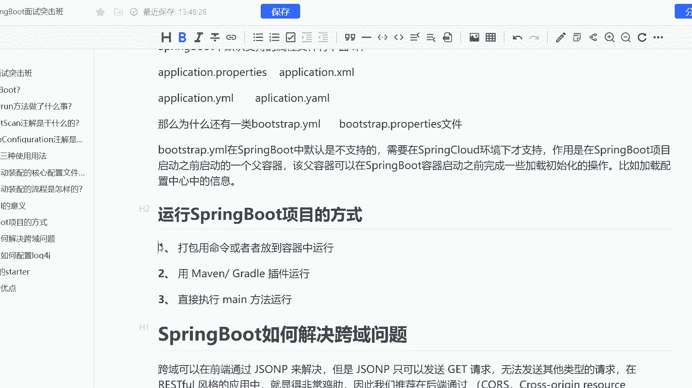
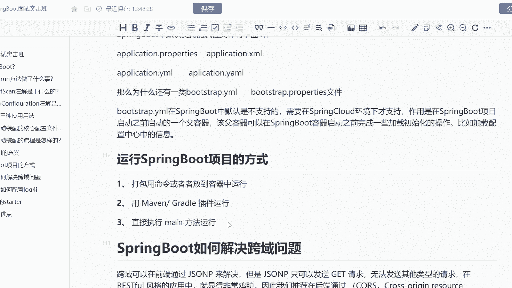
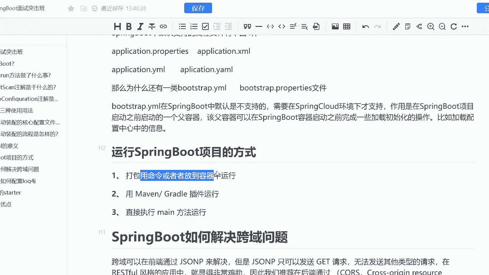
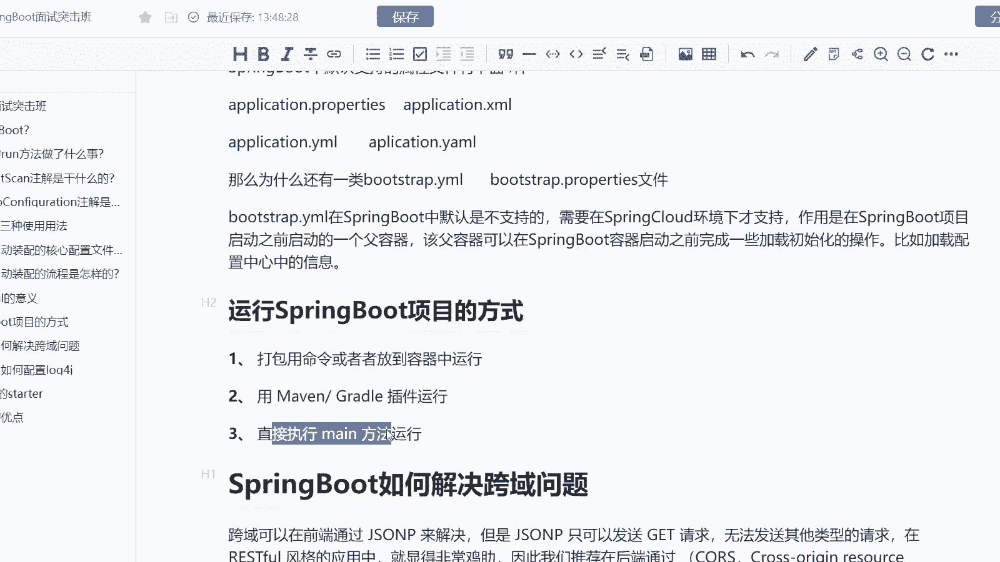
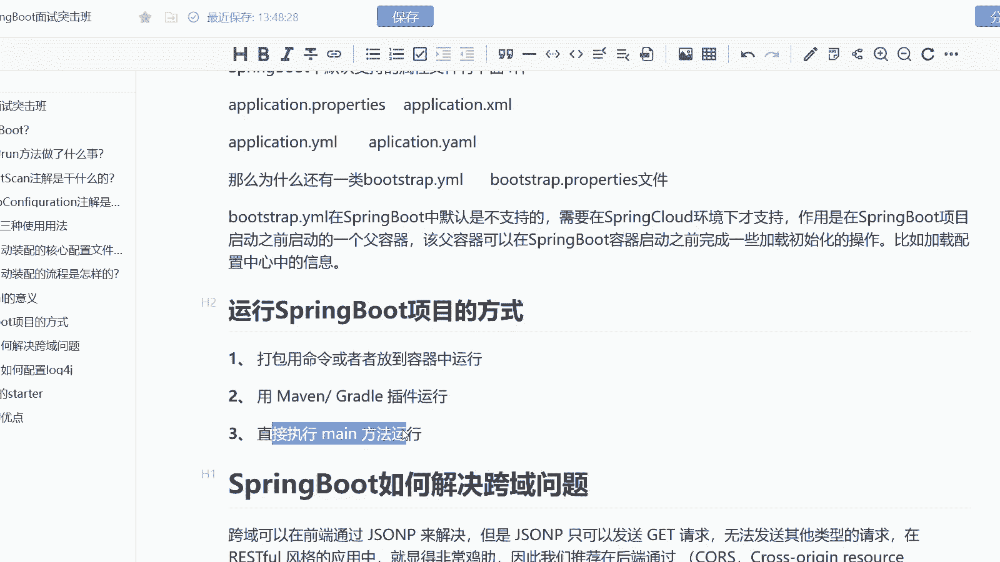

# 马士兵教育MCA架构师课程 - P196：运行SpringBoot项目的方式 - 马士兵学堂 - BV1RY4y1Q7DL

也是来自于阿里的一道11月份的一道面试题啊，说是运行spring boot项目的一个方式有哪些呢？而这道题主要考察的是各位对于spring boot的一个基础的一个问题啊。然后呢。

这道面试题在面试中高级java开发工程师的时候会问到啊，主要对应的薪资呢是15到25K之间。因为阿里其实社招啊，这这次也在P5左右的一个级别。

所以呢呃会强行的把一些就是说呃比较简单的问题放在中高级的一个工程师的一个面试题当中啊，当然。平时的时候我们也会去问到，而运行spring boot项目的几种方式呢。

首先第一个我们可以直接打包呃clean instore，然后呢用打包的命令，然后呢把它放到比如说类似于ca呀及bo啊 j这样的容器当中去运行。同时呢我们也可以用gra，类似于这样的一个构建的工具。

然后呢，通过这样的插件去进行一个当前的直接运行。同时呢我们还可以比如说直接通过它的起启动器，然后呢通过启动器的方法的run方法去进行IOC的一个初始化啊。

所以呢这三种方式都可以让我们正确的去运行spring boot的一个项目啊，大家只要把一23聊出来，基本上跟面试官去聊出来这样的一个方式。然后呢大概去说一下每种方式大概是怎么样的一个流程。

比如说打包的一个命令有哪些，比如说怎么去用me或者gra的插件去运行。比如说me方法它去运行。

然后呢，需要的就是IOC的一个初始化让方法的IOC初始化，把这个聊出来，基本上就不会扣分啊OK。

