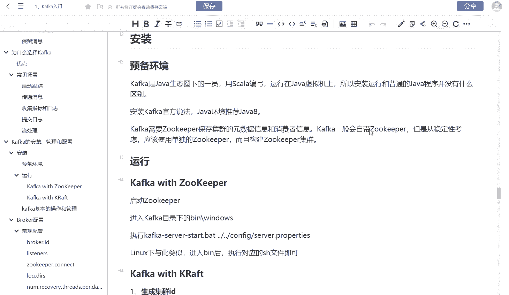
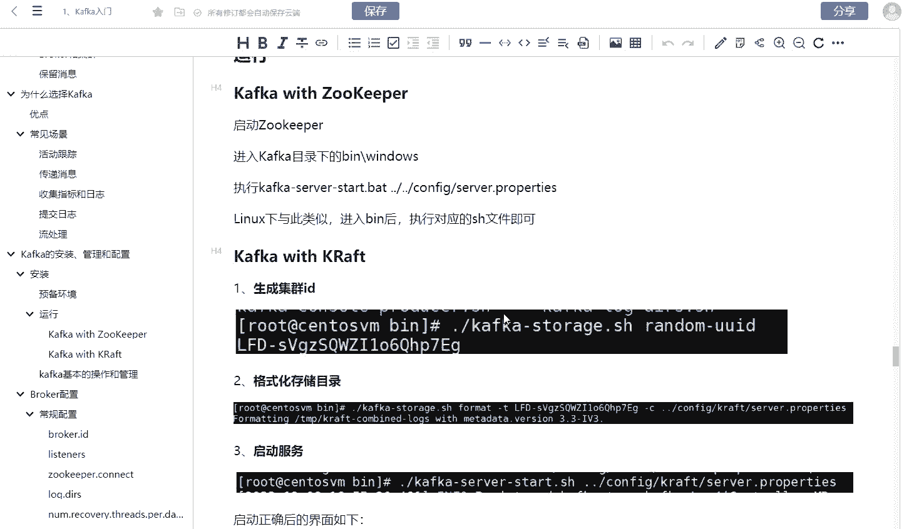
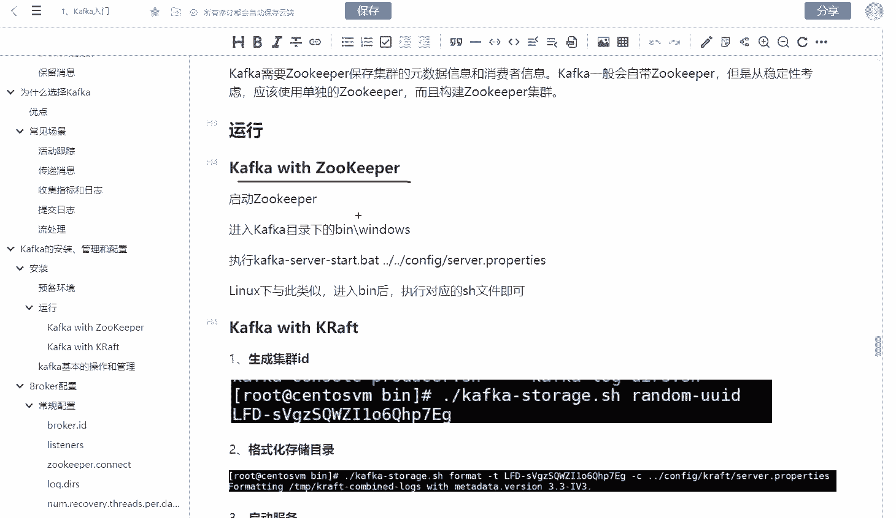
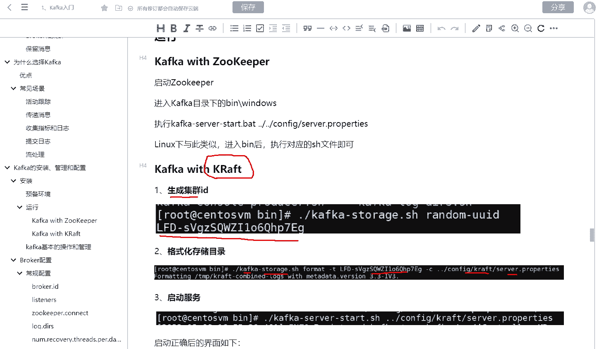
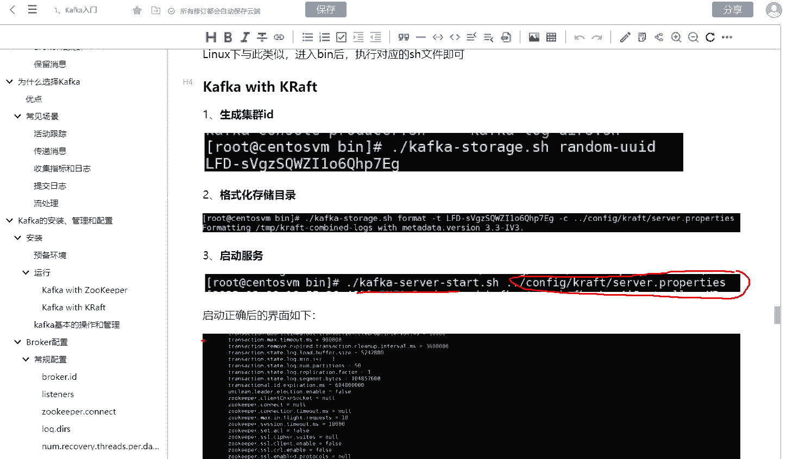
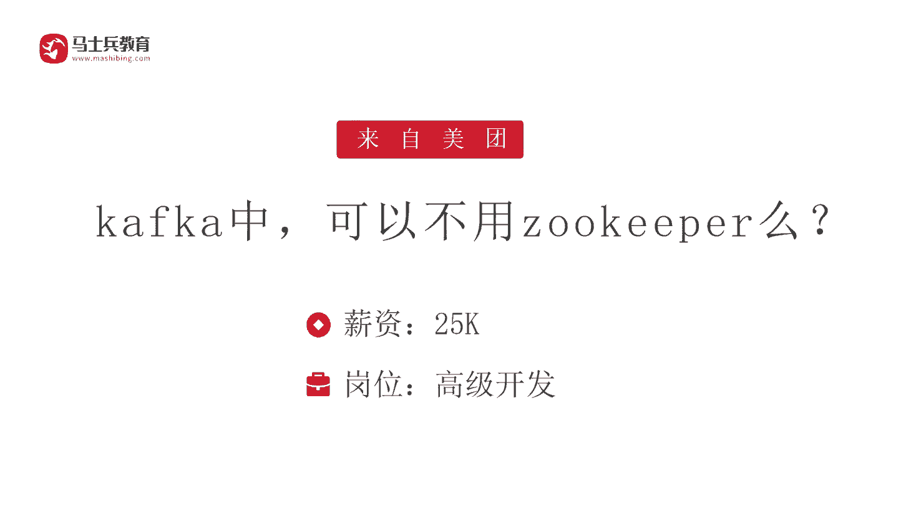

# 系列 6：P197：kafka中，可以不用zookeeper么？ - 马士兵学堂 - BV1RY4y1Q7DL

我们再来看一下来自美团的一道面试题，在卡夫卡中可以不使用做ke吗？知道面试题了啊还是比较简单，所以它对应的薪资是25K，然后呢，依然是高级开发。我们知道在卡普卡里面，它的早期版本是必须强依赖于做ke的。

所以回答这个问题的话呢，你可以站在不同的版本。😊，啊，你可以说老的版本它是必须要使用做ke的。然后新的版本呢，这个地方它有一个分界线啊，就是版本在2。8还是2。8以下，还是2。8以上。😊。

如果你的版本它是大于等于2。8，就是比如说是三或者3点几的版本，它是可以不使用做keeper了。啊，这个地方呢请注意它可以不使用，不意味着完全费气。所以我们可以看到你在去安装这种卡不卡的时候。😊。

作为卡夫卡的话呢，它的安装，你像新版本里面，我们把它下下来，对不对？一般情况下面呢，你的GDK环境当然是java吧卡夫卡里面它会自带一个 keep。如果说你要处于稳定性考虑。

你也可以去自己去使用一个 keep啊。另外的话呢你也可以建立一个 keep的集群。那么在卡夫卡里面它有两种方式啊。第一种就是卡夫卡 keep。你可以是先启动一个 keep。

然后的话呢再启动我们的这个卡夫卡。第二种方式的话呢，你可以通过它的一个组件叫做 k的这样一个组件。😊。

就是首先这个组件它是怎么玩的呢？就是首先你会去因为是一个分布式就是是个分布式协议啊。所以的话它需要去生成一个集群I里面有一个啊叫做的个执行文件。

然后呢你可以生成一个样的集群生成完之后的话呢你要去格式化存储。就是这个的里面呢，本质上面就是把这些东西保存在我们的本机的目录上面啊，所以呢这个地方也通过然杠 storage这个命令。

然后呢把对应的I然后配置到你的这个然后除此之外的话，我们就可以按照我们的方式进行启动了。你只要去指定对应的生成的个配置文件。那么它在这个地方启动的时候，它就不依赖于了。O所以大家可以看到回答这道面试题。

它的核心是什么？你必须要把你的技术更新。😊。

很多时候很多小伙伴可能以前用过卡不卡，他就觉得卡不卡一定要使用做ke。但是你会发现其实新版本里面它已经完全可以去抛弃做ke了啊，他慢慢的去做ke化。以这道面试题呢，他其实考核的是你的技术的更新啊。

你可能在简历里面经常会写着我是一个技术控，我喜欢研究技术啊，你用卡不卡，那这个时候卡不卡很早之前他就已经废弃了做ke，对不对？这个技术如果你不了解的话，那么你在面试的时候啊。

你自己写的这一些什么技术控啊，我喜欢研究技术啊，这些东西你就不成立了啊，因为你不关心技术，你可能用的技术还是三年前几年前的这个版本，对不对？然后一直没有更新，也没有去关注过这个技术它的一个发展。😊。

所以我们去面试的时候啊，除了这个技术的本身之外，我也希望大家可以去关注一下一些技术的更新。比如说你关心spring的话，可以经常看一下spring官网，比如说spring里面呢最近出了6。

然后spring boot出了3，然后这些新版本它的特性是什么，对不对？然后这个新版本在未来它的定位是什么？包括卡夫卡，它也出了比较新的版本，这个新版本它的定位是什么？然后这个新版本。😊。

对于我们未来的这个运用，或者是我们的应用场景有什么帮助啊，你要站在多个维度去分析这个问题。

