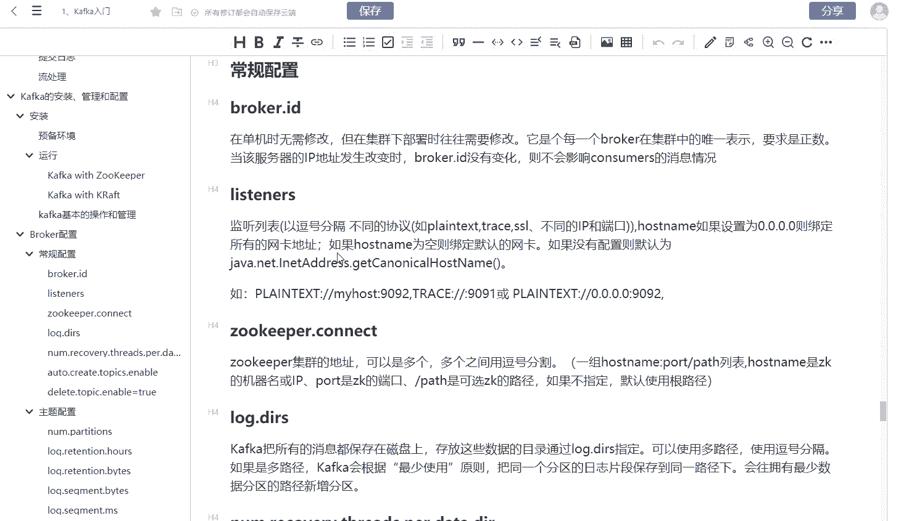
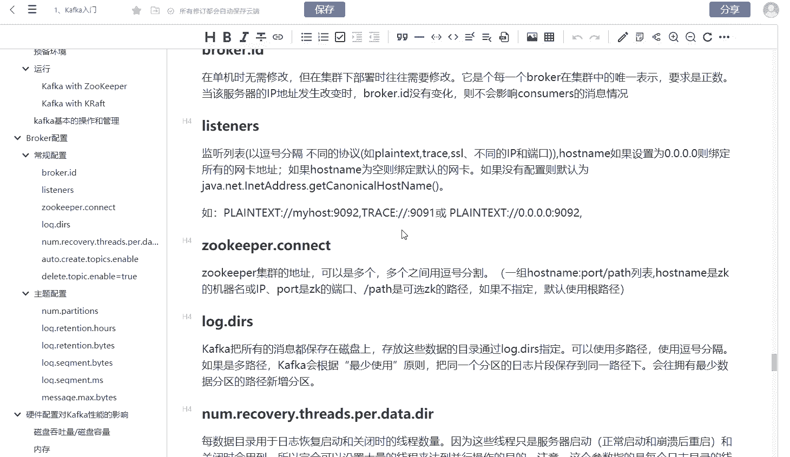

# 马士兵教育MCA架构师课程 - P198：说一说Kafka你熟悉的参数？ - 马士兵学堂 - BV1RY4y1Q7DL

我们再来看一下这样的一道面试题，说一说卡夫卡你熟悉的参数。这道面试题的话呢，它是考核的一个知识面。就是如果你使用卡夫卡的话，你应该要知道它一些比较常见的参数。所以这道面试题呢它是来自于阿里巴巴啊。

他希望考核你对卡夫卡的一个熟悉程度。你在工作当中你用到卡夫卡。但是的话呢，如果你不熟悉参数，那说明啊你可能没有研究的那么全面啊，所以这道面试题的话呢，它考核的是一个知识的广度。

我们来看一下卡夫卡有那些常见的参数呢？😊。

大家可以看一下，其实卡夫卡的参数的话呢，从整体上面来说，我们要分成几个部分啊，主要的话呢是放到我们的bro，就是我们的这个主机上面的配置啊。一般情况下面这个配置文件的话，会放到卡夫卡的fi目录下面啊。

主要是serv点这样的一个文件啊。在这个文件里面呢，比如说像bro ID这个是我们表示在集群下面的唯一表示啊，如果是单机的话呢，就没有问题。如果是集群的话，那么每一台机器它一个单独的bro ID。

并且要求是正数。😊。

所以的话呢这个地方它配置的一个原因你也可以讲清楚。因为你的服务器IP有可能会发生改变。但如果bro ID没有改变的话呢，它就不会影响我们的整个的consumer这个消费的一个情况。然后第二个的话。

listers就是我们的这一个监听。😊，啊，就是你的起的监听地址啊，这种情况下面也要注意，如果你写的是0。0。0。0，这个一般情况下面就绑定所有的网卡地址。因为一台服务器它可能有不同的网卡。

不同的IP所以4个0默认是绑定所有，然后你也可以填上你的IP啊，填上你的IP的话呢，你可能是绑定某一个具体的IPIP地址。然后像做 keep点connect这个东西呢是我们去连做ke的一个路径啊。

还有包括ng点我们的DRDRDI这个东西的话就是我们的消息保存的路径。啊，这个路径的话呢，一般情况下面啊，你也可以去配多路径，你也可以配置什么用逗号来分割。

啊，所以你要注意这个参数里面它的一些含义啊，其实还比较重要的一点就是这个al greater topics enable。😊。

就是是不是允许你自动创建主题？就是我们进行生产或者进行消费的时候，有可能这个主题不存在，对不对？那么如果这个enable这个参数它是te的话，它就会自动创建啊，它的默认值它就是te。😊，OK啊。

大家可以看到，其实参数的话呢，对于我们平时去玩rock卡夫卡的话呢，它影响非常大啊，还有包括主题的配置啊，number partitions就是我们的新建主题的分区数。😊。

注意这个分区一般来说它只能增加，它不能减少。

OK还有包括就是日志的保存日期啊，nuger rotation health，还有包括nugger rotation battles。

啊，分区的这个文件的限制啊，还有包括每个卷sment的bes这种限制。

OK还有包括最大的一个消息的besmessage点max这些参数啊。所以大家可以看到，你要去说一说卡夫卡当中常见的配置参数的话，如果默认情况下面你只能说出一两个，那说明你对卡夫卡的话不太熟悉。😊，啊。

默认情况下面，如果你能够说出5个甚至10个以上，那说明你在工作当中啊，非常的去注重这些参数，或者非常注重这些配置。因为卡夫卡它作为一款消息中间键的话，其实里面你要熟悉它，首先必须要去熟悉它的一些参数。

因为你在这种工作当中，你去生产消息，或者你去消费消息。啊，这个里面呢你都会去用到卡夫卡一些非常常用的参数。这些参数的话呢，对我们的这一个生产来说，对于我们的消费来说，它是有很大影响的。

比如我们知道啊你的这一个自动创建主题，如果这个参数没有配的话，那有可能这个主题不存在，我生产往里面发的时候，它就会报报错啊，如果说你把它设成for的话，它就不会自动创建。所以有些生产环境啊。

它出于权限的考虑，它会把这个al greater topics这个东西配成for。😊。

啊，就是你必须要。😡，通过。控制后台或者通过命令的方式，就是那种直接连接卡夫卡的命令的方式才能去创建啊。你不能通过这个程序的方式去创建一个主题啊，当然通过这种程序创建主题有它的好处。

就是我可以通过应用程序啊，然后它的一个业务逻辑来去创建不同的主题，然后满足不同的业务需求。所以的话呢，作为这个消息中间键，卡夫卡它其实是是比较吃配置的。也就是说你在工作当中。

你必须要去熟悉它的很多配置文件，你在工作的生产和消费当中，你才能把卡夫卡玩的很赚。所以呢这道题目它首先考核的是你一个知识的广度。😊。

就是你对命令到底熟悉哪几个。另外的话呢，这个面试题也考核知识的一个深度。

就是你在玩各种配置的时候，可能不同的命令里面，它对于集群，它对于这种集群的部署，它对于我们多网卡的绑定，还有包括它对于我们平时生产和消费，它都是有影响的。

所以的话呢这道面试题一般来说它是作为一个综合的面试题出现在你的面试当中。OK。

