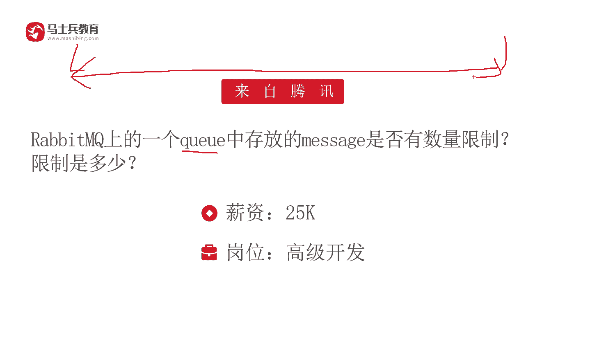
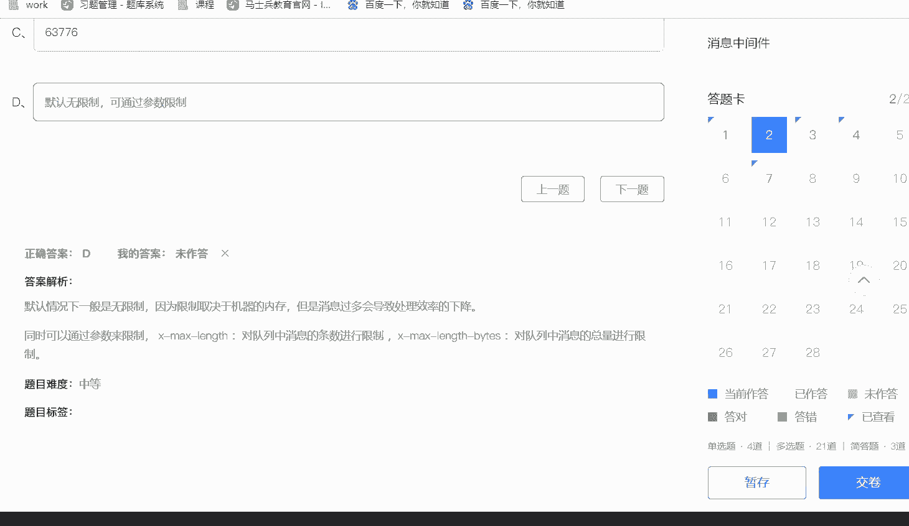

# 马士兵教育MCA架构师课程 - P199：RabbitMQ上的一个queue中存放的message是否有数量限制？ - 马士兵学堂 - BV1RY4y1Q7DL

我们再来看一下这一道rapQ的面试题，它来自于腾讯啊，对应的薪资是25K岗位高级开发rappingQ当中的Q，它存放的message是否有数量的限制，这个限制是多少呢？首先大家应该要知道。

其实在rappingQ当中，这个Q对应的就是存放message的一个队列。一般情况下面，我们可以这么去认为，在这个Q当中，它应该是一个无限场。就是作为我们rappingQ当中，你存放的这个Q啊。

理论上讲来说它应该是没有限制的啊。当然回答这道问题的话呢，你不能这么绝对啊，我们可以看到。😊。

嗯，你怎么去回答呢，都不是太合适啊。比如说你回答没有限制，好像呢也是不行的啊，但是默认情况下面它是没有限制的。它可以通过一个参数来进行限制啊，它也不是我们经常所说的什么1024啊。

4028还有一些其他的数数字，我们可以看到在这道问题当中，默认情况它是无限制。就是你rapq当中的内存有多大。那这个Q它就可以多长。但是呢我们知道如果你的消息过多的话。

它肯定会导致我们rapq处理这个消息的效率它会下降。因为这个对立过长的话，那么我们知道第一个内存占用的多。第二个的话呢，你要把这个数据从这个内存里面拿出来啊，相对来说呢，它效率要低很多。

所以我们可以通过对应的参数来限制，这个参数叫做X杠m杠啊，这样一个参数。这个参数的话呢，请注意这个参数它是限制消息的调。😊。

数啊，比如说这个设置成100万，那么队列当中的消息就不能超过100万。另外的话呢，还有一个限制参数叫做X杠m杠be，这个呢是限制我们消息的总量。比如说我们的消息总量限制成200兆。那么在队列里面啊。

单独的一个Q里面它就不能超过200兆。所以我们可以通过两个参数。第一个参数是消息的条数。第二个参数是消息的总容量啊，两个方面，对rapbinQ当中的Q进行限制。😊，所以的话当面试官问这样的问题的话。

他其实就是有一定的欺骗性。就是他问你的限制是多少。很多人呢可能是啊去绞尽脑汁想一想，哎，这个rapQ当中的这个mes是不是限制是多少呢？随便猜个数啊，如果这个数量。😊。

就是你随便说一个的话，那么这个答案明显就是错误的。应该说默认情况下面它是没有限制。但是我们可以通过两个参数来控制一下rapq当中这个Q的数量和Q的容量。通过这样的方式呢，我们可以去稍加限制。😊。

所以呢这就是这道面试题，他回答的一个重点和核心。

