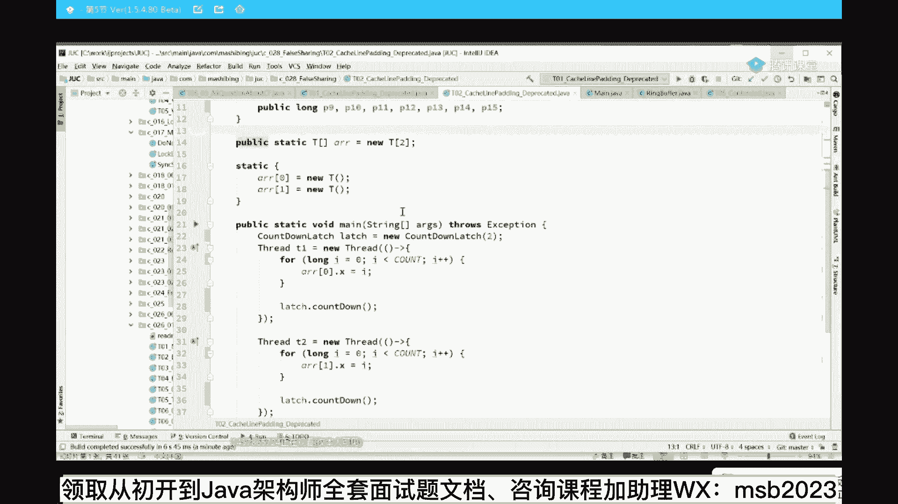
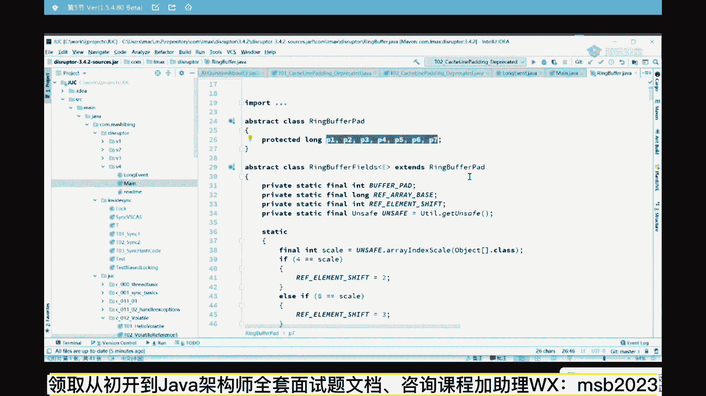
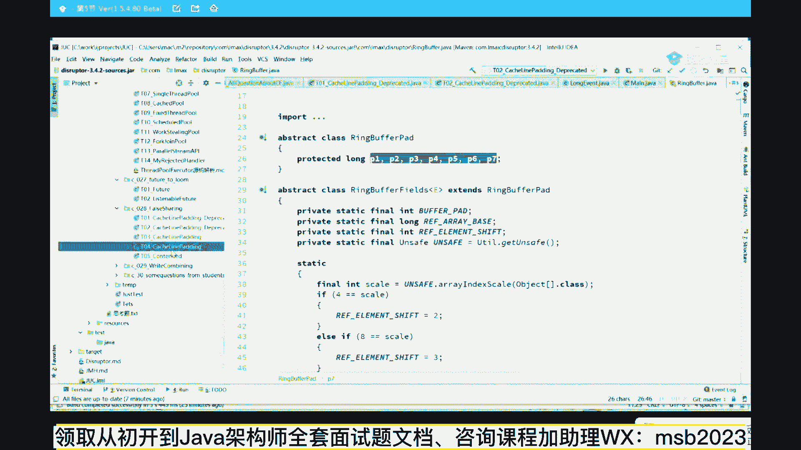

# 马士兵教育MCA架构师课程 - P20：小程序演示 - 马士兵学堂 - BV1RY4y1Q7DL

两秒九，这是毫秒，两秒九，大概三秒钟左右吧，有同学说老师你想干嘛。

这个这个刚才这小程序能跟得上的，来给给老师扣个一，没问题吧，小程序比较简单啊，简单解释了一下好，同样的程序我做了一个小小的修改啊。

注意看啊，这个小修改呢干了这么一件事，还是那个x，只不过呢我在前面怼了一堆的p一到p7 ，long类型的，我在后面怼了一堆的p9 到p 15 long类型的，这些值都没用，就是用来占空间的。

其他的代码都没变，依然是1亿次的循环。

依然是第一个线程就改第一个x，第二个线程就改第二个x跑一下，一秒三诶，刚才是多少，两秒九，现在一秒三，what what's up，发生了什么，好，同学们拿大腿给我好好想一下问题到底出在哪。

为什么会有这么明显的效率的不同，为什么，问题出在这儿，同学们，你们想想第一种模型的情况下，这个x一和这个x2 挨着发现没有，他们挨着注意，这是long类型，long类型是八个字节。

一个long类型是八字节对吧，这也是八字节，我们还记得呢一个缓存行是64字节，所以这时候极有可能发生一种情况，这哥儿俩位于同一行里头，在同一个块里头，很有可能这个块第一个线程嘛。

被缓存到了第一颗cpu里，这个块与此同时又被缓存到了第二个cpu里，那么由于我第一个线程玩了命的改x1 ，我改完x一是不是得通知你另外一颗线程啊，说我这个行失效了，你是不是得存内存里头重新读啊。

大哥我通知你一遍，你得给我重新读一遍，我通知你一遍，你给我重新读一遍，这哥俩位于同一行，互相之间修改之后会造成效率上的降低，居然而第二种编程方式，第二种编程方式是这样的，注意看这是我们的x1 。

可是很不幸的是，诶前面这个x前面怼了七个long，我刚才说一个long类已经八个字节，七个long一共是56个字节，他在后面又怼了七个浪，又是56个字节，他自己占多少八字减。

所以这哥们无论跟前面组合跟后面组合，跟中间组合，无论如何，都不可能和其他的另外一个x2 位于同一行，那既然不位于同一行的话，你们拿大腿想一下，作为第一个cpu来说，我只改x1 。

反正不可能有其他的那个行，有其他那个cpu跟我这个x一做共享，那我还用通知你吗，你改你的x2 ，你跟我有半毛钱关系吗，就在缓存里玩命改，改完之后刷回内存就可以了，而第一个呢就是玩命给x一刷分。

你用我不用通知另外一行说失效了，所以这个效率非常的高，o，好能get到这点，同学老师扣一，有同学可能会说，老师真的有人这么来编程吗。

真的有有一个著名的框架，这个框架呢叫this raptor闪电，我说有没有没有人听说这框架，如果你面试的时候能把这个东西给说出来，那面试官肯定是高看一眼，this roger闪电好，闪电的意思是什么。

就是那个最单机最快的mq，应该说它的核心呢是一个你像别人家的缓存呃，都是一个呃，不管你是链表还是数组，一个一个头指针，一个尾指针来做你的缓存，但是mq吗存消息吗，但是这哥们儿是一个环形列表，环形队列。

环形队列它只有一个指针，这个指针来回的转，你知道吧，转到了头之后，转到尾之后就从头开始来回转，它只有一个指针，而且多线程访问的时候，他对这个指针做了一个优化。

做了什么优化呢，看一眼，呃disruption，这是他的那个环形环形缓存，叫rain buffer，rain的意思是环buffer是缓存环形缓存，你们看他的代码。

点进去之后，你会发现一个奇奇怪的代码，这哥们儿后面怼了p一到p7 ，看到了七个long，半毛钱没用，就怼在这用的这个叫缓存行的对齐，好来看这里有同学说他只在后面对了，前面有没有怼啊。

你们看你们看这个rain buffer他是从谁继承的，从呃rain buffer fields继承，我们看他的父亲，remember fields又是从rebuffer pad继承。

而remember pad本身没有别的七个类型的long，所以他前面对了七个，后面得了七个缓存行的对齐，还真有人这么写程序，因为作为disruption来说，他追求的就是效率上的完美提升，追求极致效率。

这就是现在有人在招招聘成员的时候，经常会说对代码有洁癖，什么叫代码洁癖，ok这个算一种对cpu的性能要压榨到极致，什么叫压榨到极致好，这是一种，当然如果你读过jdk，1。7的源码，jdk的作者道个理。

这大哥就在1。7的concurrent hashmap里面，就用这种写法了，就是强迫这个值不和其他值位于同一行，橘啊，橘猫这样大橘这样也会存在浪费吧。

我告诉你局，这个我是我这事得报了你啊，报了你这个局啊，开个玩笑，那个，空间换时间，这是经常提高效率时候的使用的一种方式啊，经常经常经常使用的用空间换时间，好多时候那个面试题。

算法题里头非常多的这种应用的形式啊，你要想到这一点，不存在一种说非常完美能解决问题，而且也不多多消耗资源的，不存在没有，如果那样的话，就有银弹了，不可能好了，看这里，当然jdk一点八之后呢。

其实又增加了一个一个。

这个其实讲起来就没啥意思了，因为jdk一点九又把它给删了。

就增加了这么一个注解，看看啊，啊。

那么jdk一点八呢增加了一个注解，这个注解呢大家理解有这么一个东西都可以诶。

我是放在哪儿了。

fty sharing，这个注解呢叫contented啊，就是这个注解，这注解呢只有1。8能用，你过了这版本还不给你用了，呃，这个注解呢就是我绝绝对的，让我下面这两个值问不是位于同一行。

那这个呢也能明显的体现出来他们的差距，但我建议大家呢也不要不要不要用，这个没啥意思，给大家讲一下这个注解吧，简单说一下啊。

呃一般来说除了面试，没有人会问这玩意儿还是同一个程序啊，大家注意看，我依然是这个t里边有个x，然后一个线程不断的改x1 ，另外一个线程不断的改x2 ，现在呢我跑一下这小程序，两秒一。

假如我要把这个注解打开a，同时呢你还得开一个参数，必须打开这个参数叫restrict contained，这时候它的效率呢就会明显提升一秒二，看到了吧，当然呃这种就是属于什么级别呢，奇技淫巧啊。

这属于就是俗称的奇技淫巧，这个这个这个这个东西，但不建议大家去呃，用在你真正的编程里头用这玩意儿，还是那句话啊，面试官你你你把它调起来打就可以了，你了解了之后呢，吊打面试官就行。

没有必要在你实际场景之中用这个好吧，这有点过了就好了，我讲到现在为止，我相信大家应该能理解。

这个缓存行的一致的概念了，到底什么意思了，呃还是那句话。

就是好多东西呢，你得通过编程来才能够深入透彻理解，就是我们学代码的得通过代码来展现好了，缓存好这个概念，我就讲到现在为止来可以继续的给老师扣个一，呃下面我们来聊另外一个非常重要的概念，这才是比较难的。

经常会被问到的问题就是volatile，还有一个作用还记得吗，volatile第一个作用叫保持线程可见性，第二个作用叫什么，第二个作用叫做禁止指令，重排序，下面我们来聊重排序这个概念，什么叫重排序。

重排序就是乱序执行。

