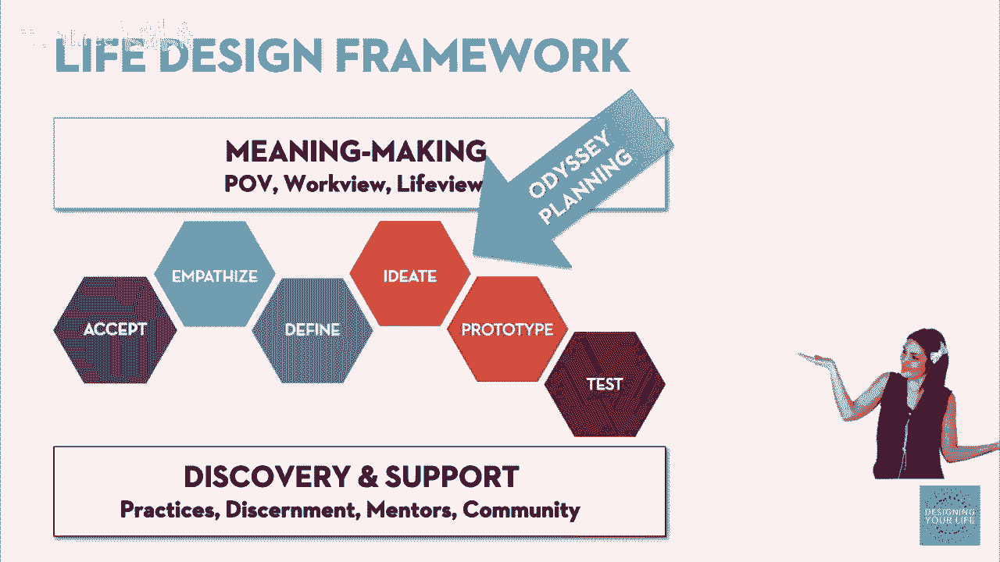
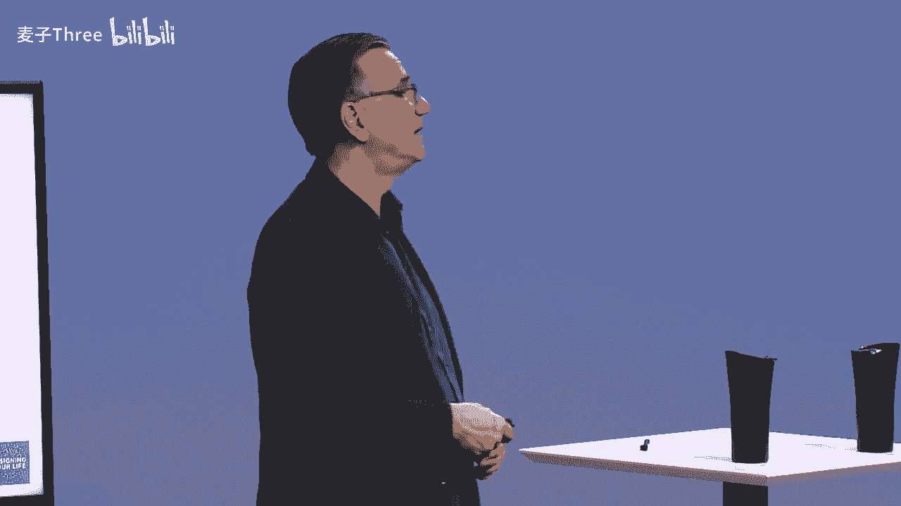
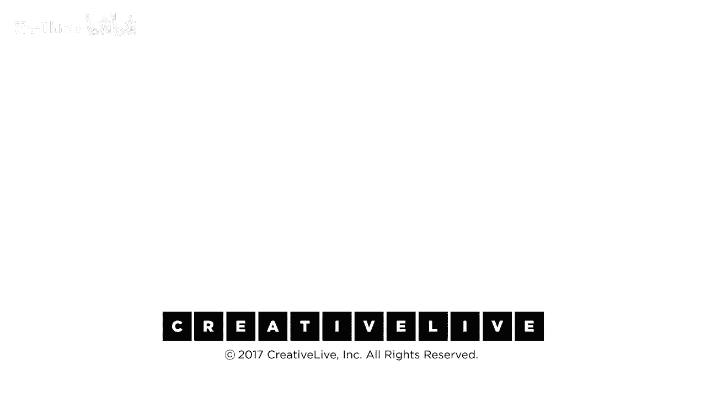

# P11：11-DesigningYourLifee-EvansBurnett-PrototypeIdeationAndExercise-HD - 麦子Three - BV1tzDVYHEGb

我们将从你已经完成的奥德赛计划中原型化一些东西，我记得我们讨论安妮的计划时，她对写书和重返学校感到好奇，这两件事她都很感兴趣，如果我尝试那件事会怎样，如果我尝试一小部分，如果我尝试一小部分。

那会是怎样的体验，我们将通过你的奥德赛计划来做这件事，我现在希望你们做的事情，只是开始思考如何对一些事情产生好奇，你的计划中可能有一两件事你想去原型化，我们将向你展示如何具体去做。

但是拿出你的计划并思考清单上可能有什么，你面前有十五年的想法，我们建议你只挑选一两个，不要超过三个，比如，是的，我真的很想了解更多，我对这个感到好奇，那是关键问题，我们将教你如何构建这个问题。

我们正处于构思和原型制作之间，我们希望提出我们想要原型化的一些东西，然后我们将教你如何生成大量想法，这样当你去原型化它们时，你有不止一个想法来达到你对某个事物的好奇。

或者关于你感兴趣的事物的一点体验或对话，很多人在学习头脑风暴时知道，或者他们只是随便做，他们只是头脑风暴，但这实际上不如它本可以更有用，我们已经做了很多关于如何有更好的想法的研究。

实际上我们将其分为大约四个步骤，如果你有一个坏的问题，你就不能产生一个好的想法，所以我们将稍微处理一下关于如何提出好问题的想法，什么是一个好的原型，你不想让它太宽，你不想让它太窄，它必须是开放式的。

必须有产生性答案的可能性，我们会帮助你设定那个问题，从你对计划感到好奇的事情中，然后非常重要的是你必须热身，我不知道你，但我如果刚从预算会议来，你们在争论谁用了，谁，复印机，没有写下复印的数量。

你知道复印的数量，他们做了疯狂的事情，你可能不在你最创造性的模式或情绪中，你真的需要从你大脑的分析和理性方面，转移到你的合成和打开创造性方面的大脑，所以我们做了很多热身练习，我们很快就会做其中一个。

然后构思判断推迟和产生大量想法的那个图表，Dave向你展示了那个小传感器，哦，不，这些想法不安全，不要拥有它们，我们需要消除那个传感器，我们将进行小组过程来构思你的原型想法，然后最好的事情是。

我发现很多团队在构思方面做得很好，但当来到选择想法的时候，他们选择安全的或容易的事情，或者他们知道的事情，这很少是，将教你最多的事情，你最好奇的事情，所以我们将选择一些不同的准则来选择想法。

如果你只做构思部分，并且不选择想法，你不使它们可行，这实际上没有多大用处，这就是我想要你跟随我们的过程的部分，有多少人参加过头脑风暴，参加过头脑风暴会议，被卷入头脑风暴，然后它以墙上贴满便签纸结束。

然后有人拿出他们的iPhone，拍下便签纸，然后在网站上发布，然后这就结束了，然后我们浪费了很多便签纸，我们不知道该做什么，那不是头脑风暴，那是便签浪费，好的，所以我们不这样做。

这就是为什么第四步如此关键，我的观点是手机是主意去死的地方，没有人再看那些照片的，因为从所有那些东西的照片中你无法得到任何信息，因为，因为，所以如何提出一个好问题，让我们假设。

让我们谈谈如何提出一个问题，当我们谈论安时，她正在考虑回学校，她可以提出许多不同的问题，嗯，现在的大学是什么样的，我二十年没上过大学了，你知道，二十年了，我还喜欢它吗，我仍然喜欢学习，我喜欢努力学习。

这对我有什么影响，这些都是很泛化的问题，研究生真的需要吗，你知道，这就是 sexting，不是原型，是一个问题，你可以自己去查，我的意思是，我想做什么，我想，我需要一个学位才能实现吗，是或不是，这不。

这不需要一个创新或生成过程，我真的应该这样做吗，关于结果的问题，看，前两个问题真的在乎过程，它是什么样子的，它会对我有什么影响，我真的应该这样做吗，这不是，这不是一个过程问题，这是一个结果问题。

你不能原型，我真的应该这样做吗，因为精确不是一个原型，这是一个基于你从其他原型中获得的经验做出的决定，嗯，年轻的学生真的很讨厌我，这又是，这不是你能在脑子里决定的事情，你必须通过在那里做来弄清楚。

所以我们的感觉是，我能以多少种方式原型化严肃学习的经验，是种生成性问题，这将导致，哦，我想到五种我可以做的事情来了解更多关于这个问题，我的好奇心会引导我围绕这个问题进行原型化，也有写书的想法。

他说你知道你可以做很多事情，你可以问其他写过书的人，那感觉怎么样，你可以，你可以去找作家谈话，了解他们是如何写作的，你可以去参加作家工作坊，短时间的，比如一个周末，嗯，我喜欢当作者的感觉，嗯。

这是一个你直到你做了才知道的问题，这不是可以模拟的，这不是可以原型化的，我真的应该再做一次吗，这不是可以原型化的，这总是被提出来，这是一个决定，为了提出一个好问题。

我们要确保你提出的问题是你可以得到一些数据的，我能不能搞定钱和这些东西，这是一个规划问题，这不是原型，我能有多少种方式去原型化，认真写作的体验，是生成性问题，这设定了一个很好的头脑风暴。

然后有很多选项去尝试事情，所以你又在寻找一个对话或经历，这不是关于做出决定，当你有数据时，决定自然会来，你会从对话或经历中获得数据，然后你做出决定，你知道，决定你是否喜欢某事，这是唯一能理解的方式。

因为这是关于我将来会是什么样子，是去尝试一些你可以体验的事情，从而对你是否适合你有一些直觉，如果我们得到一个好问题，那么我们可以绝对构思出一些伟大的原型，在可以真正尝试的方面。

你可以明天这个周末去尝试它们，你记得我什么时候说的，我说原型必须快速且便宜地构建，并且它们必须教你一些东西，所以它们必须在现实中可行，好的，我们将分发一个工作表，构思工作表。

我们希望你能提出一个好的框架问题，选择一个元素，或者你知道你圈了两到三个东西，也许在你的计划中，只选择一个你认为有趣的，你对此最感兴趣，我想了解，不一定是你知道如何学习的，这不是关于。

这不是关于容易的事情，但你对它感到好奇，那会是什么样子，我会如何发现更多，我们必须提出一个问题，这不是结果或决定，这是一个探索，这是一个过程，在安的例子中，你会发现她问自己，她试了几次。

我想问自己什么问题，作为一个作家，再次成为学生，然后我将得到，真正的好问题，那是我真的能帮助我集中注意力的问题，这就是我们现在要做的，你现在做，所以只填写顶部行，提出一个你认为生成性的问题并原型化。

这就是主题，然后在下面放问题，现在，在那些框架问题下面，我如何原型化那种经验，这模板了问题的第一部分，焦点是我想要体验而不是答案，我不是在做决定，我正在收集经验，这将告诉我后来的决定。

即使你现在正在处理这个，如果你卡住了，举手，因为你可能提出的问题，其他人也有，是的，是的，是的，继续，所以我的例子，我想做一个网络系列，关于某个主题，一些我感兴趣的主题，所以，类似于原型制作。

制作一个简短的小样，例如，一个例子，嗯，所以问题是，我想知道做一个完整的网络系列是什么感觉，或者你有没有开发过东西，我的意思是，我对什么感到好奇，原型制作，我只想开始，我想开始做这项工作，不。

我对成为这个人的感觉感到好奇，那生活方式怎么样，那工作怎么样，职业路径，你对了解更多感兴趣吗，好的，问题不是，我如何实施我的计划，那是实施问题，这是一个好奇的原型，尝试一下。

然后两三个你认为可能是实现方法的事情，你知道的，思考成为作者，制片人，编剧和导演以及我自己的网络系列明星，我将与以前做过类似事情的人交谈，我将调查，你知道的，写那些东西的人。

我可能会跟creative live这里的人谈谈，他们做类似的事情，许多不同的对话，我想甚至你提到的，即使我只是尝试制作一个十分钟的片段，那将会是怎样的，但我喜欢与，那将会是怎样的。

但如果我只尝试制作一个小片段，不要试图制作一整个东西，一个小小片段，好的，你有机会吗，这只是一个问题，还没有想法列表，问题是什么，我正在询问框架，你，不必做三件事，如果第一件事对你有效，这真的很清楚。

这真的很清楚，可以，我，我好像对这件事很敏感，这感觉怎么样，我无法超越这一点，生活在这里的感觉怎么样，决定过这样的生活是什么感觉，是的，但我在那之后就卡住了，我无法问下一个问题，好的，好的。

可能有一个方面，就是你关注的生活计划的一个方面，你知道，这与这种特定的经历有关，或者这种特定的角色，或者生活在这种特定的文化世界中，所以，你对你的计划中什么感到好奇，你能告诉我你想知道什么吗。

或者你知道你所有可能知道的事情吗，你所有的想法，你所有的计划，不，所以在你的计划中，说出一个你想了解更多的事情，你想，这可能需要多长时间，这可能需要多长时间，这是一个资源，这可能需要多长时间才能完成。

是的，这是一个规划问题，这是一个经验问题，这就是我的意思是，我，你卡住了，你卡在那里，你卡住了，好的，嗯，什么，第一件事，第一年，你计划的第一步，第一年，那些美好的事情之一，这实际上是关于写一本书。

好的，好的，所以我想成为一名作家，但我似乎找不到另一个问题，在那之后，你对那个问题的答案是否感兴趣，是的，是的，好的，那是什么，那是一个好问题，那是一个正确的，所以你喜欢并且感兴趣，你的名字恰好是。

因此，也许你对学习感兴趣，成为书籍作者的人会是怎样，你对此感兴趣吗，你真的对这个问题感兴趣吗，你对作者如何获得报酬感兴趣吗，是的，好的，那是另一个问题，我想知道作者如何获得报酬，你对此感兴趣吗。

作者如何找到代理人，是的，好的，那是另一个问题，你对作者感兴趣，如何找到代理人，这些都是可以通过与作者交谈来轻松原型化的事情，一个代理人，你知道，一个制片人，或者某人，你知道，书籍正逐渐消失。

关于数字呢，我的意思是，这个领域里有这么多有趣的问题，当我们开始时，我们可能只是想制作一个PDF并在亚马逊上发布，我真的很高兴我们没有这样做，好的，所以每个人都提了一个问题，那就是，你正在问自己。

不久后其他人也会问，你知道，我如何原型化成为作家的体验，我如何体验学习飞行飞机的原型，我如何体验原型，实际上，你在我的家里开了一个 acres 中心，一边开着，你知道无论那是什么，你们有那些问题。

好的 现在 现在，我们都要做什么 好的，当然，你通常会，你立刻跳进去试图解决那个问题，但那不是正确的做法，因为你们你们所有人都坐在这里，你们有点被动，你们知道我们在谈话，你们在坐着，你们非常被动。

所以如果你们真的认为创造力确实是一个身心问题，它就是一个身心连接，我甚至不再把它视为一个问题，但是看，我们是一个具身的智能，这不是这个只把我的大脑带到会议中的东西，你知道我们有智能，所有。

我们有情绪智能，运动感知智能，智力，你得把他们都连接到一起，以便你能够做你的最好的发想法，你最富有创造力的工作，所以在热身中会发生什么，如果你做得好，我们会让你的大脑从一个模式集切换到另一个。

一个不同的，这是一个非常专业的术语，一个跨性别的跨前性，是的，他真的很喜欢 cyo 前性，我像，我们必须有这个幻灯片吗，他说是的，超前性太多了，超少前性，所以没有太多前性，这是你的大脑。

前额叶皮质都是温暖明亮而阳光的，那不是你想要的，因为前额叶皮质是你大脑的一部分，它会告诉你那是一个愚蠢的想法，超前性 那超前性，你想要那个平静下来，你想要那个几乎完全不开启，你想要比左更多右大脑活动。

并且你想要连接两者的东西，胼胝体，胼胝体，全部火力全开，要让那发生，我们需要，我们需要改变你的状态，所以我们要玩一个叫做倒计时的游戏，请大家都站起来，请不要，请，再来一次，有一点空间，是的，告诉我一点。

因为你会用手做这件事，所以不要摇晃，不要拍打任何人，正如我在我们研讨会的最开始所说，以任何方式做这件事，这对你来说是舒适的，如果你在这个练习中到达某个地方，并且你像，我想我会摔倒，就停止，不要。

不要摔倒，你可以完全在家做这件事，你可以绝对在家做这件事，观众可以跟着做，尤其是没有人在看我要用的东西，尤其是所以我要，我要带你，我会向你展示怎么做，你将用你的右手，你将去做。

八七六五四三二一八七六五四三二一，八七六五四三二一，我的腿不好，五四七六五四三二一，我想我可以做这件事，我想我可以做这件事，然后我们会从七开始，五四三二和一，我们会数到一，它会越来越快，并且会越来越快。

因为它会越来越快，所以每个人都明白我们要做什么，你会和我一起喊出数字，我们是否准备好玩倒计时，这是一个，这是一个游戏，我们借鉴了即兴喜剧，这是即兴喜剧团队热身的方式。

以使他们真正地兴奋并一起想出有趣的事情，准备，八七六五，四，三二一八七六五四三二一八七六五四三二一八七，六五四三二一八七六五四三二一八七六五四三二一七六五，四三二一七六五四三二一七六五四三二一七六五。

七六五四三二一六五四三二一，六五四三二一，六五四三二一六五四三二一五四三二一，五四三二一五四三二一五四三二一，四三二一四三二一四三二一四三二一，三二一三二一三二一三二一，二一二一二一二一一一一一一一好。

非常好，好工作，好工作，关于游戏的两件事，很有趣的一件事，我们做了双侧运动，左右侧，左脑，右脑，两边都，你有没有注意到奇数比偶数更难数在西方音乐中，有四和三和二和六，但没有七和五，除了。

唯一以五计数并达到第一的歌曲是，戴夫的五，它是唯一的，因为它实际上是在五拍，如果你现在扫描你的大脑，它完全不同，希望更开心，好的，所以这里是创意练习，你将帮助彼此构建你已经有的想法，所以你有框架问题。

翻过你的纸，我相信是的，背面，选择一个你的问题，你写了两个或三个，最好的选择，你认为最开放的一个，它将给你最多的创造性答案，这是我的原型框架问题是，我如何，我如何学习成为作者，我如何。

我如何发现找到经纪人的感觉，我喜欢住在纽约，在纽约生活一年的感觉会是什么样子，所以把它放在最上面，好的，你是这张纸的所有者，你已经把你的框架问题写下来了，现在你有机会做一些自己的脑暴。

希望你能写下两到三种你可以原型化的方式，我怎么才能不搬到纽约，那不是原型，住在纽约，但我可以和Dave谈谈，因为我知道Dave每年春天都会在纽约做创业驻留，春天每年春天，所以他去纽约，他在那里找地方住。

我和他谈了，我和Dave关于住在纽约进行了原型对话，那是一个想法，我有一个朋友真的很喜欢纽约，你知道，在布鲁克林长大，我和她谈了，如果我知道，她喜欢暴看，一夜之间看六部纽约电影，我可以暴看六部电影。

我可以一遍又一遍地看《曼哈顿》，如果你不喜欢伍迪·艾伦，那对你来说就不管用，所以写下一两个，好的，现在我们要做的就是通常，一种做头脑风暴的方式，我们都会上去一块白板，我们就开始贴上想法。

头脑风暴的理念真的是要建立在他人的想法之上，但我们要做的是另一种头脑风暴的方式，我不知道，你有没有做过，如果你做过，拿那张纸，你上面有几点想法，两到三点想法，每个人都拿到了，你不是你的合作伙伴。

你有五个合作，原型，然后你是好是坏，你知道，顺便说一下，是的，没有对话，别忘了，没有判断，你可以和各种各样的人谈论这个话题，你知道，所以，一个想法是不去和别人说话，就像，你知道，和那里长大的人交谈。

和刚从那里回来的人交谈，和去那里度假的人交谈，所有的夜晚，那就是三个对话，是的，有很多不同类型的人你可以和他们交谈，我们将会有，你现在把工作表传向右边，在你右边，你有你的名字在上面，所以你知道。

你是这份工作表的主人，把它传向右边，你准备好做它了吗，去掉你的右边，好的现在，你旁边的人会非常富有创造性并且很好并且抬头看，他们会看你的问题，他们会想出两种方法来做，然后每隔30秒我们会继续传它。

传它传它直到每个人都建立在他人的想法之上，你被允许误解，他们的问题不重要快速，写下一两个可能的事情，你认为，他们会有经验，他们可以进行对话，他们可以注册，他们会听到他们学习关于顶部问题的事情。

像一两个建议，其他他们可以做的事情是什么，这是你发邮件给某人并说嘿，我正在处理这个问题，你可以把它做成连锁信，是的，这几乎像，这几乎像单词与朋友，在这里我有三种解决我问题的方法，你能现在给我寄回三件吗。

记住，现在是一个阶段，如果你停下来拍下板子的照片，然后说头脑风暴结束了，什么也没发生，现在是我们开始工作的部分，工作就是，我希望你能以开放的心态审视你列出的想法清单，即使它们可能看起来模糊。

即使你无法完全理解它们，也要进行解读，决定你稍微回答一下你的问题，那没问题，就是这样，你决定那是一个有趣的想法，我希望你思考一下你可能会感兴趣的两种想法类别，但首先在你认为的想法旁边画个勾，哇。

我没想过那样，或者那是一个有趣的想法，在你认为有趣的想法旁边画个勾，也许它们全都很有趣，也许人们会想出一些疯狂的东西，你会觉得那很有趣，所以把有趣的东西打勾，或者那些与你想的不同的东西。

那些吸引你的东西，好的，然后我想给你一个选择标准，我们希望能缩小到两个你真正会做的想法，你将会在接下来的七天内做，所以它必须是一个快速的原型，容易且经济实惠，不需要你飞往纽约。

你可以在接下来的两三天内做的事情，最多六到七天，但两个标准是，哦，我知道如何做这个或这个很简单，我希望你选择一个想法，你认为是最令人愉快的，如果你真的完成了这个原型，你会很高兴的，你会笑。

或者你会感到有趣，你会有一些积极的情感影响，第二件事是你每天必须写一个有趣的招牌，一周每天，然后在人行道上穿它一个小时，看看人们喜欢哪一个，这将是一个非常愉快的原型，我觉得自己像个作家。

另一个是你认为你能从中获得最多的是什么，你认为你能学到最多的是什么，什么是最有信息量的，如果我能联系到一个真正的经纪人，他们能解释书是如何销售的，这将告诉我是否想进入这一行业，顺便说一下。

非小说类书籍像我们的书以完全不同的方式销售与虚构类书籍，在我们写完整本书后才意识到，你不这样做，我们非常慷慨的编辑和经纪人看了这本书说，我不能卖这本书，它是一堆垃圾，我们同意了，他们告诉我该怎么做。

你写那一段并写一章，我会继续，所以虚构类书籍是完全不同的故事，你知道你最想学什么，如果你真的像那样原型化它，选择一个信息丰富，有趣且信息丰富的，至少选择一个，我们希望你做的是，你明白，帕里什不。

所以最后，从行动开始，所以重点在于我们希望你真的去做，你可能无法完成它们，但你至少可以开始，你可以开始这些，你认为有多少个带有圆圈的东西，嗯，我认为这实际上是可行的，我认为这可能是一个值得的想法。

我认为如果我这样做，我会学到一些东西他有一个，你们中有多少人实际上有一个那样的想法，你认为什么可以做，好的，好的，所以所以有什么想法，你做什么给我们一个报告，所以有什么原型，我看到很多手，你指的是什么。

你将要做什么，嗯，我跟踪一些在youtube上制作内容的人，我跟踪他们的订阅他们的频道，所以我试图联系他们，看看是否能进行一个信息性的面试，询问他们一个过程和一些事情。

我可以联系一些youtube内容创作者进行对话，太好了，还有其他人有他们可以做的事情吗，是的，我想我今天可以做到这一点，我想制作视频内容，是的，我带了我的视频相机，我还没有鼓起勇气向任何人询问。

如果我可以在课程结束时拍摄他们，我去拿我的相机，我会站在这里拍摄视频，在休息时间做，并在一天结束前报告，好的，好的，有一些你可以做的事情，这张桌子上有几件事，人们曾经有过的事情，与社区领导人会面。

像给定的区域，我想在那里开设冲浪治疗中心，只是，你知道，社区中的有影响力的人物，那样，你可以让整个社区参与进来，好的，所以我学到了两件事，第一，我会了解一下社区以及他们的需求，第二，实际上。

我会建立一个支持网络，如果我决定在社区中推进某事，所以在那个原型中，你会得到两份，对，关于对话，我想强调这一点，有很多这样的，我应该和经纪人谈谈，不，你应该和五个人谈谈，几年前我做了这个练习。

当我在加州教课时，我的两名学生与不同职业的人交谈后回来了，两名女性与牙医交谈，一名女性，我们称她为苏西，回来了，她说，哦，戴夫，非常感谢这个作业，太重要了，因为我学会了牙医是个可怕的职业，太糟糕了。

你救了我的命，让我避免了在牙科领域自毁，现在回来了，你知道，Eloise和Eloise说，哦，戴夫，你知道，非常感谢您分配的任务，牙科是美妙的，它是非凡的，我迫不及待想去，然后我去，哇。

没有人知道任何事情，你知道，你知道，三个不开心的牙医，你知道，三个快乐的牙科并不好或坏，它就是牙科，你想要知道，他们是为什么快乐的牙医，快乐，他们是为什么悲伤的牙医，悲伤交换名字，去和更多的人交谈。

聚在一起，现在喝咖啡，六位牙医在你可能会学到一些东西，所以你的一些想法，你可以一遍又一遍地复制，它会越来越好，现在关于原型的任何其他问题，如何做，它是为了你知道，或其他要点，你从这个，你从你做的练习中。

以及整个想法从构思的下一步不是决策，从构思的下一步是去尝试它，是的，现在我们关于这一点的观点是，你知道，原型真的是一种接近未来的方式，我不知道它将会是什么样子，但你知道某人，你知道，你听说过这句话吗。

未来已经到来，它只是分布不均，所以威廉·吉布森引用了科幻小说作家，未来已经到来，所以金钱正在做你想要做的事情，他们已经在那个职业中十年了，他们非常喜欢，如果你能去他们的商店看看，你是怎么来的。

你会做什么，你做什么工作，你必须要求他们的故事，我只是在网上和一个人发邮件，他说我知道你想回复这封邮件，但我一直在和人们交谈，但我总是被拒绝，我说好吧，我从不回答这些问题，但你在做什么，他说好吧。

这是我的邮箱，它说我想和你谈谈，这就是，这就是主题，我说，你认为，要求与人进行对话是解决问题的正确方式，有没有更有趣的方式，比如我看到，我看到了你的youtube视频，我真的很欣赏你，我能不能跟你聊聊。

我能不能不问就了解，我只是，我是你的崇拜者，然后我打开了它，然后你提出请求，所以这只是在请求一个故事，这是一个小小的步骤，你可以从中学到一些东西，这是一种接近未来的方式，因为已经有人住在那里。

如果你经常这样做，它会，它会有70%的成功率，在不成功的时候，你会学到一些东西，你学到了关于你方法的一些东西，或者你试图交谈的人一些东西，这就是这个想法，我们之前提到过，没关系，没有什么失败的原型。

我以为牙科会很有趣，我找了一个牙医交谈，他说我想自杀，这是我做过的最糟糕的事情，我做了，我学到了一些东西，是的，我学到了一些东西，我刚了解到，这可能是一个不快乐的人，但我也有机会。

然后与下一个人更深入地交谈，我积累了这个数据库的经验和交谈，现在我对正在发生的事情有了更多的了解，我不怕失败，恐惧，羞耻或恐惧，是这个想法，恐惧是阻止我们的东西，真的有非常简单的对话。

你知道关于这个的某人，知道一些东西，如果你可以以原型的方式前进，那就是以你的想法前进的方式，你可以总是找到自己在一个新地方，对我来说，我不真的这样生活，我不确定我真的理解它，你知道，原型听起来有点不同。

可能通过这种方式更容易理解，当你不进行原型设计时会发生什么，这在以前是非常常见的，所以你知道一个女人，我们称她为艾莉森。

你知道，她直接开始创业，她决定追随自己的激情，做出重大改变并开一家餐厅和便利店，她一直热爱意大利美食，我确信意大利菜在合适的环境中精心制作，确实促进了美好的对话。这是社交活动，这是一个社区。

这是一个美妙的社区。食物很好，社交也很好。这就是要做的事情。我知道我会去做。因为我有热情。这是一个真实的故事。她从职业生涯中跳出来。她从职业生涯中跳出来。花了一大笔钱买了一个地方，完全翻新。

收集了一大堆食谱，制定菜单，设置所有这一切，它是一个熟食店，你可以买东西，和一个小咖啡馆，你可以实时获得食物，你知道美妙的咖啡，整个事情都打开了它，当然你知道，也许餐厅的失败率是可怕的，她成功了。

直接从盒子里出来，这个东西工作得很好，哇，除了她讨厌它，因为经营餐厅与计划或想象是完全不同的，我的意思是，运行和你知道，我的我的托斯卡纳夏天在你的头脑中是完全不同的，实际上每一天，出现并检查购物清单。

雇佣18岁的年轻人，他们每周辞职，并且你不得不不断地重新培训他们，我上周做了那件事，我不得不再做一次，是的，为你的余生，哦我的天，我做了什么，然后我们在事后和她谈话说，也许我应该原型化，是的。

就像你可以，你知道，你可以暂时在一家那样的餐厅当服务员，看看它是否真的正确，如何做外卖，你可以在周末做，你知道，你不必支付一年的租金，甚至发现它是否有效，你可以关闭那件事。

她有很多方法可以体验做这件事而不必购买或出售农场，所以偷偷摸摸地不过度，不过早期承诺，我们发现这在很多情况下都是真实的，人们会说，你知道我想我真的想做的是，结果她喜欢的是设计那种体验。

而不是运行那种体验，经营餐厅，设计餐厅有点困难，是一种相当有趣的事情，顺便说一下，她卖掉了餐厅，是的。

她现在在，她没事，她没事，她在做新的事情，所以原型是一个值得做的事情，我们做了我们的规划，我们做了我们的规划，我们有了所有这些想法和工具，但你知道什么，我有点希望，你打算帮我找份工作。

我们还没有谈论过工作，哦，是的，这必须是一门实用的课程，不是所有这些设计类的东西，比如很好，那很好，那很好。

