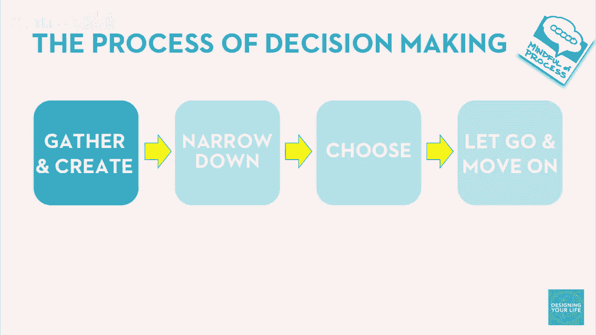
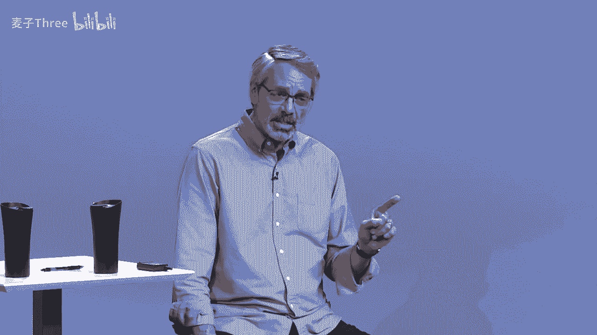
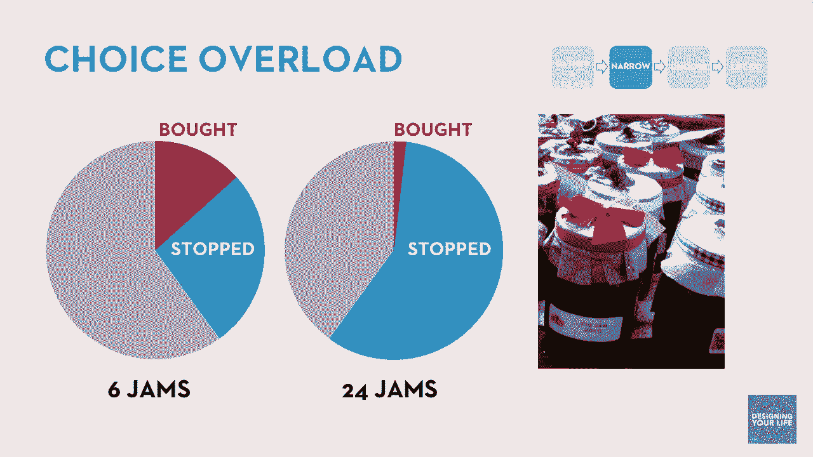
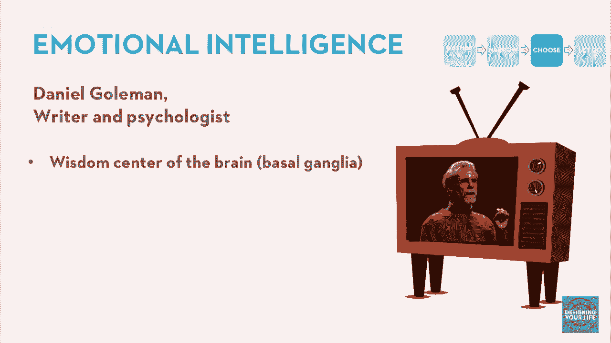
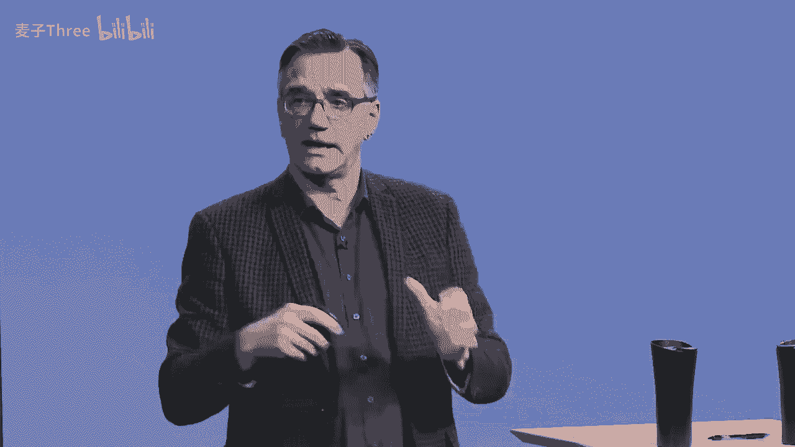
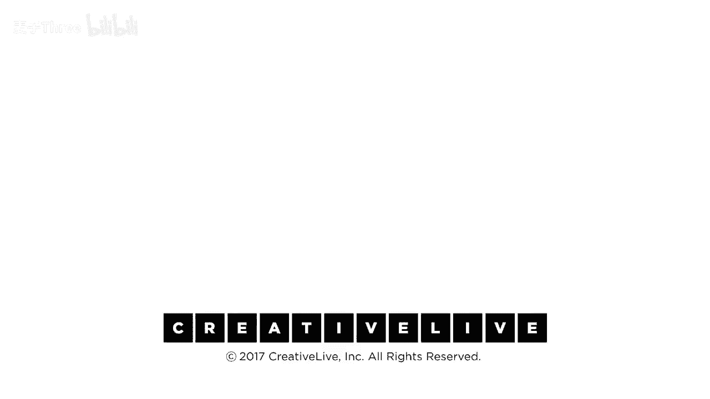

# P15：15-DesigningYourLifee-EvansBurnett-TheDecisionProcess-HD - 麦子Three - BV1tzDVYHEGb

好的，所以我们还有几件事情要做，然后我们会回到生活设计框架，我们在设计思维模型中心，我们谈论了意义创造，世界观和生活观，事物运作观和生活观，现在我们将谈论实践，实践和辨别，特别是关于选择，我们如何辨别。

我们如何做出好选择，有很多证据，这是神经科学的部分，我们知道关于选择的很多证据，我们从观察人们在做那件事，看人们的大脑，古老的问题是，当你知道时，你怎么知道，你知道，我的意思是，什么，什么使一个好决定。

以及如何做出一个你可以真正满意的决定，我们有一个决策模型，我们总是喜欢模型，我们很科学，那样你收集和创造你的选择，你试图做出一个好选择，你收集和创造一堆选项，我们谈论了创新和产生许多想法。

你缩小那些选项到最有用的那些，然后你选择一个，然后你纠结于，你是否选择了正确的事情，你完全或焦虑于，我是否选择了正确的，或者另一个更好，我不知道什么是更好的，那是糟糕的，那看起来是坏的，那似乎是一个坏。

那是一个糟糕的方式，实际上，积极心理学和大脑科学围绕这一点是，你应该放手并继续前进，为了有一个好选择，我们将走遍这些步骤，重要的是这个过程实际上变得更糟，在变得更好之前。

仅仅做出一个好决定是不够的，你必须做出一个好决定，好吧，比尔谈论的是如何做出决定，好吧，事实证明，即使做出了伟大的决定，但如果处理不当，效果也不佳。

实际上，中等水平的决定如果处理得当，效果会比伟大的决定处理不当要好得多，你必须选择正确的事情，然后你必须正确地选择，所以我们已经谈了一点关于收集和创造，我们做了练习，我们把想法传给大家。

在别人的想法上建立，有很多其他技巧，头脑风暴，思维导图，我们所谓的形态分析，只是以独特的方式将不同事物的特性混合在一起，我想你们可能会很好地产生想法，但这里有一个部分，你们有很多想法。

所以我们已经填满了，你知道的，满是帖子的板子，或者你已经用几十个想法填满了你的名单，现在你需要选择技巧，缩小范围，制作一个更短的列表，以便你可以做出选择，这来源于心理学中的一些有趣工作，叫做选择超载。

你听说过吗，这是一个非常有名的研究，被称为果酱研究，有一个有趣的设置，你去一家商店，一家不错的杂货店，有一个友好的女士在那里，她有一个桌子满满的果酱，你知道你来尝试果酱果酱周，是的，你来尝试果酱。

然后你决定是否要买对吧，这是他们的销售方式，这有点像costco什么的，但这是一家非常高端的商店，他们有美妙的果酱，大约六种果酱，你知道，三分之二的人停下来，这很有趣，让我尝尝这个果酱。

大约40%的人停下来，然后大约20%的人，大约40%的人停下来，大约14%的人实际上买了东西，所以你知道，很多人停下来，相当数量的人实际上买了东西，如果你店里有很多果酱，好的，两周后，同一家商店。

同一位友好的女士，两瓶四罐果酱，我们有辣椒，草莓，香蕉，我们有，你知道，此外，这是有趣的味道，两瓶四罐果酱，你的预测是什么，有多少人来停下来，更多的人停下来，或者更少的人停下来，更多的人停下来。

更多的人停下来，我看着这张桌子上的果酱，这一定很有趣，让我看看选项，我们喜欢有很多选择，没有人，几乎没有人买了任何东西，当你有很多选择时，实际上你没有选择，几个人能够解决这个问题。

但主要是通过只关注他们喜欢的东西。

这实际上是一个有趣的事情，当你有很多选择时，你的大脑会过载，现在你没有选择，你的头脑会感到麻木，或者你不知道做什么，你反复浏览列表，一遍又一遍，谁在面临选择清单时感到困惑，是的，欢迎来到人类的处境。

是的，结果你实际上能记住的选择数量，在任何一时间大约是四到七，六是一个不错的选择，这就是为什么他们选择六，如果你列表中有超过五或六种选择，这就是你应该做的，你只需划掉它们，我要划掉那个，我在错误的地方。

会好的，非常好的列表，我为我的列表付出了很多努力，我不能放弃第七项，这可能是正确的选择，是的，但是但是但是，这里有件事，如果你有太多的选择，你不会做出正确的选择，所以你必须把它减少到五或六个。

那么你该怎么做，你怎么知道你已经划掉了错误的一项，嗯，实际上你必须先做，这里有件事，我们称之为比萨饼中餐综合症，一群人在工作，你说嘿，今天我们出去吃午饭吧，是的，那太好了，你想吃比萨还是中餐。

因为这里有一家，那家在那边，比萨试图，我不在乎，好的，我们去吃比萨，不，不，不，我想吃中餐，中餐，你不会在你决定之前做出决定，但你会在做出决定后立即知道那不是你想要的东西，相信我们，如果你有20个选项。

划掉15个，但当你说不，我不在乎比萨中餐时，你讲的是实话，你不知道你知道你不想在今天吃比萨，你大脑的一部分知道这一点，但没有和你说话的部分交流，那就是你的大脑部分，和你说话的部分。

你在做出决定后才发现这一点，这不是什么奇怪的心理现象，这实际上是你大脑的工作方式，为自己设定目标，这就是我们帮助你进入的状态。

所以你的列表已经减少到可以管理的，一个可控的集合，现在您做出选择，大多数人会使用一种理性的选择方法，这很好，您制作一个优缺点列表，当我决定是去微软工作还是成为教授时，我制作了一个优缺点列表，很明显。

去微软工作，两倍，我作为教授的工作收入是现在的一半，我看了清单很久，还是决定不了，所以我决定，丹·戈尔德曼，他是一位作家和心理学家，他研究情感智商，有一个很好的视频，我认为这是一个TED演讲。

这是一个谷歌演讲，还有一个TED演讲，他特别关注你的情绪如何帮助你做出好的决定。

这绝对是我们现在从脑科学中理解的，情感，尽管你的前额叶皮质可以列出利弊清单，你可以进行加权平均，这个想法得分87，另一个想法得分74，我想选择87分的想法，但这感觉不对，感觉不对劲，我的直觉告诉我。

另一个想法更好，这是真的，你大脑中有一部分叫做基底神经节，基底神经节是大脑的非常早期的一部分，它在灵长类动物和一些爬行动物中也存在，这是你大脑中总结的部分，我做出决定时感觉如何，我做了这个事情。

我得到了很多积极的回应，那是一个好决定。

我做了另一个事情，我作出了这个决定，哦，一切都没有成功，我得到了负面的反馈，他把它称为智慧中心，情感智慧，大脑的中心，它平衡决策，他谈到了一个律师，他有一个病变，他们必须进行手术。

意外切断了基底节的连接，他无法做出任何决定，他能够列出所有可能的优缺点，但他无法决定哪一个更好，所以没有感情信息，你不能做出一个好决定，与基底节的问题如此早地在大脑中，那并没有连接到负责说话的大脑部分。

它与你大脑的一部分没有关联，那就是现在正在和你说话，它只与你的肠道相连，顺便说一句，原来你的消化道神经元比你的大脑还要多，那里面有一个完整的智能系统，当你谈论直觉时，这是真的，这真的很真实。

如果没有那种信息的访问，你就无法做出好的决定，注意这里因为我们是那么爱说话的人在这么技术的世界里，表达是种智能的表示，你是聪明的，如果你能说很多话，这就是我为什么说得这么多，你会以为我比我实际聪明。

但不要把不善言辞与不聪明混淆，好的，你处于无意识的状态，知道你大脑的智慧中心，它与情绪相连，与情绪中心相连，与大肠相连，所以直觉是真实存在的，不要混淆这一点，哦，它是，它并不特别清晰，它一定是愚蠢的。

这是一种感觉，我听人们说类似的话，你知道，我想做出一个非常好的决定，我不想做出一些情绪化的决定，我想做出一个好决定，没有没情绪的决定，你知道没有，我的意思是，更大当然是更好的，对吧。

所以我想要一个更大的肿瘤，而不是一个较小的肿瘤，因为更大当然是更好的，哦不，你遇到了ipos，哦，对不起，不，不，客观事实，更大的意义，并不重要，更大就是更大，更好的是什么，我不知道，它是。

这是一个情感现实，这是一个基于价值的现实，所以，深入挖掘你内心的这一部分，并且聪明地使用它，真的是一种强大的工具，在我们文化为了说话和理性，我们花很少的时间去发展我们对这些情感的辨别力。

有些人在这方面做得很好，他们似乎知道什么是好的决定，他们有这种感觉，他们不需要用言语来解释，但关键点是，神经科学的研究告诉我们，这部分大脑，对于做出决定至关重要，却没有能力与说话的部分交流，所以。

你认为的自己，你总是在这里重复的，以及你做出的决定，几乎总是从之前的事情中预想的，很大程度上受到你的情感智慧的平衡，你可以培养这种智慧，让自己变得更好，EQ和IQ结合，你会做出更好的决定，好的。

假设你已经通过了选择的部分，现在，我们要学习放手和继续前进，我不知道你，但对我来说，这部分是最具挑战性的，因为我读了所有这些研究，我说，嗯，这可能对其他人来说是真的，但对我来说，这不是真的。

因为我知道如何做出决定，我可以保持选择开放，这个人叫丹·吉尔伯特，不知道为什么，他没有做保险广告，但他实际上是哈佛的神经科学家，一个非常聪明的人，他一直在研究决策，他做了一个非常有趣的实验。

一个非常有趣的实验，这个实验有两个有趣的结论，你知道，我们来谈谈这个实验，我们想要放大实验的一个特定结果，他们正在研究人们如何做出决定以及他们对这些决定的感受，事后他研究合成的幸福，不是虚假的幸福。

但人类是如何真正创造或合成，持久且有效的幸福，这是他的研究领域，在一种情况下，他们让一组人评估，看四幅不同的莫奈画作，四幅不同的莫奈艺术作品，他们需要给它们排个序，从一到四，然后当他们完成时，他们说。

哦，顺便说一下，感谢您的排名，这就是我们想要的，我们有很多备用的您认为第二或第三的画作，您可以选择其中一幅带回家，您喜欢哪一幅都可以，您不介意，他们对两组人做了同样的事情，除了在第一组中，他们说。

顺便说一下，请您确认您选择的画作，因为这是您最后一次选择，一旦您拿走它，我们就没有时间再和您打交道了，您只需要带回家，我们永远不想再和您联系，再见，第二组人说，哦，顺便说一下，您知道，这不成问题。

我们觉得我们有足够的备用画作，您可以选择您喜欢的第二或第三幅画作，如果您改变主意，您有三周的时间来找我们，给我们打电话，换另一幅画作，这不成问题，如果您改变主意，您可以在几周后回来，这不成问题。

您可以选择第三幅画作，如果您改变主意，这不成问题，然后他们等待了几周，超过了截止日期，他们再次联系了参与者，所以所有选择了第二幅画作的人，他们只能保留它，与选择了第二幅画作的人相比，他们只能保留它。

他们本可以把它带回来，但他们没有交换，所以你知道，苏西选择了第二个号码并保留了它，哈里选择了第二个号码并保留了它，但哈里认为他不能改变它，而苏呢，她对自己的结果不如他那么满意，结果完全相同。

丹的线是可逆条件，不利于幸福的合成，令人烦恼的现实是，你知道，仅仅保持选择开放的可能性，因为我可能会不满意，保持你的潜在不满，帮助你最长时间不开心，因为你得到你想要的并不是重点，它是什么，嗯。

研究另一个有趣的事情是，当我们让他重新排名刺激物时，重新排名，画作，我选择的这幅画比我想象的要好得多，现在是第一名，我爱这幅画，其他画它们并不好，什么都没有改变，除了我感觉自己做了一个不可逆转的决定。

然后活在那个决定中，不回头，所以你真的要放手，回到机会的可能性，这个模型的好地方是，如果你学会像设计师一样思考，如果你带着好奇心领导，你真的灵活地重新定义问题，提出很多选择。

没有什么问题在挑选一些并放手，其他保存的问题并不是问题，没有问题，我们会有更多的，我们会想出更多的想法，我会从这个点到下一个事情，然后有趣的事情会发生，我会有这个美妙的，你知道，与你的采访。

然后我会发现完全与我想的不同的东西，然后我会去下一个事情，如果那件事行不通，我可以回到头脑风暴，生成更多的选择，所以没有惩罚，你知道，它是，你知道，登陆船只，烧掉船只，你知道，只是进入新领土。

不要保留你的选择，一个，你好，你留着它到底有什么用，选项变成什么，当它长大了，它就变成了一个决定，这就是你现在为什么有它的原因，我已经决定了其他的选项都已经完成，我已经进入了下一个世界，是的。

那里将会发生很多事情，这将会很激动人心也很有趣，我不怕做我的选择，大卫，你确定你做了正确的事情，如果你留在加莱会怎样，你会有一个更大的机构，另一个，你知道你真的确定你在斯坦福做了正确的事情吗。

我对这个问题的回答是，我不知道你在说什么，我从来不考虑这个问题，我在斯坦福，我们过得很好，那是过去，现在是现在，我比担心我做了正确的事情要开心得多，你总是担心你做了正确的事情，如果你担心。

如果你做了正确的事情，你永远不会知道，所以你得到的只是你的担忧和没有答案，如果你觉得这样可以。

