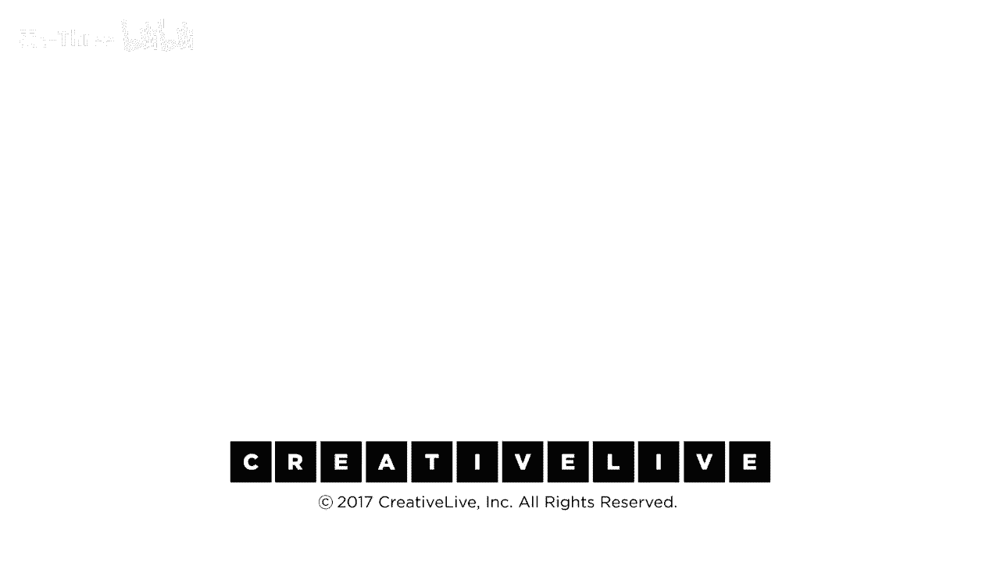

# P19：19-DesigningYourLifee-EvansBurnett-ReflectionSession-HD - 麦子Three - BV1tzDVYHEGb

我们希望你思考你今天所学到的和你所摒弃的知识，也许你还没有考虑过摒弃知识，那可能是一个全新的想法，好的，所以有学习和摒弃，所有的那些东西，你知道你意识到你的意识有100%，你知道那。

那就是你所知道的一切，然后你学习一个新的东西，它出现并说，这里有一些新的东西，你不知道你不知道的有多酷，我们会添加那个，一些东西进来，它就把自己添加到另一个部分的馅饼中，很好，但有时你学习一些东西。

或者你只是决定你不再认为某事了，一个旧的想法有时会离开，一个旧的想法会独自离开，我不再那样想了，有时它会被一个新想法驱逐，两者都会发生，你知道，你可能今天学到了一些东西，你可能选择了今天摒弃一些东西。

两者都非常有价值，所以我们希望你现在，事实上想想这一天是怎样的，我们有一份工作表给你，这一天的最后一天，它有一张看起来正好像那样的图片，我们谈论过的视觉课程，这就是我们今天所做的一切。

去这里15或16个想法和目的，再次，这些是逻辑上组织的，但这不是1 2 3 4 5到16的顺序，然后你的生活就被设计好了，这完全不起作用，你在对你来说有意义的顺序做这些事情。

所以你扫描那个事物列表并问你自己，那只是提示你，它不是制作检查清单，但你知道，写下，我今天学到了什么，也许我不想，我不再认为保持选择开放是一个好主意，那真是个好主意，我想我正在学习如何重新学习。

保持选项是好主意，你可能已经决定要忘记一些事情，这份工作表的最后一部分，在你写下你的收获后，和你的不学习，给自己一个机会注意到，你所学到的东西，和你不学习的东西，请写下几项行动项，无论是原型，跟进。

无论是从那些收获中拿出一个并继续下去，但我学到了什么，我学到了什么，完成这两件事然后做，我将在下一周或两周内采取什么行动，如果你真的从今天学到的东西中做了些什么，很快你的事情继续下去的机会就会大大增加。

这就是我们如何处理它的方式，所以我们想要进行的最后一次对话是在你们的桌子上，你知道，只是做一个轮盘，轮流每个人分享一个学习或n n学习，你知道我只给你几分钟，你知道而不是一个月长的段落。

但你知道只是一个简短的标题，我们都有了相同的内容，他们会知道你在说什么，所以我学到了这个，我学到了这个，或者我正在思考这个简短地，你知道，下一个人，下一个人是去，给予，你知道，也许一两个，也许三轮分享。

我会在一分钟后回来我们做的最后一件事，分享你的收获，只是去一圈，其中一个我的主要收获是足够有趣，而且我对我正在走的当前路径非常满意，酷，棒，那真的很好，它被称为一当你得到，那，使它。

在我们这里需要几年时间，但我不得不说我的生活和工作非常一致，并且我们所做的对女性非常有影响力，可能比我意识到的更有力量行动，好的，所以我有两个行动，其中一个与商业有关，我喜欢做的令人满意的工作。

我们欠它，确保我们给更多的女性机会体验它并从中学习，这就是进入数字空间的整个想法，所以只是与制作那种东西的人进行对话，以确保这成为现实，然后是我的第二个，因为我的第二人生很重要，有人接手并让它发生。

才刚刚开始调查，我想知道谁会成为领导者，如果这不是一条会走下去的路，我希望你现在就随便选择一个行动项，转向你的同伴，没关系，具体来说你可能已经展示过了，那很好，我选择一个行动项，与另一个人分享。

我想让你在离开大楼之前安排，我想让你安排一个问责检查，现在是星期四，我希望你最迟在下周一上午10点完成，最好是周一或周二，最好是周一或周二，大约是一周的中间，一周后，现在来一道非常强硬的问责问题。

你们应该互相提问，进展如何，我们已经进行了多次实验，事实证明，你知道我们都很忙，我们都有很多事情要做，而且我们不是想威胁任何人，但我们只是想友好地出现，但是只是一个非常友好的出现，嘿。

我正在做你和正在做的事情，你知道嘿，你知道过得怎么样，你知道还有联系，要么通过电话，要么，最好是如果你们足够接近，一起喝杯咖啡，就像嘿，回到上个星期四，我们学到了什么，你知道，进展如何，只是查看一下。

所以现在，与某人分享一个行动项，并安排时间，要么，打电话或喝咖啡检查彼此的情况，下周一或周二分享感谢，我感激这实际上是我们早些时候谈论的，我真的很想把我在工作中的理念和想法付诸实践，这个人，你知道的。

世界观和所有那些，实际上应用它们，我在工作上有了这种范式转变，我认为这将非常有趣，我记得我们之前谈论过这一点，所以像所有的事情，我在那里写下了，对不起我没有听到三联，但是，嗯，是的，实际上应用这个。

看看这如何改变体验，所以我想得到你的号码，所以星期二给你打电话。

