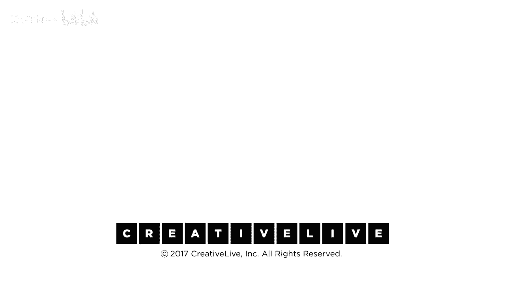

# P2：02-DesigningYourLifee-EvansBurnett-DesignThinkingOverview-HD - 麦子Three - BV1tzDVYHEGb

如果你跟着我们一起走，你会得到什么，并且你会做我们今天谈论的所有想法和工具，你会得到什么，戴夫，你会得到什么，你会得到一堆东西，你会得到一个设计思维的介绍，这是斯坦福大学设计项目的执行董事。

五岁四个月的孩子，斯坦福大学最古老的跨学科项目，设计思维的发源地，你知道吗，自从1964年以来，你就知道你将会教书，他已经教书三十年了，但我们想出了，甚至在他到达之前。

你知道你将会得到解决工作与生活平衡问题的全新方法，并且你将会在这周结束之前得到开始实施它们的工具，这意味着从明天开始，因为明天是星期五，你将会得到破解隐藏就业市场的秘密，你如何发现隐藏的就业市场。

以及如何进入其中，你知道，你将获得神经科学的见解，了解如何做出真正明智的决定，这将对你有益，还有很多其他好处，这只是一个开始列表，这就是我们现在停留的地方，这些人是谁，我的意思是，这些人在哪里。

我的意思是，克里斯对我们说了一些好话，但我的意思是，真的，戴夫，除了在苹果工作之外，在早期的鼠标和共同创立一家你可能听说过的公司叫做电子艺界，一直在教授这类东西，首先是在伯克利，然后超过18年。

所以他在2006年来找我，2007年，他说他在伯克利上这个课，但是我更愿意在斯坦福教书，谁不愿意呢，是的，所以我认为你的学生有这个问题，我绝对同意，我办公室经常听到，所以我们一起吃了午饭，我和比尔。

你知道比尔是谁吗，我的意思是，除了是一个酷酷的早期苹果人和多年经营设计公司之外，实际上真的做了很多设计工作，导致了硅谷的很多成功，你知道，他总是热爱教学，他在斯坦福大学开始教学。

几乎是他毕业之后的第二件事，当大卫·凯利，IDEO的创始人，斯坦福大学设计项目的负责人，你知道，创立了D学校研究所，他说，谁能管理这个项目，谁能管理这个项目，培养我们斯坦福大学的所有设计学生。

他选择了比尔作为最好的老师，他是他见过的最好的老师之一，比尔已经教了这些东西超过30年，我们加起来有几十年的教学经验，所以我们已经练习了很久，今天来到这里，当我们开始时，校园里有恐龙，是的，现在，是的。

所以，但是真的，好的，我们知道理论上我们在做什么，我们做了很多，你能信任我们吗，你不是小白鼠，好的，成千上万的人在你之前做过，你知道，这对他们起作用，比尔提到了研究，在斯坦福大学。

你不能随便编东西就说它很酷，你真的需要有研究，所以斯坦福教育研究生院的两项研究，展示了我们课程干预的格式有效性，这是他们所说的，听起来有点像肛肠科，但无论如何，这意味着，确实，你知道。

穿着白大褂的人过来，到处爬，确实，这东西确实管用，数据表明它确实管用，也许最重要的是，在我们有一个五年级的人类中心设计项目在斯坦福大学之后，我们第一次意识到，也许我们应该把人类中心设计应用到人类经验上。

这可能是第一次，在我们有一个五年级的人类中心设计项目在斯坦福大学之后，我们第一次意识到，也许我们应该把人类中心设计应用到人类经验上，我如何设计自己成为一个人，所以这是一个大问题，让我们聚焦在这个问题上。

这是一个今天非常大的想法，正如克里斯所说，在顶部，所以这种设计思维有点像秘密配方，告诉我们关于这个秘密配方比尔，嗯，它已经成为一个相当流行的短语，这种设计思维的想法，它是一种方法论，我们教人们进行创新。

设计思维，好的，每个人，所以是的，通常它应用于产品和服务，我们与银行合作，我们与大型组织合作，我们教他们如何做，我们也教我们的学生，这是一种本质上以人为中心的方法论，但为了给它一个框架，让我来解释。

你知道这种设计，什么是设计思维呢，有很多种类型的思考，你知道我们在工程学校，斯坦福大学的工程学校有设计项目，所以工程思维，这是一个非常有力的工具在你的工具箱中，你可以把这些看作是不是相互替代的。

它是一个很好的工具，如果你有一个工程问题，你想要用这种思维方式，所以如果你想建造这座桥，你需要知道桥梁的长度，钢材的强度以及将要在桥梁上行驶的车辆数量，但如果你知道所有这些信息。

我们有解决这个问题的方程，桥梁将正常工作，它将一直工作到桥梁倒塌，如果你将相同的参数放在其他地方，这是奥克兰的一座桥，但你将桥梁移到，你知道移到波士顿，它也会在那里工作，因为这是一个非常受限的问题。

并且所有数据是可靠的，如果你去了一家商学院，你可能会学到，我们称之为商业思维的东西，它与数据不太精确，但你可以得到关于商业决策的信息和一些数据，我想收购这家公司，你现在是一家公司，或者我想收购这家公司。

我可以看看他们的资产回报率，我可以看他们的盈利能力，我可以预测未来，你认为，他们的未来收益价值会是多少，所以我们有这些优点，我们可以优化决策，但是，在这个问题中，斯坦福有大量的数据，我们做研究，研究。

使用科学方法，这实际上是自黑暗时代和启蒙时代以来推动人类的力量，你有一个假设，你形成一个非常小心的实验来隔离你想要测试的变量，你进行实验，得到一个数据集，然后分析你进入解决方案，在这种情况下。

你不能改变假设，那是作弊，因为你改变假设以适应数据，你不是科学家，我不知道作弊，你在作弊，你在作弊，我在尝试不在关于当前政府的科学思维缺乏上开玩笑，但是再次，你必须能够分析数据集才能让这工作，现在。

现在人们在方程式中，当我们首次开始使用设计方法论，或试图理解以人为中心的设计，我们去了人类学家，我们问，你怎么研究人，你怎么以无偏见的方式研究人，我们去了心理学家，我们问，需求层次是什么。

马斯洛的需求层次，我们开始看那个，我们说，好吧，因为人们是不同的，这很有趣，因为人们是不同的，我们说，好吧，嗯，这很有趣，因为人们是不同的，不同的情况，假设，假设我研究了这张桌子这里的一群人。

这边我研究了奇怪的手机使用者部落，而你们都有不同的手机，然后我列出了所有的需求，然后我问每个人他们想要什么，然后我为你们制作了完美的手机，但这将会发生，我会向你们展示我的原型，然后你们会说，是的。

我知道我说我想要那个，但现在我看到，你知道什么，我真的，我改变了主意，令人发狂，这经常发生在设计师身上，人们，改变他们的想法，发生了什么是你想要，我知道，但发生了什么是你不知道你想要什么。

你知道你有什么，以及它的问题，当我向你展示可能的未来，你可以拥有，你说，哦，如果这是可能的，你知道我真的想要，这一直在发生，心理学家称之为邪恶问题，但我们已经发展出解决问题的方法。

我们发展出一种发明未来的方法，这就是我们作为设计师做的事情，我们发明从未发生过的事情，然后如果它成功了，如果它真的满足了需求，并且与我们的用户产生共鸣，我们有一个成功的产品或者服务，或者你知道任何事。

我们现在正在重新设计金融服务，各种各样的事情，所以设计思维中，我们说，因为你无法依赖的数据，并且你不能预测未来，前进的唯一方法就是构建，我们构建，我们探索，我们与用户一起探索。

这确实是设计你生活的一种绝佳方法，因为你不知道未来会怎样，事情可能会迅速变化，你的工作，可能会，你知道，消失，或者突然出现一个新职位，你想要决定是否接受，所以在不确定的环境中，你想要使用这种方法。

我们有一个小图表，我们说我们从同理心开始，我们从理解人问题和在这个情况下理解我们自己开始，以及世界如何看待我们，以及我们如何看待世界，我们重新定义问题，我们提出大量想法。

然后我们进行原型测试原型测试循环，我们以建设性的方式走向未来，这就是方法，这就是我们教授的方式，当我们在设计你生活的方法论中教授它时，我们有一个步骤，那就是'接受'，每个人都或多或少地接受了这一点。

你接受了来这里参加这个课程的邀请，这意味着你对此感兴趣，你可能没有完全接受做所有练习，但你至少来到这里并开始了，但这很重要，Dave总是说你不能解决一个问题，如果你不愿意，我赌你有一个朋友，不是你。

但一个总是抱怨，每次你出去喝酒时，他们讨厌他们的工作，他们讨厌他们的关系，他们讨厌他们的老板，他们一直在谈论，但他们不采取任何行动，所以他们没有接受，哇，这是一个问题，我需要处理。

我需要向前推进一些解决方案，所以接受是设计你生活过程的第一步，然后我们有这个，我们称之为，你知道，像设计师一样思考，如果你有设计师的思维方式，你就会像设计师一样行动，这只是行为，如果你像设计师一样行动。

我无法分辨你和真正的设计师，所以如果你从好奇而不是怀疑开始，因为你想要发明未来，没有理由去怀疑，你还不知道它长什么样，并且从好奇开始会更有创造性，然后重新定义问题，大多数人都在错误的问题上工作。

如果我们能让你正确思考问题，摆脱这种激情，摆脱这种，我来晚了，那么你就打开了解决方案的空间，现在有更多的地方让你有好主意，激进的合作，这就是你为什么在团队中，我们只是混合了完全陌生的人在大多数情况下。

因为你的经验如此不同当你一起合作时，在中间会发生一些令人兴奋的事情，设计是复杂的，有时你是在发散寻找很多答案，有时你是在收敛尝试测试某些想法，你想要注意过程，这样你不会混淆。

然后最大的事情是我们有一种倾向于行动，因为未来是不确定的，你无法得到任何关于它的数据，你为什么要计划，你用那个计划什么，你没有任何数据，你是在编造，我喜欢说没有计划，没有生活计划。

无法生存第一次与现实接触，无论你计划什么，你知道世界在外面，随时都在变化，所以更容易开始做一些积极的事情，我们把那个设计思维的东西，这是我们教设计和设计创新的方式。

我们把它放在一个小小的框架里以确保再次，你知道你在哪里，并且我们今天会多次提到这个框架，它将成为我们的视觉课程，帮助我们现在找到方向，五年前我们构思设计思维时，我们实际上是在思考产品。

这个项目最初被称为产品设计项目，但事实证明，这种创新方法论现在更广泛地适用，当你在设计一种生活时，这是一个更广泛的事情，因此，需要一些额外的工具，银器抽屉中还需要几个额外的插槽，顶部一层是意义构建层。

你知道，你的观点是什么，你的工作观点是什么，你的世界观将在一分钟内描述这些事情，你对此做了一些家庭作业，希望组织思想有助于回答问题，这对我真的有用吗，这真的是我吗，你如何回答这些问题。

然后你想如何获取信息来回答这些问题，与，这就是支持层的意义所在，我如何发现并支持，对我来说，实际上什么才是真实的，我所有那些在我脑海中跑来跑去的声音，哪一个才是真正的我，哪一个还是妈妈，你知道的。

我如何弄清这些事情，你是怎么知道的，当你知道，你知道，所以我们可以采取一些步骤来帮助支持，发现信息，做出好的决定并维持这个过程，因为坦白地说，我们唯一可以肯定我们会得到的工作。

是得到擅长找到下一个工作的能力，我们只是会继续做这些事情，一遍又一遍，你可以争论说，生活设计就是生活，我们总是在设计我们的生活，你做了一些重大的决定，你在一段时间里生活，你知道，好的，我要。

我想我会抚养这些孩子，我从医院把他们带回家，我想我会在接下来的二十年里照顾他们，或者你坚持下去，但这每天都在变化，所以我们现在总是做这些事情，我们需要很多想法和工具来填充这些，这就是你要得到的。

所以你今天将得到所有这些，在你回家之前，你将得到整个套装，这就是我们所做的，我们有很多工作要做，你知道，通常这仅是一个为期10周的20小时课程，所以在接下来的6-7个小时内，我们将能够覆盖所有内容。

我肯定，这将是一个忙碌的一天，希望你带着你的行李回家，我希望你能带着真正可以使用的工具回家，我必须说我们在斯坦福已经打破了规则，因为我们是设计教师，设计人员做事，我们不谈论事情，我们根本不讲课。

我们只允许自己，我们称之为讲座的讲座，持续12到15分钟，我认为我们已经超过了，所以我非常抱歉，现在是时候做点什么了比尔，我们做的是，让我们不担心完全重新设计我们的生活，顺便说一下。

设计你的生活仅仅意味着设计一个更好的生活，不一定是完全不同的一个，所以让我们抓住低垂的果实，首先，小的变化更容易得到，所以低垂的果实在这个情况下可能包括我们几乎每个人都会问的问题。

