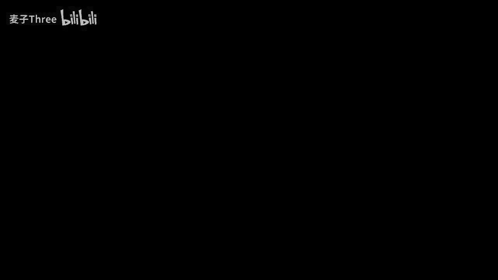
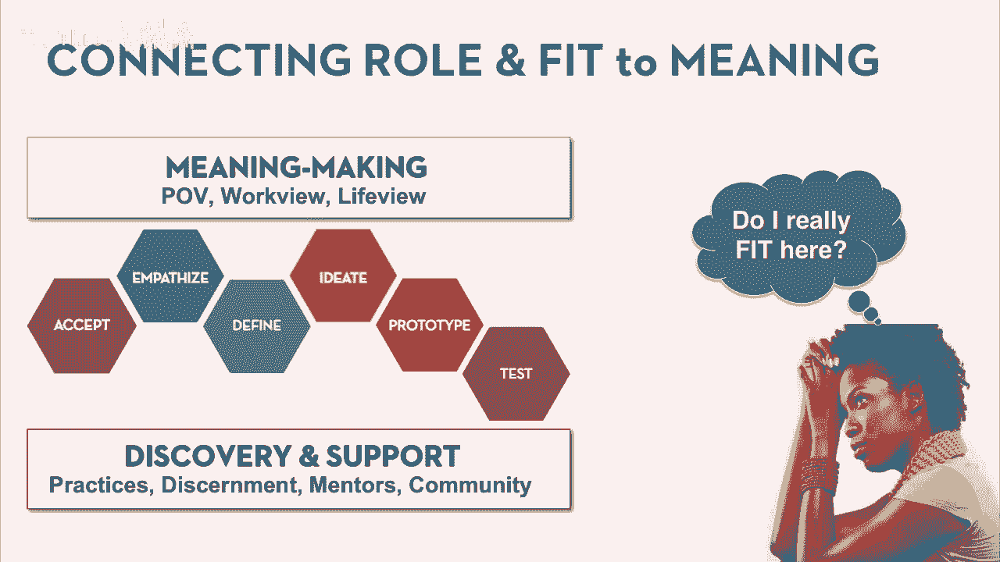
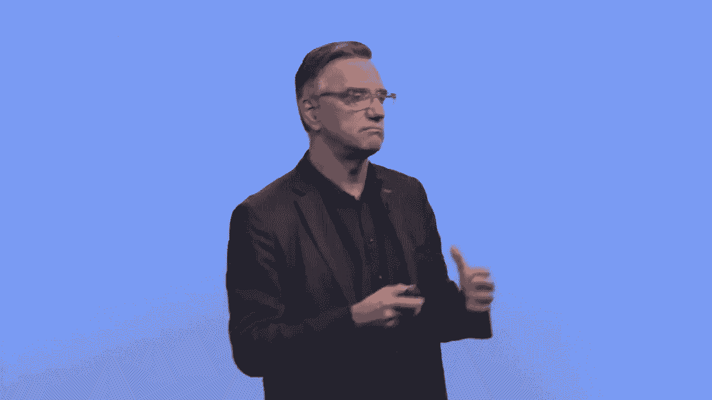
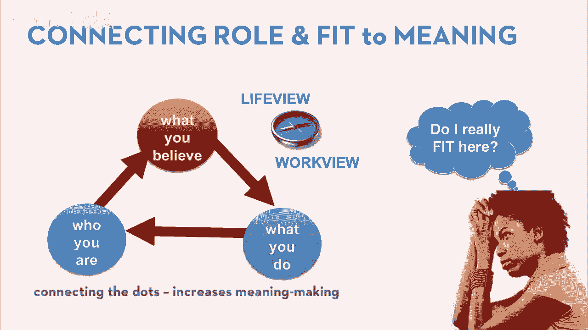
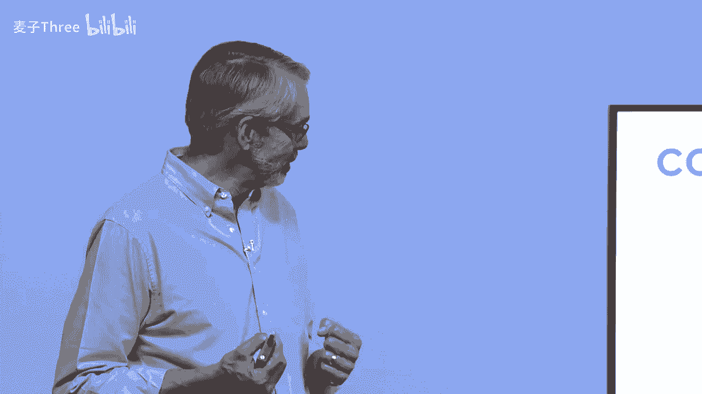
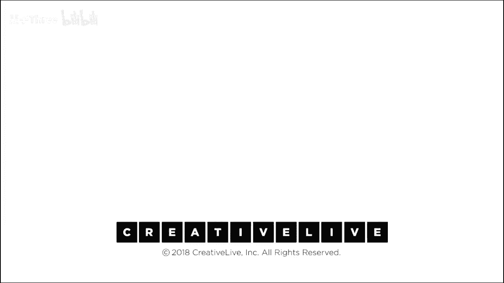

# P21：21-DesigningYourLifee-EvansBurnett-ImpactAndMeaning-HD - 麦子Three - BV1tzDVYHEGb

你好，我是比尔·伯内特，我是戴夫·埃文斯，我们很高兴能回到这里在创live，谈论如何设计你的生活，使用设计思维，我们今天带来了一些额外的材料，我们有一个新的模块为你。

所以第一个问题是这个模块真的对我有用吗，你在问自己，或者如果你在线观看，我应该继续待在这里吗，嗯，这就是你如何知道的，如果你像这个年轻女人一样，如果你听起来有点像她，对自己说一些事情，比如，你知道。

我真的想为这件事做出这样的贡献吗，你知道我是，我真的在这个正确的地方，我真的适合这里吗，如果你在为这个问题挣扎，我们听到很多人在为这个问题挣扎，这个模块是从与成千上万正在规划他们生活的人的对话中产生的。

这是我们在与真正成千上万的人打交道时发现的一个问题，这是一个经常出现的问题，所以，如果你有这个问题，我真的适合这里吗，我们所谈论的适合度，是角色与世界的匹配度，我在世界中扮演的角色，可能是我的工作。

这对我有意义吗，这是一个大问题，关于意义构建的问题，我的角色对我来说意味着什么，这些都是我们整个课程构建的框架的一部分，我们现在正在做的，我认为我们今天的第一模块，所以比尔。

这个想法在这个框架中适合在哪里。

所以我们有一个设计你生活的框架，从设计思维开始，这就是中心的，想法是从，你知道，接受问题，对世界有同理心，也许对你的需求有同理心，然后通过设计过程，我们支持这一点，我们用我们称之为发现和支持层来支持。

这是你知道的，你的做法是什么，你是什么，你社区是什么，你和它一起工作，谁支持你，谁指导你，然后在顶部，意义构建层，这是你对事物的观点，你的工作观点，和你的生活观点，我们在这个模块中讨论的是你扮演的角色。

你可能在工作中扮演的角色，也可能是非营利组织或其他不被视为工作的东西，但你所做的事情，你在人类冒险中做的事情，是的，这与你的工作和生活观点直接相关，但也与你如何定义你的角色有关。

因为我们已经和很多人谈过，事实证明你可以重新定义，或定义你扮演的角色，以有意义的方式。

或不那么有意义，我们希望鼓励一个有意义的角色，适合和有意义的位置，我们有一个模型说一致的生活，是你会经历最多意义的生活，所以模型说，如果你能连接你是谁，你相信什么，和你在做什么。

这些事情在一个一致的方式连接，我们所看到的积极心理学研究，和我们工作的学生，他们会说嘿，我的生活是有意义的，因为我能连接点，我们在前面的模块中，你做了一个生活观点，生活的意义是什么。

你做了一个工作观点，关于你为什么工作的250个字，这创造了你的指南针，你的生活指南针，所以你已经完成了课程，你正在回访，你正在回到你的练习，你真的想回去拉你的生活，如果你刚加入，今天开始与我们一起。

你知道这是你可以期待的事情，我们将加倍关注这一点，特别是看其中的一个点，我们在看什么比尔。

我们想看看你做了什么，你在世界上扮演什么角色，以及这个角色如何产生影响，因为我们与人交谈时，什么使他们的工作或他们在生活中的角色变得有意义，他们说，你知道我想对这个世界产生影响。

我想要我的工作或者我所做的事情，我想要知道它对世界产生了影响，以积极的方式影响世界，所以我们回答这个问题的很大一部分是，它是，它进展如何，它是否有效，嘿，金，效果怎么样，这取决于你对影响的感受。

所以我们设计了一个新工具，它叫做影响地图，影响地图，我们将很好地绘制我们的影响，我们如何绘制它，这张地图的坐标是什么，哦，我很高兴你问到了x轴上的状况，你知道水平的，我们正在考虑什么类型的影响。

我们认为，你可以通过三种基本不同的方式对世界产生影响，它们有质的不同，它们并不比较好或较差，但是它们确实感觉非常不同，所以在中间，你是在维持和支持事情，你是在继续运行控制世界的系统吗，你知道是，你知道。

现在控制室里有人，帮助运行创意生活创造这种材料的方式，他们维持着，这个系统实际上允许这些东西发生，或者我正在更新或修复东西，我在修复坏掉的东西，我在消除不好的东西，我差不多是在防守，如果你愿意。

或者我正在给世界带来新的东西，那些以前从未存在的东西，我正通过引入新事物改变游戏规则，所以我在某种程度上处于进攻地位，新事物，我在防守，修复坏东西，我在支持，运行重要事务，你知道，而这些是不同的角色。

垂直上我的影响点，现在影响类型，我触及世界的地方，你知道，这可能离我很近，或者离我很远，而近，我指的是个人，而远，我指的是一直到全球，在个人之间，一对一的互动，我和地球，你知道，在我去的路上我去小团体。

去机构，你知道去一个国家或者一个整个部门，你知道，一直到全球，也许一个给定的宇宙，你知道，所以我连接世界的地方取决于我，现在，这些都是些奇怪的想法，必然地，所以让我们给你一些例子，你只需要理解。

这就是给你一些例子，所以如果这里是一张地图，我在映射，比如比尔或者戴夫，其他种类的人，让我们说我是一个投资银行的系统分析师，我为一家大投资银行工作在纽约，我分析公司，你知道，根据我们的资本主义，你知道。

评价体系，好吧，我正在做的是，我在运作，你知道，系统或国家层面，我经营整个市场，垂直市场的区域，比如医疗保健或类似的，你知道，我在运行资本主义，我在运行资本市场银行，我们总是有一个重要的事情要做。

所以我在某种程度上处于支持角色，在机构层面，让我们说在基金会，疟疾项目经理，我的工作是永远消除疟疾，让地球，这是一个大修复，大，如果我做我的工作，好吧，某样东西消失了，我安装了没有疟疾，某样不好的。

某样不好的消失了，我是脑外科医生，我在角落里，我正在移除癌症肿瘤，我从你的脑中移除肿瘤，你知道我在个人层面工作，我在修复某样东西，我在修复你的脑，我没有做任何新的事情，我没有让你变得更好。

你没有变得更聪明，因为肿瘤消失了，你知道，如果你幸运，你差不多回到了起点，所以我在这里，这不可扩展，但这非常重要，是的，这是非常低规模的，你知道，这可能是两全其美的，可以做两个脑同时。

我们还没有做到这一点，一次，我是无家可归者中心厨师，实际上我在无家可归者中心工作，我们照顾那些处于真正困境的人，你知道，我在给他们提供食物，你知道，我在解决他们的饥饿问题，但我也在这一边培训人。

所有员工，我们的客户和我们稍微培训他们一下，所以我在和一个小团体的人一起工作，只是我们服务中心服务的邻居，我主要是解决他们的饥饿问题，但我正在努力帮助他们支持他们能够自给自足，所以我正在向那个方向移动。

我是谷歌自动驾驶汽车开发项目人员，她是在试图改变实际上不是地球上的每个人的交通方式，因为不是每个人都拥有汽车或者能够接触到沥青和道路，但是很多人，世界上的很多人，你知道，数以百万计的人。

甚至可能是数十亿人，这将会是一种全新的交通方式，所以我在新的一边，规模非常大，或者我是比尔还是戴夫，当我们教这门课时，我们在斯坦福教，你知道，我们和几千人交谈，我们做的是一件非常新的事情。

我们在斯坦福谈论的生活设计是一件非常新的事情，但是关于设计思维在斯坦福实际上并不是新事物，它已经有五年，七年的历史，所以它是一种前卫的事情，但你知道现在我们正在和全国的教育工作者交谈。

我们运行工作室来培训其他大学来做我们做的事情，在教育界这是一件非常前卫的事情，所以它是一件非常新的事情，生活设计是一个想法，在大学世界里这是一个非常新的想法，所以我们在更广泛的范围内是思想领袖。

因为我们和多个学院交谈，不仅仅是一个，并且我们写了一本书，现在，一本畅销书，所以有几十万人阅读了我们的书，但书不如我们正在做的事情有力，我们在这里做的事情稍微更个人化，但很多人确实阅读了它，你知道。

超过三十万本图书在两三个不同的国家被阅读，设计你的生活，所以我们对全球产生了一个小影响，这就是它看起来的样子，但你知道，比尔和戴夫同时在三个地方，我们在斯坦福大学的左设计实验室有一个工作。

今天让我们来到这里，在其中我们有多个角色，几乎每个人的工作，我赌你们八个人都有超过单一角色的工作，你们差不多都住在那个区域，那个小回旋镖形状的东西是种住在那个区域，我们在，这就是它看起来的样子。

这样才合理，我们明白了吗，我们正在做的事情，通过例子，太好了，比尔，是时候我们做这个了，是的，我们不喜欢做很多讲座，你知道，设计是一项接触运动，那么我们来实际确定你在世界中的角色，首先需要做的是列出。

你知道的，四到六个你可能需要记住的可能角色，你的工作可能有多个角色，你可能是生产助理和规划者，并且在企业文化委员会，或者无论它是什么，所以请确保你列出你所有的角色，你可以列出你以前有过的角色，事实上。

考虑历史可能是一个好主意，我做过哪些其他工作，它们如何适应，你可能还会想到一些你知道的，你知道的，你可能已经想象过的未来角色，所以第一步，方式，如果你正准备参加课程，当你到达奥德赛规划练习。

或者如果你回来并捡起这种新材料，你可以回去捡起你的奥德赛，在这些计划中嵌入了角色，你可以挑选一些未来的角色，并将它们放在这里，因为这样看起来会很有趣，所以第一个低头活动是看。

如果你能想出四到六种不同的角色，只需将它们放入列表中，我们将给你大约五分钟来做那件事，确实可以加入一两个未来的可能性，甚至包括疯狂的想法，喜欢，在某个时刻，我想成为一名儿童医院的治疗小丑。

显然下一步是在这张小小的2x2地图上定位这些角色，我们非常清楚，没有哪个象限是好的，很多时候当你看到这样的东西时，你会想，哦，右上角，是最好的，新事物总是更好，不是的，它不是，我的意思是。

根除疟疾对世界影响巨大，创造下一代自动驾驶车辆，对某人的大脑进行手术，这对他来说意义重大，所以地图上没有哪个地方是好的，但你的每一个角色都会在某个地方找到自己的位置，记住这是更新和修复，持续创造新事物。

这就是，那个无家可归的大厨，他正在把一碗汤递给无家可归的人，这是一对一的，或者你可能在这里，你知道，为无家可归者筹集资金，在联合国地下室办公室起草政策，在全球层面上，是的，所以它们都是好地方。

没有坏地方，但你可能会发现你曾经有过的角色有一些模式，你看，如果你能把这些角色再次放在这张小小的2x2地图上，我们会给你大约五分钟的时间，是的，一个角色可以有多个描述方式，并且放在那里，没有正确答案。

也没有错误答案，重要的是你给出的答案，就像你对那个角色意义的思考方式，那个角色在你心中的感觉，它在地图上的位置，那就是它应该去的地方，现在，在设计你的生活的每一个模块中。

你会发现我们实际上会要求你做一些事情，然后我们会要求你反思，因为我认为你知道，我想理解，我刚学到了什么，或者我刚绘制了什么，这对我有什么意义，所以反思通常从简单地开始，你注意到了什么。

你所有的角色都在一个象限，或者它们散布在各处，你注意到了什么，这是否产生了关于适合你的角色类型的任何洞察，你可能有一个角色，你在地图上的某个地方扮演，而你就像，我从来不喜欢那份工作，或者你有另一个角色。

你没有认为它很重要，你现在意识到你已经把它放在了地图上，你就像，哦，那实际上是我最满意的事情之一，我想我在那里产生了最大的影响，那么你注意到了什么，那个产生了什么见解，这会给你带来任何问题吗，哦。

为什么我所有的东西都在这里或那里，所以，我们再给你几分钟时间，写下一些观察，笔记，你知道，观察，洞察，你对这个映射发现了什么，注意到什么，这是很常见的，哦，我讨厌的工作，我所有讨厌的工作都在一个象限里。

或者我所有认为对我有影响的角色，都在这个地图上的某个地方，所以寻找模式，或者缺乏模式，两者都会产生洞察或随着时间的变化，比如以前很酷，然后不再酷了，也许我与这之间的关系发生了变化，在我不注意的时候。

是的，你不是一个静止的物体，当你成长为角色时，你的需求会改变，你感知影响的方式也会改变，好的，看起来大多数人都有一些观察，所以生活设计的另一个原则看起来，那就是自己做很难，我们总是社区里做。

我们总是讨论我们所观察到的事情，现在我们想要做的是让你们成对，我认为这对这个群体效果最好，所以如果你能滑到成对形成，这样你可以实际上和对方交谈，我希望你们分享，我给你们几分钟分享，那是，这是我的地图。

这是我注意到的，这是我注意到的，所以和你的伴侣进行那次对话，对于那些在线做的，你知道你现在是否与某人在一起，无论你是在做这个还是不做，这是一个很好的对话平台，我们发现很多人已经使用这个工作表。

只和他们的朋友交谈，嘿，你想和我做这个吗，我们可以讨论这里发生的事情，有一个大学校长我们实际上介绍了这个，他说这个工作表允许我和我两岁的女儿，我们一直在试图进行的对话，我们从未到达过那里。

我们解决了这个问题，我们终于有了我们想要的对话，我们试图帮助人们表达我们所有关心的事情，但我们通常不知道如何谈论，这就是我们在这里做的事情，例如，论坛，或者我确信，然后像未来，我写了像潜在的视频主持人。

并带来那些两个世界一起行动与社交媒体，这是我喜欢想的更多，然后我在想一个更一对一的事情，然后我是像嗯，妈妈在想，妈妈的角色，是的，未来的未来，所以那一个是在那里，但我感觉他们都住在这里，所以我是像，哦。

我喜欢，我被吸引到那些全球触及和更新的，是的，以及我的类型我的，我的问题从那里是像，仅仅因为我被吸引到那个，到那个这意味着我更擅长那些东西，或者我也可以读那个像像仅仅因为那是像我的过去。

或者我正在真正趋势，并且我被吸引到那个，这意味着，那就是我要做的，或者我是只是在某种程度上跟随，也许就像你知道你的兴趣，像那些你喜欢的事情正好是全球，像，我不认为你是积极试图喜欢不，我是像。

我从来没有那样想过，并且我感觉像我的最喜欢的事情是像对某人一对一，所以是的，是的，那很有趣，是的，是的，关于公司可能有一个外展目标，但是我是某种，你知道什么方式，我看到这种像是的我支持。

你知道像嗯这个公司和嗯所以是的，那就是我发现的，他们都是像这些线，像非常周围这里，嗯，我曾经是一个项目经理，嗯我不能，我我可能可以改变主题像更远到右边，嗯因为我们正在与其他公司合作并开发技术。

材料科学和但是我总是感觉像是有像非常小的影响，像一小群人互动，并且你知道一个一项目或两项目，所以是的，我把他们嗯在像，我是否喜欢这份工作，我不真的不看它有什么关系，我确实享受，但是我不会，你知道。

我不会认为它不出我看它，从这个视角，是的，这总是有趣的部分，因为你们看起来像正在进行一次非常有趣的对话，充满了一些非常有趣的信息，我猜你们没有在谈论菜单规划，是的，是的，你们可以告诉我们。

给我们一些感觉，是的，在这个练习中你们都想到了什么，是的，我正在谈论我发现比我最初预期的有更多的变化，当你知道你比想象的有更多的部分，是的，当你们开始谈论这个时，我差不多想象自己处于一个或两个象限。

但当我进行这个练习时，注意到我实际上遍布所有四个象限，这对我来说是一个有趣的发现，我们可以说我比我想象的更多样化，因为甚至散乱的这个词，它有一点情感色彩，就像你不知道自己在做什么。

你只是一个稍微有点散乱的人，语言很重要，好的，其他人有什么想法，我发现这对我自己很有帮助，我大部分时间都在右下角，在我大部分的角色中，而我的一个未来目标则更接近全局和左上角的起点。

我提出的问题是我是否在右下角，因为我在那里感到舒适，我是否试图将自己推向不舒服的情况，或者我是否试图将自己推向一个舒适的情况，我是否从这里开始并可能成长为这个位置，记住脑外科医生可以成为外科主任。

然后成为医院的首席部长，然后，随着你的职业发展，回到那里，你可能，你可能发现，向更大的系统性影响移动是我为下一步要做的事情，但这是你应该问自己的一个好问题，你是否在推动自己，因为你认为你应该这样做。

或者因为这是一个自然的进步，我们不喜欢，我们应该不做任何射击，这是我们对这个的第九版，顺便说一下，这又是从我们合作的人们的生活中产生的一个练习，他们一直在问这个问题，我们认为他们需要更多的帮助。

更多的工具，设计你的生活的总体目标是通过设计思维使你能够，培养生活中的有意识的胜任力和职业导航能力，所以擅长并知道如何擅长，弄清楚如何做这件事，随着生活和职业导航，所以这是一个工具来澄清。

对我来说这意味着什么，我们发现人们，到处都有应该，你知道，我试图成长为那个职位，e，那个职位比这个职位更好，你明白，而不是只是，获得与在那里相称的技能，而不是更好，所以你知道你可以有一个偏见。

如果你认为向上或向左或向下，向右更好，那完全取决于你，但图表不在乎，其他思考，什么也出现了，我想到了什么，我所有的都似乎聚集在底部，稍微向右，即使我担任了很多不同类型的工作，所以我注意到的是。

无论工作如何，我对它的看法似乎，应该在这个特定的象限，所以这个问题引起了一个问题，你知道那是否，嗯，我如何，我如何利用这一点，我为未来的成功做准备，我在这里的位置，是的，嗯我应该开始，再次应该。

我应该开始以不同的方式思考它，以便在未来取得成功，或者你知道这里有一个方式，这对成功是好的，记住这整個想法的目的是為了決定，嗨，我的影響點對我有意義嗎，所以如果我對今天有意義，我從來。

我們從來沒想過我們會寫一本書，我們只以為我們在教課，對我來說在課堂上意義重大，影響我們正在交談的二十、三十或六十個學生，但當我們有機會將這個想法推廣到更廣泛的群體，並將其放在創意生活上，讓更多人體驗它。

我發現哇，這是一種比單一教學不同的一種影響，你知不知道這並不一定不同，這並不一定更好，但我認為這是我們認為重要的事情，所以你可以在下一個角色中決定，或你已經有的角色，你可以改變你已經有角色的影響。

你可以在現場重新設計，你不需要換工作，你只需要改變，你決定，影響對你有意義，對他人，有一個概念叫做職業雕塑，那就是不換工作，有很多不同的方式可以做同一份工作，有很多不同的方式去思考同一份工作。

和你如何做，和你如何思考，這完全取決於你，這可以有外觀效果，比如讓我更有效或更有影響力，並且有內在效果，它更與我協調，當我畫我們的東西時，我說我們正在成為教育改革者，我們都參加了很大的教育會議。

我將其描述為教育改革，所以我把它放在更新的一面，我們運行的培訓其他大學來發展他們自己的計劃，不是教我們的，我們不說，這是怎樣做我們正在做的，我們說，這是怎樣你可以受到我們工作的啟發，但你做你自己的事情。

我們團隊的另一個成員，這種使能，而不是你知道的，特许经营方法对事物真的很重要，因为它承认了我们支持的每个机构的自主性和独特性，我们只是在支持你，成为你，带着更多的设计思维，所以她可能会这样想。

我正在思考的完全相同的事情，我认为是改革，因为现在大学关心你生活的形成，而不仅仅是你大脑中的信息，这是一个巨大的转变，戴夫关心这个，但加布里埃尔可能更关心，我们真的很支持你被使用。

这样她就可能在不同的地方画同样的东西，这很重要，你是负责人的，只是为了确保我们澄清任何混淆或关于这个工具如何工作的问题，下一步会是什么，下一步会是什么，比尔提到了，你知道，我们两个，我们是否不想要很好。

下一步将会是，让我们说，如果你有一个问题，你知道，想要思考那个询问那个思考那个，如果有一个洞察，这里的一些结果可能只是，哦，我将开始强化并捕捉自己在，是的，这正是我想要的效果，或者如果有geis。

我希望在这里有更多的影响，你想当哨兵，是的，通常下一步是原型，如果你已经，如果你已经完成了在线课程的其余部分，我们会说嘿，那个问题，我想要上升到更全球，或者问题是嘿工作是，我完全正确。

但我需要对我的关系对影响的重新设计，我想回到下面去，把我的手更多地与人接触，是的，那么，而不是像我辞职一样，或者我突然改变了我的生活，我们会说你在运行一个原型，而原型可能只是。

我打算去和别人进行一次对话，那个人已经在全球层面上在做这件事，或者在高层，或者在那个那个那个宇宙的层面上，只是看看那个人的生活质量如何，看看这是否与我共鸣，或者我可以直接去找我的老板说，嘿。

我正在考虑改变我在这里的影响力方式，是的，工作不变，改变影响力方式，让我们来谈谈这件事，让我们尝试一周我以不同的方式工作，看看这对组织是否有效，因为原型设计几乎总是我们下一步要做的，如果你在做整个课程。

回去看看奥德赛规划模块，因为那里有一些想法，然后从那些奥德赛计划中你可以跳入原型设计，那是另一个模块，那些地方是你会去的地方，好的，让我们结束这件事，你知道，关于要点，我们真正建议你今天带走的。

是评估两种影响力的类型和影响力点，你知道，28：明确你对影响力的看法，每个人都说，哦，我想产生影响，你指的是什么，所以让我们在这方面变得更聪明，真的，没有对错地方，世界上有很多事情可以做。

问题是适合和你的一致性，你可能适合不止一个地方，我认为人们不是单一的地点，没有正确的答案，即使是对你个人来说，然后使用这些见解重新设计你的位置，我们正在谈论的事情，你可以立即使用这些见解。

让你已经做的事情更有价值，在我们结束的时候，当你们走出门，你今天学到了什么，你们讨论的事情，所以你实际上学到了什么，你学到了什么，你学到了什么，一个要点，你今天得到的，一个洞察或一个问题。

你想跟进的事情，一个收获，我曾经设定的未来目标，是我曾经考虑过的，在我还很年轻的时候完全忘记了，直到我实际上做了这个练习，好的，所以，突然之间，一个潜伏在我记忆中的东西被唤醒了，我发现了它。

但它一直在那里，是的，你知道我们也注意到了，当人们做他们的奥德赛计划时，很多时候，他们有些事情被遗忘了，当他们20岁时，然后生活发生了，现在他们有一份工作，和一个妻子和孩子，但你知道。

那些我们可以扮演的身份，那些仍然存在的生活，它们是活跃的，有时候这些工具只是表面这些信息，然后你可以决定你想要做什么，我的全职工作并不是我唯一产生影响的地方，我们可以思考，你知道这个和那个连接在一起。

然后连接到一个更大的系统中的事情，所以我应该怎样思考这些事情在我的生活中的位置，以及它们意味着什么，然后我在业余时间做什么，以及我如何补充整个项目，因为再次，我在设计我的生活，而不仅仅是一份工作。

所以再次，这个工具的整体想法是给你一个思考某事的方式，更清晰地，那很可能对你很重要，因为大多数人认为你知道我生活的影响实际上关系到，我的生活是否有意义，因为我们都在试图回答这个问题，你好吗。

我们希望你知道，有了这些工具，情况会好一些，你在创造你真正关心的那种影响，谢谢你今天花时间，你们做得很好，给自己鼓掌。

