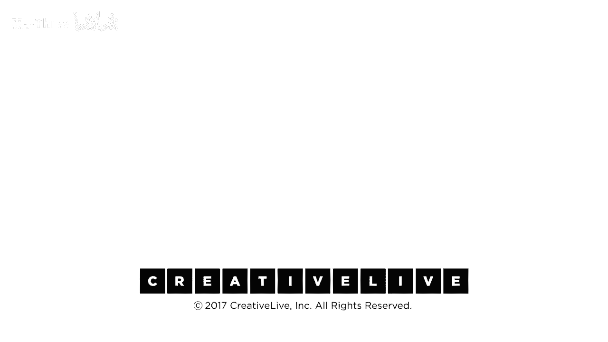

# P4：04-DesigningYourLifee-EvansBurnett-DefineWorkview-HD - 麦子Three - BV1tzDVYHEGb

我们将进入意义构建层，看看一些大的想法，帮助我们确定该怎么做的组织原则，我们正在前往的地方，并真正回答这个问题，这真的是真正的我吗，这适合我吗，第一个是我们称之为工作观，这不是你的工作描述，这不是。

我想要一个角落的办公室，我还想要一辆车，你知道这是一份工作描述或一个愿望清单，工作视野是宣言，一组定义我认为的价值观，好工作是这样有人问，告诉我关于你的工作，你知道这真的是你想要做的工作吗你的工作视野。

回答了这个问题，所以我们将立即开始，你们已经在作业中做了这些事情，对于在线参与者来说，如果你还没有写你的工作、生活和你，你想要，你知道，休息一下，完成这些事情，因为我们将要谈论你们的想法。

你必须表达它们以便谈论它们，当我们谈论它们时，这是我们在房间里将要进行的许多非常个人化对话的开始，我们今天在这里说的话，就像在这个生命设计室里一样，永远留在这里。

我们今天的角色是帮助彼此在这个生命设计过程中。顺便说一下，这在云端的2亿人中也适用。你知道，甚至这些人的对话，我们在一个小组里一起工作。你将会听到这个小组的对话，大部分时间都在这里。

他们的目的是自愿分享他们的生活，公开他们的生活，以便支持我们所有人，让我们在这个过程中有一个同情和真实的体验。这意味着在白天，如果你在家组团这样做，你也希望保持机密，这些都是这些人的故事，这很个人。

而不是普遍，我们会说一些，正如我们所知，我的意思是，工作几乎只关于钱，嗯，实际上在我的个人生活中，我的看法是，我们都在第一人称，主动语态，我们不会试图夸大其词，你知道，当然尊重且富有生成性。

生成性意味着我们今天会充满肯定和提出建议，有多少人你有很多可以接受批评的地方，是的，我们基本上认为今天就跳过那部分，你今天会得到很多批评，我们会富有生成性，而不是批评，考虑到这一点。

我们不会真的拿出你的工作视图，我们将在三人小组中进行对话，我们今天会做很多这样的三人小组，你知道，如果你能和一两个朋友一起上这门课，那真是太棒了，三人小组意味着三个人，当你今天分组时，当你分组时。

你通过拉回椅子进入完美的小，我看到ely的三角形，如果比尔在那里，和，假设苏珊在这里，那不是三人小组，那是一个直线，你知道后面有一个大漏洞，拉回你的椅子，这里有足够的空间，我们将全天为您提供评分标准。

我们的工作是为您提供一个容器来容纳对话，这就是容器，它从阅读你的工作视图开始，当我说阅读时，现在就读，你知道在进入时，我决定我再也不相信这些了，我真的不知道谁写了这些东西，我的狗，你知道，在它上面尿尿。

你知道不，不，不，不，不，所有那些我们习惯做的免责声明，都跳过，都跳过，你写的，这是你的故事，你好，我是戴夫，我的工作视角是boom，所以，一旦你阅读了它，只需要一分钟或两分钟，然后。

那两个刚刚认识你的人在听你，这里是你的工作听众，读者在阅读她的作品时，什么时候，你觉得她的工作视角看起来最真实，而且我不会解释我所说的'真实'是什么意思，我的意思是'真实'，你知道该怎么做。

第二件事你要做的就是谈谈对你来说最突出的是什么，第一个问题是在那部作品中读者发生了什么，当你在听的时候，对你来说发生了什么，你知道我注意到当你谈论关于狗的部分时你真的看起来很兴奋。

你知道当我谈论关于狗的部分时我真的很激动，你知道我真的很激动，关于彩虹，所以无论那是什么，所以你们两个可以分享，读者看起来最真实的时候是什么时候，并且哪一部分真的让你印象深刻，那就是你所做的一切，所以。

阅读你的作品需要几分钟，你的作品，查看需要两分钟来发表一些评论，那么接下来是第二位选手，我们会给你时间让所有人都有机会发言，有什么问题吗，我很高兴，这很清楚，好的，开始，你知道该怎么做，谁想先来。

让我来，我很高兴，好的，我工作是因为我热爱我所做的事情，部分原因是它为我的日子赋予了意义，当我处于心流状态时，我在学习，在战略上思考，在合作中创造新问题的解决方案，我的工作必须涉及人，我尊重。

尤其是我现在的生活阶段，我共同创立了重启Excel，一款专为女性设计的软件，帮助她们重新想象生活，在工作之后，暂停并重新投入到有意义的有偿工作中，我们帮助他们保持最新、连接紧密、充满信心。

以实现他们的梦想工作或开始自己的创业之旅，我的每一天都充满了目的感和喜悦，每周我都听到另一个生活被改变成为更伟大的事情，我们做的事情和对女性全国乃至全球的影响，对我来说是一项重要的使命，对我来说。

成功更多地由影响生活的程度而不是金钱来驱动，尽管，感到为我的工作得到公平的补偿是理想的，我来自一个工作伦理很强的家庭，我父亲在85岁时创办了一所特许学校，并在87岁时主持了他最后一次退休高管的公民会议。

我被教导工作很重要，回馈社会是我存在的重要部分，我感激能找到有意义的工作，我喜欢与人合作，我尊重，并且这份工作能充分发挥我的才能，对我而言，尊重是最重要的，我听到了这个词，当你说尊重他人的时候。

你的声音变了，我尊重，是的，你两次使用了这个词，我也注意到，当有人说你使用了'流畅'这个词时，你似乎更加投入，我意识到，那是你声音中的活力，这两件事是我听到的关键，那些，我意识到，那是你声音中的活力。

