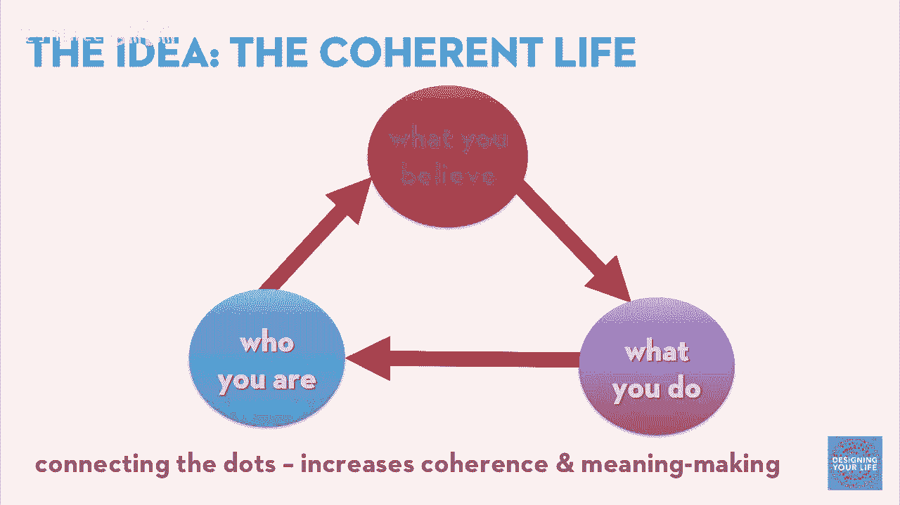
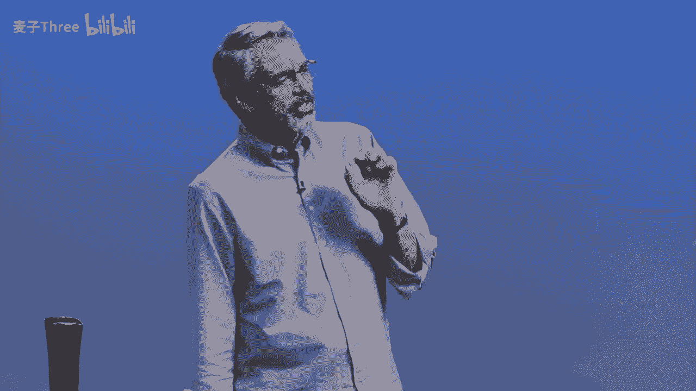
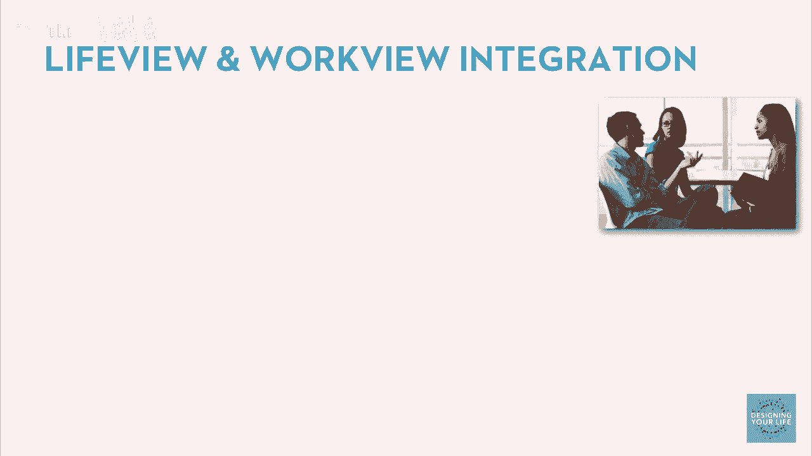
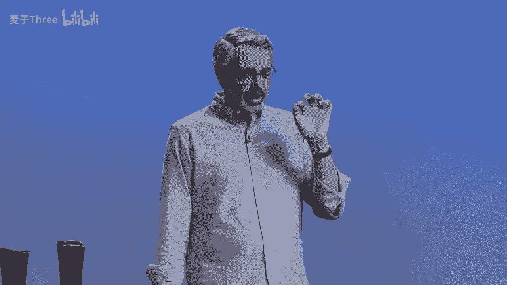
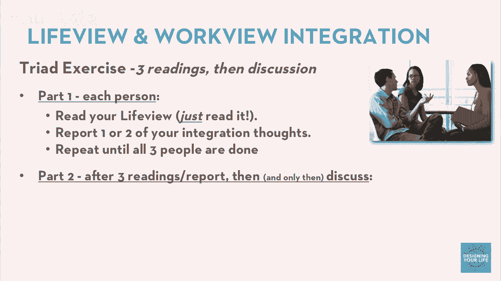
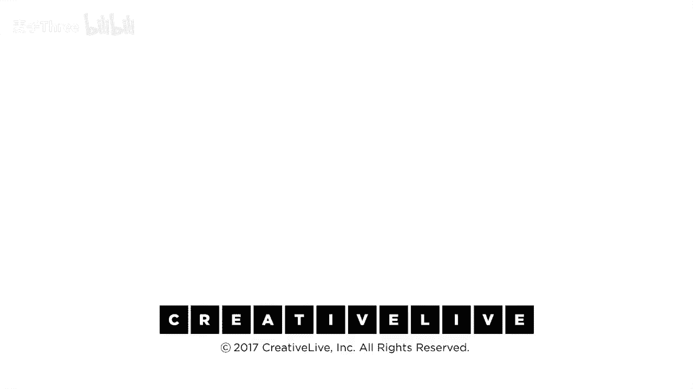

# P5：05-DesigningYourLifee-EvansBurnett-LifeviewWorkviewIntegration-HD - 麦子Three - BV1tzDVYHEGb

所以我们从工作视角出发，宣言，什么是好工作，你知道，好工作对我意味着什么，生活视角的问题，常被称为世界观，你对组织世界的重要真理有何看法，你知道，实际上你的世界观，你的生活观指导你谈论什么，你知道。

如果你认为上帝很重要，那么你就会，它会在那里，如果不，它就不在那里，你知道，如果你知道，为人类服务或为人类服务在你那里，那么它就在那里，如果不，它就不在那里，所以你的生活，你真的反映了你的生活观。

反映了你的生活观，所以我们一起努力过，我们将以不同的方式处理这个问题，这里的想法是我们想活出比尔，我叫它连贯的生活，什么是连贯的生活，它是连接点并且点，我是谁，我相信什么，我正在做什么，这似乎很有道理。

实际上研究也支持这一点，如果你能特别地连接那些点并且，特别是，向自己解释，更别说，你知道，我是谁，我相信什么，我正在做什么，你知道，当你在凌晨三点醒来，你冲进浴室，你打开灯。

镜子里的那个人回头看着你并说。

我们在做什么，这里发生了什么，谁下了这个订单，你知道，当这种情况发生在你身上，这在我们生命中的某个时刻会发生，你想准备好一个好的答案，你想能够连接这些点，因为你能够连接这些点。

这意味着你更有可能经历意义，你知道，如果有人问你你的生活是为你工作吗，它是否对你有意义，无论你如何定义意义，你回答是的机会，会增加，这不意味着你完美地一致，这不意味着几乎与美妙的完美一致，你知道。

这三者之间的平行性，生活中可能有时候，你需要做出重大妥协，我们都一直在处理取舍，这没关系，这是否是一个取舍，你是否个人感到舒适，并且你承认，是的，这就是我现在所做的，这不完全是我，但我认为这是合适的。

有人应该换尿布，我认为是我，如果这在我生命中的这个时刻是合适的事情，那么我们将这样做，我们将给你一个机会思考你的一致性。

将你的生活和工作结合起来，我将给你一分钟时间来思考他们是否一致，你的生活观和工作观是如何整合的，问题是，我们现在要读它们，读你写的，但读得像，你没有写它们，读得像，你是这个人的朋友，你是你真正关心的人。

你在听他们，你听到的是什么，你的生活观，和你的工作观是否来自同一个人，他们是否相互补充，他们是否冲突，是否有一个像天啊的差距，你知道你所谈论的生活，所有这些关于服务的谈话，总是这样。

而且他甚至没有提到工作，这很有趣，或者，或者也许你会说哇，多么全面的人啊，她是如此酷，然后你知道给自己一个大的金星，但只是注意，关于你的生活和工作观点的整合，有一些要说的，所以看看那些。

我们会给你几分钟自己的工作，甚至可能有一点背景音乐来帮助，沉思，你知道，关于这个人的生活观点和工作观点似乎一起做什么，你注意到了什么，每个人都想到了一两个好的，好的，这就是我们所知道的。

你可能还没有完成，但这没关系，正如我们早先所说，你知道，我们在这些研讨会中永远不会完成，所以我们就足够了，我们可以稍后再完成，那么我们该怎么做，好的，我们从这里开始，我们要进行另一次对话。

我们今天要谈论很多对话，让我们使用相同的三联体，你只是，因为你已经知道这部分人的故事。

这将有助于这次对话，我们将结构上稍微不同，顺便说一下，我们不在这里讨论你的世界观，你知道我们都有不同的世界观或生活观，这很好，你知道我们不在这里协商，但它们确实影响了我们的生活方式，所以这是我们做的。

回到试演，我们将有三次阅读和报告和一个讨论。

所以每个人第一部分，第二部分第一部分是阅读和报告，所以第一个人会读他的生活观点，这是我的观点，我认为世界是如何组织的，我发现我的生活观点和工作观点在一起，当我看他们的时候。

我发现我是一个非常整合和协调的人，我只是，我很幸运能成为我，你知道这是他真正知道的，或者，或者我不知道这些人是谁，我想我更喜欢第一个，你知道无论怎样都在两者之间，你知道我读了，这里有一两件事。

我注意到一些东西，这对我来说很有趣，procon无论怎样都不重要，你完成了，没有对话，第二位人士，然后重复，我们再做一遍，第二位人士做同样的事情，然后停止，没有对话，第三位人士读评论，现在。

你刚刚输入了一堆，你知道，生活观信息和整合评论，这是一个关于整合经验的讨论，我是否与自己相处融洽。

这是我们讨论的主题，不是，哦，那很有趣，你是虚无主义者，我从未见过一个，所以这是我们想要保持的对话，一旦这三次阅读和报告完成，我们可以进行对话，问题可能是，比如，你注意到了什么，听了所有这些材料。

听了自己和他人，你知道，我现在注意到了什么，你们中的一些人可能会花很多时间在这个哲学空间，这些大想法和日记，很多，你们中的一些人，嗯，我从不这样做，你知道，所以你注意到了什么，仅仅在处理这些事情后。

你有什么想法或见解，可能的改变，我们几年前与学生交流的反馈之一，我们曾经合作过，几年后，我们听到了一些事情，其中一些最常听到的是，你知道，我查看了我的生活视图，我也查看了我的工作视图，我已经升级到3。

2版本，这些永远不会完成，它们会根据我们的经验不断被编辑，也许你已经做了一些修改，那很好，你好吗，你刚进入这个对话感觉如何，这是一个一般的对话，你对这次讨论感觉如何，有意义吗，好的，好的，好的。

回到您的小组，有人自愿第一个发言，请读出您的生活视图，我们会给你大约十分钟的时间，这将足够让你完成并进行一些交谈，一定要回到您的小组，伙计们，是的，你们不能松懈，我希望你们能形成一个很好的小组。

控制好对话，轻松一点，好的，我们生来就是为了发现我们被创造的那个人，在我们害怕，不自信和外界声音剥夺我们的光芒之前，我们的目的是回到我们的本真，完全表达自己，这种完全的表达是为了某种方式服务。

无论是照顾家庭，帮助社区，成为艺术家或者在工作中贡献，无论你能贡献多少，只能做你自己能做的，所以，当我读这段话时，我想起了我的工作视图，我确实看到了其中的联系，我相信工作和生活都是为了服务和影响他人。

它们在这方面是相同的，它们也是关于实现我们自己的完全表达，无论这对我们来说意味着什么，无论这对你的独特自我意味着什么，我们都有自己的定义，什么是成功，我们只能自己定义自己，我们只能自己定义自己。

所以我肯定看到了这两种情况，是的，我肯定，对你来说，它们现在是否已经整合，并且你在做的事情，嗯，它正在接近，是的，我肯定有一些，嗯，我想填补的一些空白，和我想更多的向移动的，嗯，对我来说，嗯，我。

我的工作的标题，我，我做活动生产，咨询，所以我非常热衷于把社区聚集在一起，帮助他们连接，这基本上就是事件，你知道，帮助社区连接，但我也有非常创造性的一面，我真的喜欢看到人们，嗯，实现创造性表达，嗯。

对我来说，我，我跳舞，我做音乐，我一直在主持我自己的，嗯，我为客户举办的一些事件和工作坊，这在外面真的很令人兴奋，但你知道，我怎么做更多的，以及如何以支持我的生活的方式去做，我的生活在压力中。

与我的信仰紧密相连，我受到天主教的培养，并发现一些深刻的信仰的价值观，深深地植根于我如何看待世界，以及如何我试图运作，我相信地球上的每一个个体都是独特的，有一个目的，而我们的旅程是找到并执行那个目的。

同时建立与他人的关系，与他人的关系，并以积极的方式影响他人，尽可能，我相信我们每个人都被赋予了礼物，我觉得有责任作为父母发展并利用那些礼物，我的角色是向我的孩子传递这种责任感，注意到我优先考虑的价值观。

并向我的孩子传达，展示我的生活观之一，例如，教他们善待他人，对待，教他们善待他人，开发他们的潜力，并体验为社会服务的感觉，你的，你生活的表达是你的工作，是的，所以我会加一件事，就像不是一切都完美。

这里有一点差距，部分可能是因为对。但我被抚养和某种程度上我爱我做的足够，在我爱着的那一部分里，有一种自私的感觉，我做了这么多，我第四个孩子有唐氏综合症，她在一所寄宿学校，这对她现在来说是理想的。

但最终我们得找出她成年后住在哪里，在我们这个地区，没有很多很好的选择，所以那个问题就在那里悬而未决，我应该将我的技能应用到设置一个成人生活空间上吗？它仍在服务人们，这是我想做的很多事情之一，但是。

你知道，我现在正在做我喜欢做的事情，我离开去做一些不同种类的服务，这将服务于人们，那些更需要帮助的人，你知道，也许我需要思考一下，也许有，所以我们想做的事情，当然，我们永远没有完成，我的意思是。

人生的目的是什么，我们为什么在这里，这是一个大问题，我们不会结束，你知道，我们已经在痛苦中挣扎了几千年，那么我们该怎么做，现在我们真的在，它是什么，我们在生活中真的在追求什么，嗯，你知道这是一个大问题。

很多人对此进行了很多研究，我们的一个朋友，也是我们的同事，名叫丹·平克，你可能读过他的一些书，一位非常著名的作家，主要研究商业问题，特别是行为方面的问题，他最受欢迎的书是《驱动力》。

关于真正激励人的秘密提出了一个特别有趣的观点，我们认为这也对你有意义，有一项他喜欢关注的研究，实际上是由联邦储备银行资助的，关于补偿、金钱以及金钱如何在世界上运作，并研究金钱和补偿如何激励人们做事。

他们在多种文化中进行了研究，甚至在印度，你知道，以及美国，他们发现，当收入超过一定水平时，会发现有些非常有趣的事情，你知道，解决贫困问题后，更高的财务激励，更高的财务激励导致表现越来越差。

他们实际上去了印度的农村，他们给了一些人，你知道，你知道，一周的薪水奖金，或者两周的薪水奖金，你做了某事，或者一个月的薪水奖金，两周的薪水奖金，人们的表现并没有比一周的薪水奖金更好，人们完全没有改善。

一个月的更高奖金表现最差，彻底失败，这是怎么回事，事实证明，这种结果在各种文化中被多次复制，一次又一次，这让人才管理者和公司感到困惑，我以为更多的人会努力工作，实际上并不是这样。

一旦你把金钱问题从桌子上拿开，我知道我无法支付账单，那不是问题，对于复杂的任务，其他事情现在变得重要，做这件事，然后得到那个，你知道，你知道，训练狗通过狗门，用饼干，你知道，更多的饼干有效，你知道。

但对于不复杂的事情，那样，生活中所有重要的事情都不是那么简单，你知道，这些奖励不起作用，起作用的事情，工作到底是什么，如果他们发现三件事反复出现，它们是掌握、自主和目的，一旦我有足够的钱生活。

人们真正要什么，他们想要在某个领域变得专业，变得精通，他们想要一些自主权，一些独立性，他们想要控制自己的生活，他们想知道我为什么现在要做这件事，你们中有多少人会说，是的，掌握、自主和目的。

这对我来说很好，就像，谁被这两件事吸引，太好了，现在问题是，你从哪里得到这些，你们中有多少人认为，你们中有多少人认为你的老板，大部分晚上都在担心你是否得到了足够的掌握，自主和目的，谁有这个老板。

也许我有，是的，实际上，有一种上升的趋势，实际上，专业组织发展领域的前沿思维正在思考这个问题，但这还不是常态，天啊，如果你的老板不这么想，如果公司没有围绕它组织，你就完蛋了，对吧，不，也许不是。

你在哪里可以得到掌握，自主和目的，谁负责，无论你的情况如何，你是对的，你想在某件事上变得更好，投资于它，努力工作，你想要一些自主权，看，你可能没有像你希望的那样多的控制，我知道我想要更多的控制。

但我们有我们所拥有的，你有某种主权，这是技术术语，在某个领域的控制，你是如何使用它的和目的，这完全取决于你，我是说你实际上并不想让别人为你找到你的目的，所以这些都是我们可以投资在自己身上的事情。

