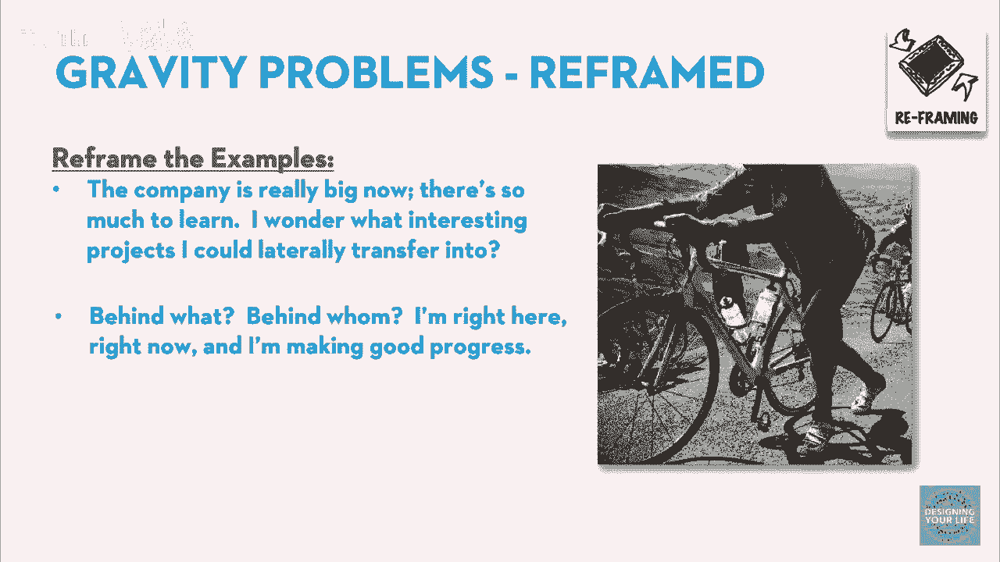
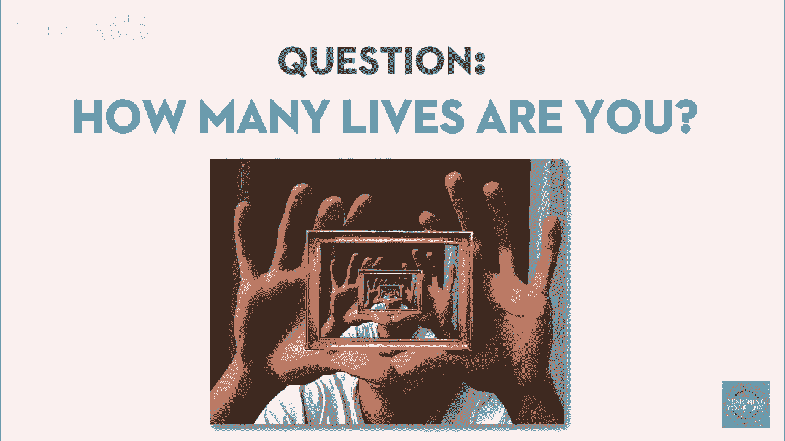
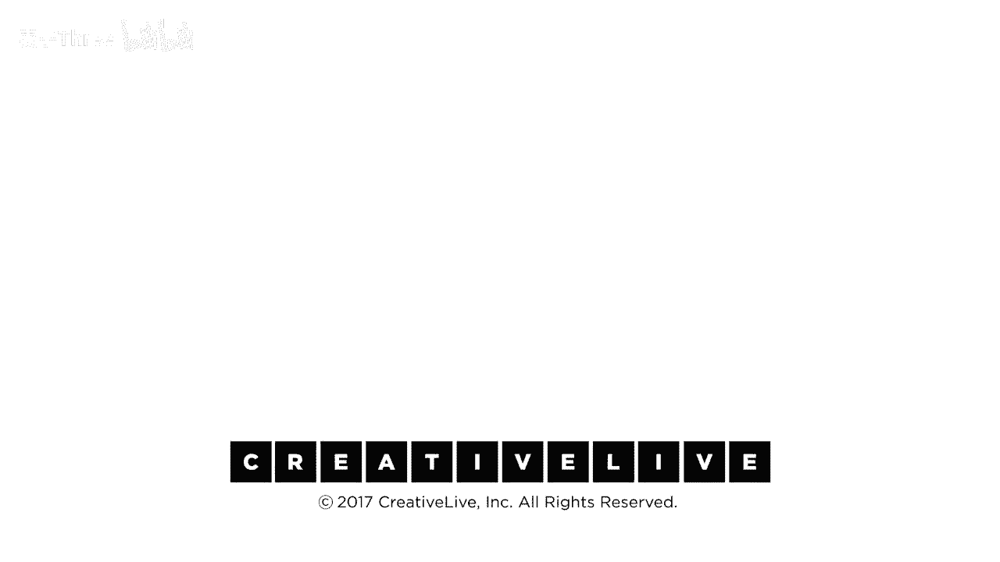

# P7：07-DesigningYourLifee-EvansBurnett-GravityProblemsAndReframe-HD - 麦子Three - BV1tzDVYHEGb

We're going to talk about gravity and gravity problems because one of the things we notice is that a lot of people and you guys are so far super smart folks。

 you're really good at solving problems。But you got to find good problems。

 If you want to work on the things that we're talking about。

 how to have a more meaningful and and more fulfilling life。

 So this idea of problem finding comes up again and again in design thinking。

 Are we working on the right problems？ And there is a particular class of problems。

We're going to work on defining and reframing as a particular class of problems。

 we call gravity problems。 and we call them this because they are the kind of problem。

If you can't do anything about geez， Dave， I don't you know， you're a bicyclist， right。

 Yeah cyclcyclist。 I noticed that as you're biking as you get， you know。

 I don't know maybe it's older or something， but it seems like you're going slower and'm going slower。

 I notice I'm going up a hill slower than I'm used to。 I look down。

 I'm actually in even a lower gear than I used to be。 It's very disappointing。

 I figured I what's going on。 It's this gravity stuff。 yeah。

 it's holding So gravitys not working for me at all。 And I really have a problem with gravity。

 Can you help me。And my answer is。No， I cant help you。 Gravity is not something that is actionable。

Dave could get a lighter bike。 He could get more gears。 He could， you know。

 he could I do have this problem。 That's right。 Yeah。

 but he cannot change the fundamental fact that gravity exists。

 And there's a lot of gravity in in problems in our lives。's's they sort of show up like this。

 and they sound like this。 gee， you know。😊，When I started out， this was a little start。

 But now the company's getting so big and it's really hard to get to the top anymore because it's so crowded。

How do I， can you help me fix that， You know， Well， is that fixable， Hey， I'm really。

 this is that that dysfunctional。 I'm three years behind where I should be。

 I should be ahead of where I am right now。 How do I catch up。 Or， you know。

 I've just got this amazing overseas assignment。😊，But I got it to be near mom。 You know。

 dads just passed， and mom needs support。 But I want to go to take the Hong Kong deal。 What do I do。

So these look like real problems， but they're actually not solvable。

 There's nothing you can do to solve them。And so what we say with gravity is we need a reframe。

We need to take the problem and just accept that this is the kind of problem that cannot be solved。

 You cannot simultaneously be in Hong Kong and in Palo Alto。 At the same time。

 we know of no way to do that。 Your problem isn't coming up with a better idea to change gravity。

 There is no idea。 There's only except。Now， once you've accepted。

 you have the opportunity to completely reframe what the problem is。

 Let me show you how that kind of works。 So on the， hey。

 the company's too big and it's hard to get to the top。 What do I do。Well。

 there's nothing you can do。 It's not a startup anymore。 So just accept that fact。

 And now there's lots of people in line ahead of you for that vice president's promotion。

 So you're not going to get it。 You're certainly not going to get it on the timetable that you thought we were working with a very big company on the valley。

You use their thing all the time。 Can't tell you who they are。 And that's the problem。 And just be。

 hey， I when I got， when I first got here， I was getting promoted every six months。

 And now we're a giant company and we're not getting promoted anymore。 I don't like that。 Well。

 the reframe on that。 first of all， you accept it's not a startup。

There's only two things you can accept it。And then decide to work with it。 So， look。

 now that the companys so big， there' are so many new opportunities for me to have roles where I could learn something。

 I wonder what interesting projects I could transfer to and it be a lateral move instead of a vertical move。

😊，That's a perfectly valid reframe。 Once I accept， I'm not in a startup anymore。

The other reframe would be。O， the company's too big。

 I'm going to move to a startup because I love that energy of constant motion。😊。

But if you stick with the problem of。But here I am now at Facebook， Google， whatever。

 And it's too big。 And I don't like it being this big。 Can you please fix it。We're design guys。

 We can't fix that problem。 It's not actionable。 It's just a circumstance。Hey。

 I'm really three years behind。How do I catch up。This one is my favorite。

 this is that dysfunctional belief。This ones， there is no reframe。You're not behind。

 What are you behind， Be what。Behind some expectation you had of yourself。

 But that was based on a plan。 And reality got in the middle of that plan。

 and it didn't work that way。And I'll bet you spent some time of that three years doing something that was incredibly valuable。

 So you're not behind。 you're not behind your timetable。 You're not behind anyone else。

You're right here right now。And this is the place that you can move from。

 Once you accept that this is the place you can move from。

 And what's available from here going forward， gravity just disappears。

I' love to take that overseas assignment。But I got to be your mom。Hong Kong。

 I got solve the mom problem。 What do you have my mom， well。You know， I， I， look。

I defer this and decide that right now， for the next year or two， I need to be with mom。

Ca she's by herself for the first time in， you know，40，50 years。 So that's my choice。

 I don't get to do both things or。Or， he mom。Time for an adventure。

 Want to come to Hong Kong with me。Let'll see how that goes。 One way or the other。

 I'm not dumping mom。 Okay， she's either we're doing mom here。 We're doing mom there。

 make a real choice。 But I'm not solving mom。 It's truly a radical acceptance， right。

 that the situation I am in right now is the only situation available to me。

There's nothing I can do about it。 I can't change the situation。 It's not a problem to be solved。

 It's just the way things are。 Once I sort of accept the things you cannot change philosophy。 once I。

 but once I'm there， then I'm free to reframe。The problem and create some new space for me。

Maybe mom comes with me， maybe I just don't take the promotion。 What's the big deal。

 Maybe you know I just decide I'm not behind， I am exactly where I should be right now。

 and by changing the way I framed this problem， I moves out of gravity into acceptance and from acceptance to something I can do something about。

So obviously， we would like you to try this。 you all have a little gravity worksheet。

 It's a reframing exercise。When you were looking you know。

 at your worldview and life view and also at your dashboard balance I of balance。

 were there any challenges that came up for you that you think might be， In fact， gravity problems。

 They're just actually a circumstance， not a problem。 There're a situation。

And if you could identify those， there's a thing on your， on your form there。

 See if you can write down one or two things。That you've been working on wrestling with for a while。

 probably stuck on something you've been stuck on that might it might be might not be a gravity problem。

 we'll decide after we do a little more analysis， but something that really has you stuck and something that's kind of serious。

Either a decision you're trying to make or you're trying to have it all。 there's fear of missing out。

 I want to have everything。 I don't want to want to have it all or another place where in your life。

 you are stuck either in work or personal things that gravity is in fact impossible to change。

 You say， well， actually， I mean， somebodys gonna get that vice presidentsidency at that large company。

 I still want to go for it。 Even if my chances are one in 1000。 It's not impossible。

 Its the risks are really high。 The probabilities are really low。 that's up to you。

 So that's technically not say no， I'm gonna go for it anyway。 Well， okay know。

 but if what you're up against is a really low probability thing and you want to treat as not actionable。

 There's such a long shot。 Do I really want to wait around for that。

 Maybe I should think about something else。 That's what we mean by gravity。 spend a few minutes。

 See if you going identify one or two of those。And if you're not sure what you're stuck on。

 it that thing you've been complaining to your friend or your spouse or your special other for a long time。

 but nothing's happened， that's probably a gravity problem。Okay。

 if everybody's got one or two things on there that you think might be in that category。

 Here's next the next thing。 We'd like you to look at that idea。

 See if you can take take the problem and just say， okay， I accept that， company's too big。

 I can't get a promotion or accept that I'm not late。 I'm just who I am。

 Can't make any who as a poet。 Can't make I'm a CEO making seven figures。

 but I really want to be a poet， but I only want to be a poet if I can make。7 figures， right， Okay。

 So it's a gravity problem for whatever reason society does not pay poets that unless you're a rapper。

None of you look like a raper to me， but maybe there's some latent raper out there in someplace。

 But so so accept it。 And how could you think about how you might be able to reframe it so that it becomes actionable。

 You're going to probably have to take the problem and flip it around or do something new with it in order to make it an actionable thing and then identify after the reframe。

One or two really simple things you could do like you could do this week or next week to start exploring whether you can you know。

 whether you can defy gravity， whether you can unlock that problem in a new way。

 So a reframe and a quick bias to action， what could you do to change the outcome。All right， now。

 as you might imagine， we're going to ask you to share that in pairs。

 just talk to the person next to you。 and if you're at home and you've got a friend or something。

 or if you want to just send in some comments， we can help you with that。 talk to each other。

 share what the gravity problem was and what your reframe and action step might be and then。

Talk amongst yourselves。 Certainly， I think I have two gravity problems。

 but I don't think they're like expansive gravity problems just more so on the smaller scale。

 but currently I'm traveling for a half a year and I。

Can't go every place that I actually want to go within the time frame as far as like national parks and places just to visit and camp out and do photography。

 the second problem is I start finishing my undergrad at U Penn in this fall So I think the gravity problem there is all right what am I going to study like there's two a different areas whereas there's a current problem and then a future problem and what have you been studying up to this ball I've worked in the compul industry as an artist the compul industry like doing even studying a Penn Oh no I just start in the fall is common up Yeah wow yeah so I'm like I don't know what I'm going to do but yeah。

 I was military before that and then I say you didn't seem like you were 18 years old。Baby。😊。

So I mean， that's so what are your steps？How do you reframe that？

Knowing that I can always go back to the places that I missed。

 so acknowledging that and possibly just picking the places that are best on route and accepting that that is what it is and don't get hung up on it。

 you can always go back hopefully they'll be there。They should be there。So is it more？

exciting or more practical to do only a few things and enjoy it versus doing a multitude of things and being stressed about it you know。

 I had some friends who were in their 50s or something。

 but they made a lot of money and they decided to go finally go around the world wow and they decided to do it in increments rather than go for a whole year sometimes these are the really big problems。

 people like whoa， I mean I've been struggling with this problem for a long， long time。

 sometimes people have some real attachment to these that may raise some questions。

Any questions or observations about interesting having like me do the reframe。

 having a paradigm shift you know， for example， being a project manager in construction。

 right you can， you know， that can be a hammer on the job site or that can be， you know。

 being of service to others not just your client。 but the entire team。

 So like having that shift is typically there's kind of an aha moment where you realize， well。

 wait a minute。 I kind built this prison。 I could change it。 Yeah I have key。

 What's this key for anyway。😊，So I have a question about whether or not I'm reframing correctly。

 and Nina helped me like see this framework essentially， where I work in an infinite workplace。

 There are no boundaries， There are no rules。 I can do whatever I do as long as I bring in money。

 keep clients happy， No problem。 Lots of freedom， No guidance。 Yeah There you go。

 And so that's the gravity problem， That's， that's just the way we work， It's an infinite workplace。

 And then I was thinking a reframe is to create my own boundaries to essentially develop a finite game within the infinite game。

 But I'm now thinking， I'm stuck on。 is that actually a reframe or is that me trying to actually solve a gravity problem。

😊，I would say it is a reframe because if you think， oh， I'm in a structureless workplace。

 what do I do， I'm supposed to make it up every minute of the day。 Who life is improv。 It's like。

 totally go for it。That's the rule， the rule is I have to live in an unruled place。No一 don。

One of the rules in the unruled places is， if you want a rule， you can give yourself one。

So the reframe is actually taking it so seriously that no， no， no。

 I'm the disciplined person in the anarchy company。And that's totally working for me ha。

So that's absolutely rera。 Abute。 Good job， trip。Sureman， yeah。Just out of curiosity。

 how would you solve the rapper problem？The poets don't make enough。pers fine。 Yeah， Yeah。

 the don't make enough money。 Well， my reframe is。There's things you do for money。 And there's no no。

You can't solve the problem。 You're gonna to reframe it。 Well， first of all。

 I accept that I'm not gonna make any money as a poet and that there are things that you do for money and there's things that you do for love。

 And， in fact， there's a pretty good argument that I should not do things I do for love on the market' terms。

 because then I'd have to write the poetry you like。 I only want to write the poetry。

You know that I like。I know。I'm working at Starbucks and I'm a poet。

 or I'm the CEO who writes poetry on the side。The guy who went to Tahiti， the painter。

Was an accountant。 He was an accountant。 And then he did painting on the side。

 and then he left his family and he， which was a bad thing。 But， But but， you know。

 there's always a way And also sometimes just separate， why you do。

 Why are you doing this in the first place。 And， and particularly for things that you do for love or for expression。

Be careful about putting them on the market' terms。 That's not necessarily the best place for them。

 Keep in mind， the boundaries， the， the laws of nature that caused that， you know。

 CEO Po to have a problem included。 And I have to make 7 figures。 So you're in charge of that rule。

 too。 So you can say， or。I really want to make a living as a poet。 I want to do poetry all the time。

 I accept that you only make about $15000 a year doing that。I know。

 I have to learn how to creatively live on $15000 a year， which， by the way， you actually can do。

 or I guess the， the following question for me is， is there a way to meld the two。

Meld the creativity with the CEO is that in another reframe awaited it？

Is there I don't you conduct all of your board meetings at of crows and poetry。

 Its like maybe it's not poetry。 Maybe it's not the CEO。

 but is there a role like I think there's vocation and avocation？ Can those two things。

 Can you have a life with both Ab， But I think you'd have to respect the rules of business and the rules of business are。

 know， this is about this。 It's not about this other stuff。 So you can you can have both。

 but theyre probably going to live in really different domains。 And then the only question is。

 can you， can you make that work。You can prototype。 What does it mean to be an executive poetically。

O， so I can try to live into that。 But there's not a universe。

 We do not believe that the universe has a rule that you're supposed to be able to do all the stuff you like all the time。

And get paid really well for it。I don't see that rule lying around anywhere。

 So if that rule is informing， I know I'm I' gonna to cram these things together。 You know， I love。

 I love beer， and I love ice cream。 I know a beer milkshake。 I actually tried it。 Ba idea。 Okay。

 bad idea。 You know， not everything goes together。😊，Great。

 so we have questions coming in from the online audience。 So these two are kind of similar。

 I'll start with this one posted by Shaannessa Quadri。 hope I said her name， right。

 But they say I have a nongravity problem。 I just have to act in order to solve it。

 But their issue is procrastination and laziness。 And we've seen a few variations on this。

 Like how do you deal with that。 Is that a gravity problem。

 What is it about laziness or procrastination。 It feels like it kind of bos you down。

 But is that a gravity problem， You know， I don't think that would put that in。

 because it's actionable， I can do something about my inaction。😊。

I don't like the term lazy because that's pejorative。 But a lot of people procrastinate。

 And that's why our methodology is set the bar low pick something really simple。

 What could she do this this week to get action going on something that she's curious about。

 So if you set the bar low and you have really small accomplishments。

 but you start stacking those up， you'd you'd be surprised at how quickly you notice， hey。

 my behavior used to be procrastination and now my behavior is a bias to action based on my curiosity because curiosity pulls me into my future。

 So it's totally actionable， not gravity and quite common。 really pernicious procrastinations。

 by the way， maybe an invitation for a rera， reraming is much bigger than just gravity problems。

 just that all gravity problems need a rera。 So if you can something procrastinated on forever。😊。

You could reframe it as a thing I'm choosing not to do。

 So you literally cross it off as not worthy of your time and act like you're not late anymore because it's just over。

 And then if two weeks later， nothing happened， drop it。Okay。

 I've got one more comment I want to read here。 This one comes from Janise。

 who says I'm a creative person who has always done and felt stuck in practical analytical work that's boring。

 But now I see that my strength is in creative problem solving。

 which can definitely be applied to something new。 and it's also in line with my lifework views。

 So sounds like she sings some progress as she works there's a high in actually the strength and these other things are not in opposition great。

 great one more question that we' I to ask about shame。 shame。

 as far as a source for procrastination in the sense that I know I used to be a magazine editor of a big magazine。

 new everybody in the field five years ago。 and now the field has changed and I've moved to San Francisco where I've lived before。

 but San Francisco has changed a lot in the last 20 years And so， you know。

 I'm usually very good at know putting together lists of people and going in networking and all that stuff。

 but I've had this thing。😊，Item on my do do list， build contact list for。A year now or more。

 And you know， and it's like， you know what I mean。 And I'm not doing it。 And I， you know。

 And I think it's shame。 It's like I used to be a big cohona in the media world。 And all of a sudden。

 I different place And I， you know， anybody going return my email。

 Is anybody I going know who I am so maybe shame And I put that right next to fear。

 The number one thing that holds people back on almost all of the biased to action。

 things that we suggest is fear。 It won't work。 People will laugh at me。

 No one will return my email that would result in some， you know。

 shame because I have this image of myself。 and and it's not being reflected back in the world。But。

 but fear so fear is one of the things we absolutely know how to master， right。

 This notion of guided mastery， the work of Albandurra on， on phobias。

 people who were terrified of snakes and getting on airplanes and stuff。

 We totally know how to cure that。 And it is about this methodology A very small steps taken over and over again to build up what we're going to talk to you about as failure。

 immunity， and then a nice segue into something we're about to talk about our takeaways for this is acceptance is the first step。

Because until you'd say， okay， this is a nonslvable thing。 Therefore， it's not a problem。

 It's simply a situation or a circumstance I find myself in。

 that allows you to reframe something that could be actionable。And that。

 then the result of that is you have freedom to make more choices。

 And that's what we're really after is the freedom to move from where we are to the next step。

Procrastination， fear and other things notwithstanding。 We've got to take that next step。

 the biased to action。Okay where are we in the framework， Dave， Well。

 apparently we're moving down into're moving down into sort of a real guts in the heart of design thinking a design thinking。

 if it's known for anything， it's known for ideation。 lots of ideas。

 even wild ideas and prototyping pro iteration。 That's really the core of how design thinking is different than say engineering thinking or analytic business thinking。

 So we're gonna jump into that which means we're now gonna have to address one of the really big monster dysfunctional beliefs。

 My personal favorite which is are you being the best version of you are you sure is this really this thing you're doing is this it is this。

 I this the one， was it that one other one， because I mean。

 you're not settling are Are you settling settling Oh God no。

 don't want to settle all the cool people don't settle。

 know But here's the problem with this you heard this kind of thinking。

 I this anybody been beet by this really the best version of me。

 Theres a common comment in the modern culture， The meta narrativerr we live in includes this dial。

I'll go on， but here's the problem。There's no such thing as the best you。

There are lots of versions of you。 One thing Bill and I have noticed， you know。

 with thousands of people we've been working with is almost everybody seems to agree that they have more aliveness within them than one lifetime will permit them to live。

😊，There's more than one of you in there。Now， there's more than one legitimate version of the way you could live your life。

 It's truly authentic to you。 and it's noble in the world。 and it's allowed。 I mean。

 there's not just one exact。 You write your life view and your work view。

 It doesn't give you an immediate action plan。Lots of ways you can still be authentic within that framework。

 right？So if that's true。Then there is no such thing as the best you。 You know， in business。

 you often hear this line， well。Good is the enemy of better and better is the enemy of best。

 are you being your best？What are you really going for it？But at best is a singular。

 exclusive outcome。 It requires one set of criteria by which you judge everything。Look， you I， I。

 you know， I'm 63。 about to be 6。 I got four grandkids now。 I mean。

 is my grandfather self better than my educator self。Is my teaching。

 Dave better than my startup Dave。And they're all still running， by the way， You know。

 how do I compare startup Dave to grandfather Dave， who we call Popppy， by the way。Well， you know。

 Luke， my grandson doesn't care about CEO Dave at all。 You know， these are not comparable。

 The problem is the rest of that little allegory is。

 and the false best is the enemy of the available better。 If you're stuck on this problem。

 you decided you have to be your best self and there's not just one。

 you just decided to be unhappy for the rest of your life。Don't sign up for that。So the reraing is。

 look， there are lots of great use。It's never too late to get going。You know。

 so the reframe is let the odyssey continue。 the Odyssey of our lives。

 If we want to get down the road and have this adventure continue， then how would we do that。

 Well we got to do that first， we got to answer a question。 What's the question bill。 Well。

 this is a little weird。 But I want to do a thought experiment with me。

 I'm I'm going ask you in a second to shout out a number of how many lives are you Daveve just said。

 we have more aliveness in this than we can possibly ever live。 And here's one of you。

 Here's the thought experiment。 So down at Stanford， we have the linear accelerator。

 It's a two mile long accelerator， used to be the biggest one。

 And then some Europeans built one that's bigger。 But it's still pretty cool。

 And we've actually come up with a way of putting you in the accelerator tube。

 firing you down two miles accelerating you almost to the speed of light at which point you would experience with the physicists called a multiverse。

😊。

That there are many， many universes all right next to one another。And that in those multiverses。

 you could be。Your， I wanted to be a garbage fan when I was little。 I'm a garbage man。

 I'm an astronaut。 I'm a a teacher。 I'm whatever you can have as many lives as you want。

 And because of this experiment， you would actually be aware of each life。😊。

Each life could could unfold and it would be wonderful， exactly the way you wanted。

 You could have as many as you wanted。 If some some lives are so cool， you'd love to do them over。

 you can have doovers。 My daughter Lisa wrote dumbumbo 42 times one day。

 you can have three versions of the exact same thing。 but you can have as many as you want。

 The only problem is accelator time is expensive。 So you need to tell me I got to reserve how many multiverse slots you want。

 Okay， so that's the thought experiment。 You can have as many parallel lives as you want。

 you'll experience all of them and know how wonderful they all were。

 You don't have to make any compromise in this model。😊。

You can be the ballerina and the astrophysicist。 fineine。 And the circus clown was cir to sole。

 which I always now want to be because that seems like so cool。 You can consult with all of Bain。

 Deloitte， McKinsey too， Should do them all。 Yeah， you can have right。 So on the count of three。

 Just shout out your number。 How many slots in the multiverse experiment。

 Would you like to hold for the lives that are inside of you， Are you ready，1。😊，Two， three， 1714，8，8。

 infinity。Every time so every time we do this， we get slightly different numbers。

 this group seems like there's a there's a yeah high maximum or like 12 issues an average， 12，14。

 Okay so the point of this actually， if I put you in the accelerator and fired you to the end of the thing。

Your body would compress into an infinite mass and you'd explode。 So not， It's not true。 you get one。

 Plus， it's a vacuum。 you'd be dead before you got to the other end。 So， but but it's。

 it's really interesting that when you start thinking about it， like， well。

 how could there be one best because the path that got me here is reasonably random。

 I made some decisions。 But a whole bunch of other things happen that allowed me to make those decisions。

 The path forward， it's probably going have the same level of intentionality and uncertainty。

So I can optimize a bunch of different versions of myself。

