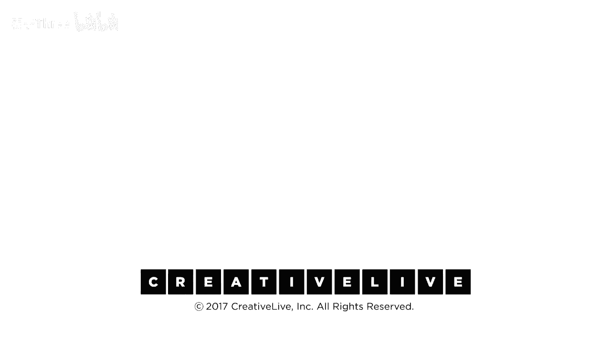

# P8：08-DesigningYourLifee-EvansBurnett-OdysseyPlanning3AlternativeFutures-HD - 麦子Three - BV1tzDVYHEGb

构思未来的时间到了，是时候构思你的未来了，不是，这不起作用，是时候吃掉你的未来了，因为当然有你们不止一个，我们将限制你仅仅在今天有三个，我们没有足够的时间来想出三个版本的你。

所以我们将实际上做我们称之为奥德赛规划的事情，这实际上是奥德赛构思，这些不是计划，但，这些是想象的可能性的想法集，这意味着我们要做三次，我们将在一个单张纸上给你，奥德赛计划工作表，你将想出三种不同的你。

那份工作表正发送给你，如果你在家远程工作，你肯定想拿到那份工作表，这很简单，大约十五分钟后，你将会有很多以前从未有过的想法，相信我，成千上万的人都做过这件事，你也可以做到，所以拿着它，让我带你走一遍。

这看起来像什么，在你手中，是的，我们会一步一步教你，你会非常清楚，具体该怎么做，因为这看起来有点奇怪，所以你会看到三个不同的板，看起来就像，我们现在展示的这个，它在顶部，它只是五年的时间段。

为什么五年的账单日期，因为两年太短，十年太长，这是一个非常精心思考的练习，五年是我们能想到的最远的时间，两年是所有计划的时间，真的，顺便说一下，这个时间线将包括主要里程碑。

这个版本的你的人生将包括职业里程碑，个人里程碑，各种各样的事情，我们会给你一个非常详细的例子，所以你知道这些可能看起来什么样子，在你做完时间线之后，然后你想给故事起个名字。

这个故事的三到六个字的标题是什么，你知道最后写诗或者任何可能的事情，你知道无论它是什么，然后我们来做仪表板，你对自己的想法感觉如何，仪表板是一些仪表，你会往上看说，我如何思考什么。

现在我认为的仪表是你不习惯的，所以有四个资源，这仅仅意味着，你是否拥有实现这个想法的原材料，培训，金钱，联系，无论它需要什么，如果你要过这五年的生活，你是否拥有所有坦克，你是否，我喜欢热到冷。

你知道这是不是我真的很兴奋的事情，我真的不知道我如何感觉这个东西，情感自信，我的信心是什么，如果我实际上这样做了，它实际上会发生，顺便说一下你可能认为自信和资源只是在问同样的问题两次，不，不是。

资源是你的客观大脑，分析你的状况，自信是你的情感直觉，告诉你你对它的感觉，你想要这两个输入，最后一致性，这是今天我们早些时候工作的真实东西，如果你这样生活，你的工作和你的契合，如果我这样生活。

这是不是我真正的我，真实的，这不是一件事，但它是你作为一个人领域的真实，这是不是真正的我，还是这，哦，是的，我妈妈会喜欢这个计划，你知道，这很好，事实上我有一个客户这样做了，他说，哦，这真的很有趣。

戴夫，然后我注意到我所有的三个计划都很低，我该怎么办，我说，你计划四、五、六做了吗，你知道现在你已经把那些从你的脑子里清除了，这就是仪表板的样子，你完成了仪表板，天啊，这个看起来怎么样，好的。

所以我们不会告诉你，一个由我们共同认识的多个女性生活构建的故事，我们将她们融合在一起，称她为安，那么这就是安，她是，你知道的，在她职业生涯的中间阶段，她是一个成功的人力资源工作者，在企业界工作。

但曾经她认为自己想要和孩子们一起工作，那么现在是否是改变的时候，所以安在那个地方，现在是改变的时候了，不仅仅是一份新工作，而是一份新职业，顺便说一下，现在的研究表明，大多数人有两到四个职业。

不仅仅是三到十个工作，所以你知道，可能是时候开始另一份职业了，所以首先她想到的，因为她是个商人，她是一位非常成功的高管，她知道如何管理事情，我要创建一个五零一C三，我要组织这件事，我要，我要，你知道。

原型化课程大纲，我不会从零开始构建这个，事实上我决定专注于阅读理解，我想与高风险人群合作，我20多岁的时候，孩子们，我大概认为你知道，也许我应该那样做，所以我选择了商业路线，我现在正在考虑那个想法。

很多人在阅读理解方面做了很多工作，我可以去学习，谁有最好的东西，我可以开始部署并弄清楚如何围绕那个服务进行扩展，我希望随着时间的推移，这将对很多人产生重大影响，这是我在做的另一个小项目。

这将成为我的新事业，这就是商业部分，这需要做很多工作，我想起了那个男孩，别忘了家庭，这是生活规划，不仅仅是职业规划，你知道，她正在接近父母开始新的生活的阶段，你知道，我们需要考虑他们去哪里。

我们已经召开了家庭会议，幸运的是，父母说，顺便说一下，我们希望你们孩子们知道，我们不想和你们住在一起，孩子们说，好的，我们也无所谓，但我们必须找到一个地方，让父母最终可以去，让我们一起做，作为一个家庭。

这也意味着，在我们忘记之前，我们要记录家庭故事，你知道整个家谱，家族的历史，只有父母知道，他们都是他们家族的最后一代，他们都是独生子女，如果他们去世而没有留下后代，记录这个故事，它将消失，我们得。

别忘了做这件事，说到写下故事，我不知道我在做什么，我曾经对儿童感兴趣，但我对这个一无所知，也许我应该去读研究生，学习一些这方面的知识，我最好在第一两年做这件事，因为当这件事开始扩大规模，如果这行得通。

我真的很忙，所以我得现在去做，那将很有趣，说到要做的事情，所以我得现在去巴黎，让我们回到巴黎，我和Zoa dan，你知道，当我们结婚时，我们，我们在巴黎度了蜜月，他说，每隔两三年，我们会回到巴黎。

我们会继续回来，重燃那种从未真正发生的浪漫，我们从未回过一次，所以我们得补上，我们最好在回家的路上去加拉帕戈斯，因为很快它就会沉入海底，我想在它沉入海底之前看看它，海龟们都得离开，好的男孩。

那真是一个相当有趣的生活，如果我那样做，我可以领导，我应该写一本书，那将是与安一起生活，那有多酷，我对那感觉如何，我的仪表盘看起来怎么样，你知道我的资源状况还不错，实际上我没有钱，我没有课程大纲。

我还不认识那些人，但我是个组织者，所以你知道，我真的很喜欢这件事，我的自信心比我的资源要高得多，因为我很确定我能搞定，我的逻辑性很好，实际上，她对此有点犹豫，关于那件事，我想到两件事，第一。

我真的很想忙起来，因为父母正在变老，我不能重新安排他们的衰老，我希望我不会后悔，我不确定，关于那件事，第二，我喜欢回忆，我曾经想要做这件事，我不确定，如果我真的在乎有风险的孩子。

还是我只是对曾经关心过他们有一种美好的怀旧之情，我曾经关心过有风险的孩子，如果我真的要这样做，这会有效果吗，还是我只是喜欢回忆我曾经打算要做这件事，这是很难理解的事情，我可能需要弄清楚这一点。

我对自己诚实，你知道也许不那么高尚，那就是现在，你知道以我的速度，我谈论它，她想象它，那就是你将很快要做的事情，但你可能会去三，是的，当比尔用线性加速器做奇怪的事情时，我说十四但三，我必须写下三。

如果你在挣扎，首先，如果你现在有三个疯狂的想法或三个非常不同的想法，很好，跟着它，但如果你是很多人之一，家里很多操蛋的人，也许我们工作的很多人，我不知道如何想出三个版本的我，我们会给你一个小提示。

所以这里是，如果你不知道如何得到三个版本，第一件事一件事一，你正在生活的生活，你正在生活的生活，跳进去，开始，这是可想象的，这不是客观的项目管理，只是假设生活非常成功，接下来的五年将非常成功。

那将是什么样子，然后假设你完全不允许做那件事，第二件事是你现在正在做的事情，那是整个行业的事情，整个领域现在死了，房间里的任何人这里真的有人做过谋生，没有人再做的事情了，你再也不能做那份工作了。

那份工作没了，是的，那就是你必须三次正确，所以你知道有多少人让我们看看，其他方式将喜欢谈论你想在12年后做的事情，但你真正希望的是我们不能因为它甚至没有被发明，希望他们找到这件事，你不知道你在找什么。

正确，如果这些事情都是真的，它们确实是这样，那么也许有一天，你可能需要做一些与你正在做的完全不同的事情，假设我必须完全重新开始，并且我必须让它开始，我会怎么做，最后一点是。

如果我能保证金钱和羞耻都不是问题，没有人会嘲笑你，你会有足够的生活不舒服，相信我，你会怎么做，金钱不是问题，没有人会嘲笑你，这是一回事，那是另一回事，那是第三件事，如果你需要一个备用计划。

那就是你这么做的方式，所以现在这个第三个是关于一个疯狂的，我们确实鼓励那种疯狂的想法，其中一个是疯狂的想法，就像那个圆圈小丑一样，就像你一直在想那个，我们希望它在那里，你知道设计师总是被贴上这个标签。

总是提出那些疯狂的想法，他们喜欢去翻看便签纸，想出一些不可能实现的疯狂事情，那看起来愚蠢，为什么我们要那样做，那并不愚蠢，那并不愚蠢，那是因为你的脑子，我们想和你的大脑合作，这就是以人为中心的设计。

人类的大脑是如何工作的，这就是它们如何工作的，当你有一个不错的想法时，内心的批评者会说干得好，我很满意，继续，你做得很好，你有一个疯狂的想法，内心的批评者会说，哦，那行不通，你真愚蠢。

你会在公众面前出丑，它会在你的大脑中建起一堵墙，保护你不受那些会让你在公众面前出丑的疯狂想法的干扰，问题是在那堵墙的另一边，与内心的批评者，那是在阻止你，大脑的不同部分，可能有一些隐藏的想法。

包括一些非常有趣和有价值的想法，如果其中一个隐藏的想法是大想法，这将对你非常有利，所以我们不想让这种情况发生，我们希望消除内心的批评者，并摧毁那个墙，你想要访问你所有的想法。

如果你强迫自己产生一个疯狂的想法，你将会打破你大脑中的那堵墙，你已经推迟了判断，并且你有了可能性的开阔田野，你的直觉可以更好地与你合作，我们之前做过这个，相信我们，这很好，至少做一个疯狂的想法。

这就是为什么我们做它，现在，是时候开始工作了，你有你的计划，你有你的文件，我们将给你十二分钟，你会发现，是的，哇，大约一半的人会在九分钟内完成，相信我，一旦你开始，这件事会进行得很顺利。

我们会给你大约十二分钟，如果你卡在一个，跳到第二个，来回切换，没关系，是的，尽可能填写它们，如果你卡住了，举手，我们会指导你，你知道像照顾孩子和去巴黎这样的事情，可以是三个计划的任何一个。

所以你不必在一个计划中不要有孩子，所以如果有一些东西在你的愿望清单上，它们会到处出现，把它们放在三个计划中就可以了，但确保在雪融化之前登顶富士山，但作为这家建筑公司的项目经理，或者另一个更大的。

那只是三个相同的，所以你知道它必须不同，并且其中一个必须是，你知道。

