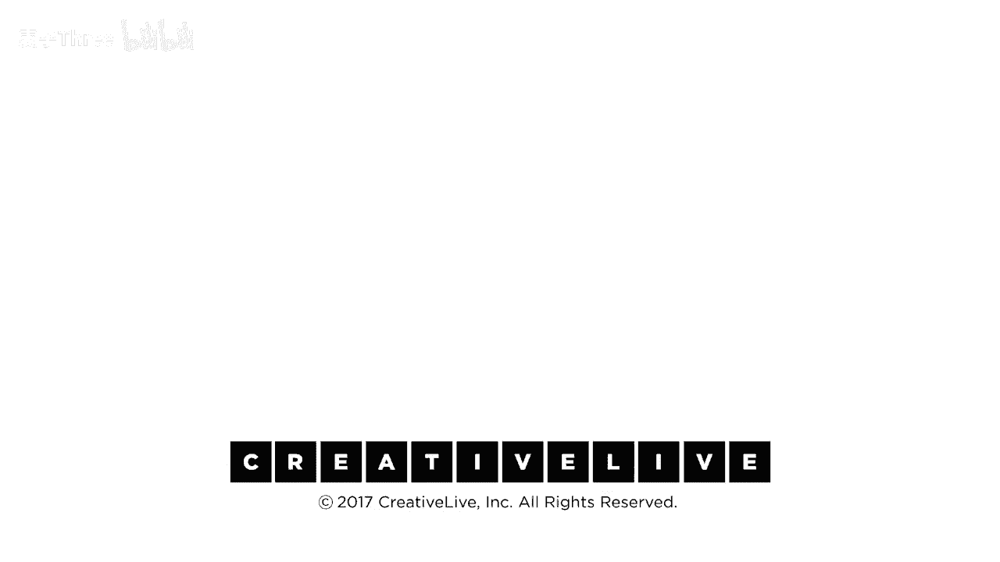

# P9：09-DesigningYourLifee-EvansBurnett-OddysseyPlanningDebrief-HD - 麦子Three - BV1tzDVYHEGb

所以我们要制定一个奥德赛计划简报，我们猜测我们要做什么，我们又要组成三人小组，但我们要混合一下，你已经和那三个人相处过了，你现在对他们非常熟悉，我们厌倦了和他们谈话，我们要重新安排，但在你们的桌子上。

所以每个人都要移动一两个人，所以只是物理上移动，所以几个人移动，所以你们在桌子旁组成不同的小组，现在就做，你们的简报过程对所有三个人都是一样的，你将花费8分钟在每个人身上，其中一半是他们谈论他们的计划。

其中一半你们三个人讨论什么，你们已经听到了，所以，第一部分，演讲者，每个演讲者将花费最多4分钟只是做一个飞行概述，那些计划，你们刚刚做了，那花了你们12分钟来写它们，你们会说你们想的那样久，你们会超时。

所以它是飞越里程碑的高光，击中你们仪表板上的反应亮点，等等给我们一个有趣的概述这些计划，第一，第二，第三，你们只是用你们的小纸条和我们谈论，一旦做完，听众，你们有两个任务要做，给两个人2到4。

如果你们能具体给出肯定语，顺便说一下，如果你想成为一个有效的肯定者，使用具体性就像那些很好，那是一个很棒的一组计划，就像，你知道，你知道，你知道，就像在安的情况下那真的很好，我特别肯定你认真考虑了。

你知道，当你能完成研究生课程或者在不在和做那在前面，这很清楚你在考虑序列和规划，并且你的能量随时间流动，在这方面你做得很好，哦现在，第一点更有帮助，第二点，这意味着我正在认真倾听，所以使用具体的肯定语。

我e，你必须认真倾听，第二件事是你注意到了什么，你想了解更多，哦哇，加拉帕戈斯说更多关于他们，所以只是指出一些事情，你可以使用技术，字面意思，问题是告诉我们更多关于那个，那不是像加拉帕戈斯，真的乌龟。

那怎么了，好的，那不是一个好问题，因为它现在是一个批评性问题，我们在社会中提出的大多数问题都是修辞性的批评，伪装成问题，你真的想买那辆车，好的，你知道，那不是我们在这里做的提问方式，我们做肯定，我们做。

告诉我们更多，四分钟的故事，四分钟的对话，我们会给你一个时间提醒，继续所以四分钟，我们将花费四分钟与，你知道，18个世界上最聪明的人在乎彼此的生活，一小会，这真的是一个很重要的时间，这意味着。

当然你想在完美的三角形中，你又在排成一排，得到那些好形状并准备，继续所以我的第一人生计划是我正在工作的，这是重启，公司的名字叫做重启excel，所以想法是今年我们在地理上和数字内容上都在扩大。

实际上我们是从一个母公司分拆出来的，这是我们第一次尝试独立运营，我假设我们会开发，这些产品，它们的成功我们会增长，大约一年半后，这将开始引起买家的兴趣，现在有一些人在跟我们交谈，他们可能成为我们的买家。

然后它就会被出售，我会说大约两年半后，我们会与买方绑定，因为这可能会是交易的一部分，所以还会有一年半到两年的过渡期，到这个新公司，以便让他们做好准备，继续运营，一旦我们知道我们已经足够投资。

我可以在那个时候离开，我将有机会参加演讲或为公司提供咨询，在这整个过程的背景中，有一些家庭义务，我最小的孩子正在她寄宿学校的海角生活，所以我需要找到这些时间，我可以在海角花大量时间。

这样她就可以成为日学生而不是寄宿学生，我有一个母亲，我们几年前失去了我父亲，我感觉她还需要支持，所以我需要确保有时间看到我的母亲和我的孩子，我喜欢旅行和锻炼，鉴于我们到目前为止在重启工作上的努力。

这基本上是一种平衡的生活方式，这当然适合我所有的需求，如果你不介意我先问几个问题，我会更明白，你谈到了产品，是的，是什么样的产品，我们现在在创艺生活，我们来这里是因为。

因为我们认为我们可能是未来的比尔和戴夫，实际上我们在向现场观众授课，然后这些课程之后会被卖给那些考虑重返工作的女性，她们不在我们提供课程的十个城市中，明白了，她们可以从创艺生活购买。

或者从另一个公司大学与他们购买，这就是我们坐在这里的原因，只是为了获得它，这就像它有一个媒体方面，我肯定有书或者，可能有一个30天的电子邮件，你将会每30天收到一封电子邮件，或者每天一次，连续30天。

这将帮助你走上训练之路，就像不同的材料，课程材料，或者在现场，然后有电子的，有个，这些都是同一条线，你的目标是谁，比如，你的生活是什么，我的意思是，比如理查德·布兰森，比如投资者方面。

实际上会是培训公司，或者可能是盈利的，提供培训的大学，这是一个有趣的目标市场对他们，我忘了，我是像，她为什么问我，我忘了，我们是双胞胎姐妹，分开了，然后过渡期总是有趣的，是的，你知道是否。

如果有人买像保险公司，或者像建筑公司，就像，哦，你得站三年，就像在那个过渡期间，是你的角色，或者你的角色是一样的，或者它是像一个退出计划，哪里是像，我想把它当作一个退出计划，因为我不想呆在被收购的公司。

我想我喜欢开始的事情，所以被成功启动，它将被购买，是的，是有点激动，所以现在我想过渡，并且继续成功，是的，在那家公司的手中，和谁他们雇佣的90天同一角色，90天培训，我得到了它酷，现在。

如果你在家做这个练习，并且你恰好独自一人，那没关系，你还是可以看那三个计划，看看这三者之间是否有联系，看看关于三者的组合对你来说意味着什么，很多人不会完全改变他们的生活并选择疯狂的计划。

但他们会从那个计划中吸取一些东西，并将它们融入到他们实际计划要做的事情中，再次，这只是一个航空示例，你不必，你知道，接受整个事情，你可以改变它，另一件事是，我们真的很鼓励你加入生活设计团队。

这样你就可以邀请一些人来吃比萨饼，和他们分享这个，也许让他们也做这个练习，你可以只使用这些工作表和我们已经进行的对话来主持，与配偶分享，一个亲人，一个兄弟，你知道的，一个真正了解你的人。

因为这样可以得到关于你所说的话的反馈，并且这些反馈会被反射回给你，真的很有趣，有时候，我们自己都不知道自己的真相，直到我们把这些话大声说出来，所以，如果你独自在家，你也可以做这个练习，它有价值。

但我们真的很鼓励你组建一个生活设计小组，至少一个人，并且与某人一起做这个练习，你可以稍后再做，因为我只剩下最后一个例子了，我要做最后一个，哪一个更疯狂，但有时我觉得这实际上很现实。

我们一家人一年前去非洲旅行，我被卢旺达完全震惊了，它完全从大屠杀的破坏中恢复过来，他们经历了种族灭绝，所以我在想，在我晚年的时候，当我的孩子们都安定下来，我不用担心，谁在哪里的想法。

搬到卢旺达并提供一些服务，因此，我们在重启中做的事情是开发一条创业轨道，因此，如果我的目标是在那里并帮助他们，提供创业服务和培训给卢旺达的女性，我可以完全想象生活在第三世界国家，以及这个地方的自然美。

以及人们的真诚，我们真的很喜欢吉姆詹姆斯，吉姆可以来，那是我丈夫，我已经告诉他，那就是其中之一，它没来，那是计划的一部分，不管怎样，所以这将是他们感谢听众如此支持的方式，那很酷，嗯，肯定语和哇。

第二位人士，我读过的三种植物，老实说，想象互相做，它们似乎都不是，你也可以顺序做，绝对如此，我的意思是，你不必放弃一个选择另一个，嗯，是的，我认为从肯定语的角度来看，我几乎认为二种是种引子。

我认为我必须负责我是否必须领导，或者我是否在一个委员会中，事实上我正在鼓励我的丈夫成为那个的领导者，这样我可以参与，但我不必是领导者，这样我可以继续做我真正喜欢的事情，但你在这里设定的里程碑，是的。

如果你在某种程度上在两种中做类似的事情，几乎是一种通往三的阶梯，绝对绝对你知道我的意思，因为你有这个，是的，我刚卖了一家公司，然后我可以，我意思是你可以，即使你做了这个成功，带到卢旺达，是的。

我肯定有同样的需求，正是如此，是的，多么连贯的猎豹，并且这回到了，你将活到120岁，并且这是一个团队事情，虽然，就像一旦你让这个运转起来，我们之前提到的，围绕你建立那个团队，是的。

所以这仍然继续在Casa进行，继续在那里运营，是的，是的，我可以去做任何我想做的事情，我刚完成的那个人，谢谢，非常感谢我们一起努力，你知道，嗯，听，是的，有两个人一起聊聊天，感觉不错，聊聊你的事情。

几分钟，不是吗，我的意思是，真正倾听，真正倾听，比如，真正发生的事情，你知道，这就是我们所说的生成性倾听，彼此倾听，你们中有多少人有太多可以倾听的地方，就像那样，是的，我们似乎无法为彼此做足够的倾听。

如果你养成了这个习惯，那就是一件好事，现在我们该怎么做呢，我们停止了那个活动，现在我们要继续浏览幻灯片，这样我就不会忘记前进，现在我们进行对话，所以我们刚刚做了大多数人在日常生活中不常做的事情，你知道。

这对我们来说又是怎样的体验呢，对话指南将发到你的桌子上，也可以在家获取，如果你和别人在一起，和一些问题，你对探索三种可能的你的想法感觉如何，这有趣吗，这吓人吗，这愚蠢吗，你对此有何看法。

你对这些可能的变体的评估有何感想，你是否发现通过你的反应来听到自己的想法的反馈循环，这是否让你从中获得了洞察力，比较和对比这些想法，是否让你感到有启发，对比这些想法，是否让你感到有启发。

这对你来说怎么样，然后真的，你从做这个练习中得到了什么，这是我们最后的问题，好的，现在我退后一步，你知道我们大约，你知道，40分钟你知道之前，我们开始了这件事，你从中得到了什么。

你从这次经历中得到了一些什么，你知道，与整个桌子进行那次对话并享受彼此，放手去做，我想一个事情让我感到印象深刻的是在我经历了我所有，你知道未来身份之后，德瑞克指出，你知道你可以现在就做那些事情。

为所有这些事情，并且为什么不能它们很糟糕，为什么不能一些它们同时发生，所以这有点消除了想法，它不是一个大事情，并且你可以现在就为它做一些小事情，所以它不必令人感到压倒。

我知道我觉得有点振奋和令人耳目一新，当你陷入那种单调的日常，我们之前提到的，哦，我一直在做这种日常，嗯它真的，打开了思维并且我想要保持创造力并且总是让那些资源达到100，是的，对我来说。

它把你的生活而不是被动的，主动的，并且你知道，掌握缰绳并设计你想要看到的生活，我同意你，一些这些开始时感觉有点不切实际，一旦你开始真的将它们分解为可操作的步骤，它们就像我们可以做到，并且那将很有趣。

并且你看，你知道那个像它米表并且你像，我们可能应该做更多那个，所以我们刚刚完成了这次旅程，我们做了构思，所以我们刚刚完成了这次旅程，我们做了构思，我们已经完成了构思阶段，设计步骤。

我们已经提出了很多不同的想法，如何构思想法，如何讨论想法，如何结构我们的会议，以便产生新的想法，你知道你学到了什么，你可能分享了一些这些，关于过程的任何问题，顺便说一下，关于你的具体计划，我们没有问题。

我们很高兴做计划，如果你喜欢的话，可以在午餐时间进行特定的指导，特别是关于奥德赛规划过程，有任何问题吗？你或者克里斯，你知道，云中的人们，无论是评论还是问题，任何人，是的，是的，请说。

我认为将一些想法写在纸上很有趣，然后你会想，如果我首先做时间跨度的事情，这比我想象的要现实得多，你知道，我们在谈论第三个，疯狂的想法，是的，倾听他人，谈论他们兴奋的事情，几乎不像其他人那么疯狂，是的。

是的，是的，我们都很疯狂，是的，我们知道，但是几乎像从自己的角度跳出来，然后放在那些不同的愿景中，真的很酷，因为每个人都对自己的话题非常兴奋，这是我们知道的，所以这真的很酷，站在外面的自己。

他说内心的批评者，你知道，你意识的一部分，现在也被称为观察者，有时候当你的大脑一部分吸引了那个人的注意，你知道，总是打击你的那个人，就像那个人总是打击你一样，你又要显得愚蠢了，就像你在六年级时那样。

你知道你要小心的那个人，但你可以有这个观察者，那不是真正体验的人，所以我们在这里给你一个机会，让你们彼此交谈，和你自己的观察者一样，你知道实际上，也许这可以工作，你知道，所以这是有可能的。

这是一个有结构地集中注意力的机会，这里有其他的想法，嗯，一个想法和一个问题，我们都在评论，与一群充满活力和创造力的人在一起是多么令人振奋，你知道，开放和富有创造力，你知道，肯定的，是的。

我们如何持续地在这个房间之外创造这些，以便我们能够持续地产生新的想法并且感到满意，按照书中所述，大量的数量并且是完整的派对，这个，这很容易在每个星期二做，你知道，我的意思是，你知道，凯西，你知道。

发出了邀请，你们报名了，我们邀请了你们，这并不是一个经过严格筛选的小组，但我们找到了六位生成式人才，在圣弗朗西斯科生活的一万八千位生成式人才，你知道，七万位圣弗朗西斯科居民，这比你想象的要容易得多。

只要有人愿意参与并努力工作，并且诚实地去做，几乎就够了，我的意思是，我们实际上已经做了，与数千名在健身房工作的人，与600人同时进行，是的，他们彼此都不认识，每个人都彼此尊重，是的。

在我们直播之前我们稍微讨论了一下这个，你需要一个容器，那就是你的队伍，你需要两个人或三个人，这足够了，你需要说，这将是一个安全的对话，你不必谈论任何事情，你不想谈论，人们会，你知道。

如果你提供容器和安全性，他们会出人意料地愿意参与，因为每个人都认为其他人的生活可能会很有趣，你所需要的只是一些结构化的方法来接近，那就是那种对话的小小支架，人们就会到场，这，关于人们我们倾向于喜欢彼此。

是的，我对你们的研究结果感到好奇，所以当人们做这个练习时，例如第三个想法总是最疯狂的，还是有一些共同点，你知道从分析角度来看，你们发现了什么，嗯，我们谈论过，我们在这个课程的一开始就谈论过。

但每个人都在不同的地方，所以有些人使用这个练习，因为他们正处于转型中，你知道我是这样的，现在我想成为那样的，但围绕转型可能意味着什么进行一些头脑风暴，这对人们来说非常有用，我认为，总的来说。

统计数据显示，大多数人会继续做他们正在做的事情，但他们希望，也许添加一些创造力或添加一些元素，那些元素并不在那里，大多数人不会跳伞，通过明确三个计划，我们发现，我们通常发现我们的学生，他们会说。

你知道我会坚持计划一，但是计划二中有些东西我必须在我的生活中，计划三中有些东西我再也不愿意放手，所以他们发现他们，他们通过，仅仅关注他们几乎已经放弃的事情来丰富他们正在做的事情，是的。

我们说我们要每五年去一次巴黎并重新宣誓，但我们没有做，你知道，而这感觉不真诚，现在我在想我的生活作为一个真实和连贯的生活，我不能，要么，我必须说我们不会做那件事，那不是优先事项，或者买票或者去巴黎。

所以他们不会，通常，你知道，跳跃，从一个ceo跳出来，成为一个诗人，如果他们，如果他们真的要那样做，那么他们有一种方式从一个事物到另一个事物，以一种不，你知道，扭曲他们的生活把他们的孩子从学校。

你知道什么，它主要是，如果人们正在找到方法修改和增强他们正在做的事情，通常，来自不同计划的想法是，你知道我想要跳那么远，我可以把这个移到这里，嗯，但我会说注意，有一种感觉，我知道我会做所有三件事。

如果我把它们折叠在一起并在上面放一个订书钉，我可以同时是三个人，你知道，因为世界确实想让我有所有可能，我可以做的事情，我们教一门课程叫做设计你的斯坦福，给斯坦福的新生和二年级学生，如何度过大学，体验它。

像一个设计师，并且我们的座右铭在那里，课程的口号是获取更多，而不是把更多的东西塞进去，所以我们的目标不是帮助，你有这么多想法，以至于你总是在为接下来的五年时间思考，这啊。

这是关于做出好的选择并在其中好好生活，人们很喜欢这个，在家的那些人，他们一直在做这件事，他们分享了他们的评论，谢谢，凯伦说，我对每个计划中出现的一些共同元素感到着迷，我很兴奋地看到一些一致的价值观出现。

肯德尔说，我很大程度上处于一个寻找和重启的地方，我有三个非常不同的想法，我发现某些方面一直在涌现，揭示了需要考虑的重要事情，当我在考虑，我余生的处境时，例如，创造力，创新。

解决问题的能力和流动性是我所有场景中的共同主题，非常感谢您分享，是的，是的，好的，我们接着进行，奥德赛，如果你们有多个想法，你们知道，并不是只有一个正确的答案在等着你们，你们想要所有的想法，想法越多。

越好，现在我们已经完成了我们的三个计划，我们应该做什么，我们必须选择。

