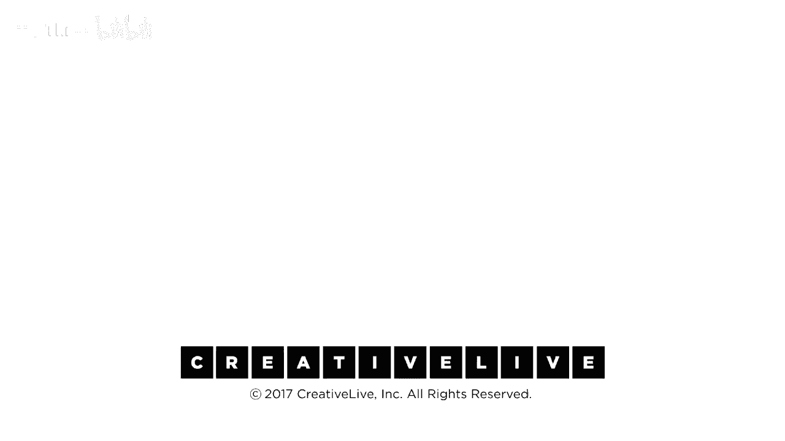

# 【公开课】斯坦福大学：人生设计课 Designing your life（21讲全）｜ 人生规划 ｜ 人生设计 - P10：10-DesigningYourLifee-EvansBurnett-IntroToPrototyping-HD - 麦子Three - BV1tzDVYHEGb

有很多想法，现在是时候采取有偏见的行动去做一些事情，让我们出发，你现在可以原型化任何事情，当我们谈论在设计思维中原型化时，我们并不是在谈论，我要去建造我卫星的一个完美的模型，以确保当我们发射它时。

它会很好，我们谈论的是一种不同类型的原型化，主要是，我们原型是为了提出一个问题，你们的计划中有一些有趣的东西，这很有趣，你不想知道更多吗，你不对这个感到好奇吗，所以提出一个有趣的问题。

也许揭示一个涉及他人假设的想法，因为你将要规划，你将要在现实中原型，然后是这个想法的，我在一开始就说过，你不能预知未来，但我们可以接近它，我们可以进行小实验，我们称之为原型，以便看看，嘿。

这是不是我真正想做的事情，在原型中是否这真的是我想要做的事情，我们必须确保建造成本低廉，它必须快速实施，我们还要学到一些东西，我将带你大致了解一下，我们如何原型化安妮的生活。

我们都将从你的计划中原型化一些东西，生活设计原型大致可以分为两类，我们称之为原型对话和原型体验，两者都非常有用，原型对话，你可能已经想过或者做过，我们称之为生活设计访谈，并且它在这个部分，你知道。

原型设计，我将尝试在世界上做一些事情，它也在，我将走出去，尝试通过使用我的同理心来学习一些东西，我的同理心工具，它也在下面的辨别力，我发现我的计划中有什么，那真的是对我而言，网上观众的评论说，嘿。

我发现所有的三个计划中都出现了一些东西，这可能是我心智的显著优势或者我生活的主题，所以我想要分辨，这真的是生活设计的采访吗，唯一需要注意的是忘记采访这个词，因为人们只是做工作，工作，采访都是为了资格。

你在寻找我是否适合这份工作，而你在准备你的小面试，扮演那个合适的人，忘掉那些，生活设计对话或生活设计面试真的是一场对话，这是你在寻求某事的时候，每个人都有 hey，告诉我你的故事。

做一个项目经理是怎样的体验，做一个。是怎样的体验，你知道，在开发一个视窗程序，所以比尔，你从经营设计咨询公司转变为现在全职教授设计，听起来很糟糕，我想知道你是否愿意和我谈谈什么。

这相当于从顾问转变为教师，是的，这可能是一个故事，我愿意分享关于这些原型的有趣事情，当你追求这些种类的原型，是，我们总是认为设定共同的目标是非常好的，所以无论是生活还是设计，设计一个原型，这种生活。

一次面试，这是一次对话的原型，分享共同的目标，我认为你很有趣，你也认为我很有趣，并且你愿意告诉我你的故事，因为我只是这么要求的，没有要求工作，没有要求推荐，没有要求任何东西，我只是真的很好奇。

在你们的世界里是什么样子的，因为我可能对那个世界感兴趣，这就是这件事开始的原因，我们2007年的对话开始的，这一切，比尔刚刚接受了这个职位，斯坦福大学新设立的设计总监职位。

实际上他是一家咨询公司的CEO，我给他打电话说，这听起来很有趣，我相信你现在的生活非常有趣，我对你的生活转变非常感兴趣，我们聊聊你的生活转变怎么样，我们度过了一段美好的时光，他请我喝了咖啡。

有什么损失呢，对吧，我的意思是，你知道，你知道，我们回到安的故事，安以前从未做过很多事情，她非常好奇，天啊，写一本书是什么感觉，嗯，她可以和人谈谈这个，她可能认识一个认识一个写书的人。

或者有一个图书经纪人，或者为出版社工作，或者有人做在线博客，有人真的在写作，现在写作一本书是什么感觉，这不是原型，这是全部，顺便说一句，这样做很糟糕，我们一点也不喜欢，我们再也不会这样做了，但你知道。

她可以通过与四个人或五个人的交谈来发现那种经历的本质，这些人要么在那个领域，要么在那个事情周围，那个事情，你知道，回到学校，我是说，她在职业生涯的中期，她在想，我不知道，回到学校，我真的想要那样做吗。

我想要在学校里，我想要那种经历，我们实际上让她去，上斯坦福大学的课程，坐在教室里，她担心千禧一代会欺负她之类的，我们完全没有那样计划，但她需要体验那种环境，感受那里的氛围，她没有那样计划。

但她需要体验那种环境，感受那里的氛围，但她需要体验那种环境，感受那里的氛围，但她需要体验那种环境，感受那里的氛围，所以，在那两种情况下，她都能找到人交谈，并获得一种体验。

