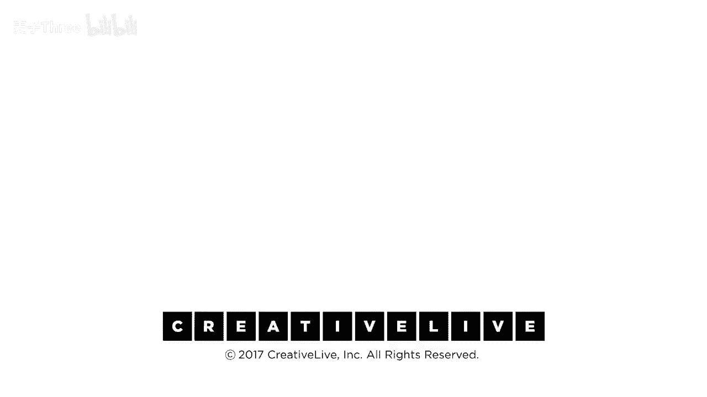

# 【公开课】斯坦福大学：人生设计课 Designing your life（21讲全）｜ 人生规划 ｜ 人生设计 - P12：12-DesigningYourLifee-EvansBurnett-UnicornHunting-HD - 麦子Three - BV1tzDVYHEGb

是时候解决冰山问题了，什么是冰山问题，根据你所看的市场，在任何给定市场中可获得的机会的百分之八十以上是看不见的，它们没有公开上市，我申请了所有东西，你们中多少人可能是你们的朋友，你知道我上网。

查看了一切，我寄出了250份简历，我申请了所有事情，但什么都没有回复，那总是发生，由于这个冰山问题，现在，你知道如果你在政府的公共部门，要求您可能发布工作，你知道那种事情，但是，非常经常地。

一旦他们放那个工作，坦白地说，已经签了名了。他们喜欢的人，他们只是迫于义务而发布，是的，每个人都在申请，他们都失败了，所以谁遇到过这个问题，我的意思是，你们怎么找到这些信息，所以我们将解决这个问题。

我们说我们，这意味着是时候去猎取独角兽了，我们去猎取独角兽，我们是否实际上可以找到这些东西，即使你不确定它们存在，而且很难看到，是的，你可以，这是一个非常重要的工具，独角兽狩猎工具。

这个找工作的过程是关于，所以，如果确实为真，高达百分之八十的工作从未公开列出，你将如何处理那些事情，你做什么，这是妹妹，那是你，那里是求职者，市场之外，这是市场的领域，世界的市场，无论是为了利润。

非营利，政府，无论它是什么，这不重要，无论你试图进入的世界领域是哪个，你所能看到的，只是这两份贴在外墙上的工作，你无法看到内部发生的事，这是个问题，嗯，实际上在这情况中发生的是，当然，正在发生的事情。

没有工作，正在发生的事情，有人们在那里，人们在闲逛，做各种事情，在各种公司和项目组织中做事，跨机构合作，人与人之间的所有活动，以及这些活动产生的机会，称为工作空缺，那些弹出的小星星。

表示我们需要一些帮助，包括你可以看到的外墙上的那些，所以你只看到这两个，因为你只能看到这些，当然每个人都只能看到这些，你去争取，每个人都会这样做，你知道，会变得非常拥挤，我的意思是，我们都有过那种经历。

那里似乎有什么东西，看起来很吸引人，很有趣，当你到达那里时，有一千个人正在想进去，对吧，人们会撞在门上，尤其是那些很酷的公司，你知道，我的意思是，哦，我知道，我想去工作，比如脸书，哦，好的。

你和这周有同样想法的另外十亿人，这真的很拥挤，我不想那样做，如果我想做别的事情，我该怎么做，我不进入工作，我进入那个人，一切都是关于人的，如果我能连接到那个社区，那个行业，那个市场，那个人。

他与那个协作网络中的其他人相连，正是在这些协作中，所以那个人知道那个机会，那个人知道其他人，那些人知道那些机会，就这样继续下去，直到我最终发现那里面有很多机会，那可能对我很有趣，一个很酷的事情发生了。

那就是那个黄色的机会，那个特别的黄色机会，是被我亲眼创造的，我正在和克里斯聊天，你知道，午餐时间，你知道，我在告诉他我们做的事情，你知道，我们用歌曲做的，他说，天啊，你知道，在那之后，你知道。

这就是我们一直在想的，这就是我们一直在想的，我们一直在想我们是否需要聘请一个生活方式的人，但实际上，我们可能需要一个生活设计，嘿，凯西，过来，让我们谈谈，你知道，他们开始谈论并说，你知道。

我们在考虑提交一个申请，你知道，我们需要通过hr证明，也许我们应该加一个生活方式的人，但可能不是，也许这是生活设计的问题，也许我们应该雇佣戴夫，你实际上看到了一个实时创建的机会，正在你眼前。

因为你在那里，这不一定是一个更好的机会，但这是一个很有趣的机会，顺便说一下，这经常发生，你们中有多少人经历过这发生过，或者你是那些做了实时创建的人之一，是的，这实际上是世界工作的方式，好的。

让我们也看看那些真正有趣的工作是在哪里的，因为那些在外面的工作通常不是，你知道的，而且，你知道，你知道，顺便说一下，你认为你发了200封简历，那些工作被列出来了，它们对你来说完美，就像你的简历一样合适。

你猜他们100%看了你的简历，200封你的简历，200封简历，如果你，如果你达到了全国平均水平，你得到了四个答案，而你浪费了196封求职信，猜猜看，这并不是因为你不好，也不是你被拒绝了。

没有人看过你的简历，它被放入了这些简历人才管理系统中，而你的关键词在排序时没有显示出来，所以你从来都没有被评估过，但你却感觉糟透了，因为你有一百份，你会觉得自己被拒绝了196次。

你用了一个非常无效的过程，简历中只有2%到4%的回复会进入面试，如果你想那样做，你可以，但你现在只是在折磨自己，人们确实通过这种方式找到工作，但他们在外面做了那两件事，工作确实会被安排。

这只是数字不在你的这一边，是的，所以如果你想获取对这些对话的访问权限，顺便说一下，你所进行的对话，你正在做什么，我们只知道一种方法可以做到这一点，你必须参与到那个领域的兴趣社区中，正在进行的对话中。

在那个世界中，而你能做到这一点的方法就是进行生活设计访谈，通过网络建立联系以发现和创造机会，所以这就是所有伟大二合一中的一员，结果发现，获得工作的最重要方式是不主动要求工作，这是请求故事的意思。

因为进入这些对话的成功方式是做你刚才正在谈论要做的事情。进行对话，我们可以考虑的一个原型对话，通过使用生活设计访谈，我想要故事发生的地方，不是工作，你好，我能得到一个工作吗，不，我们现在甚至不招聘，哦。

好吧，当你能做到的时候，不，哦，我发现你很有魅力，我们能谈谈吗，好的，大多数时候你想和人交谈，他们不和你交谈的原因是你想要的东西，他们现在没有的工作，这是大多数时候的情况。

这就是为什么这是大多数时候的情况，但如果我只想要你的故事，所以比尔现在能做你知道关于比尔的任何事情吗，我知道这是关于比尔的，那太好了，因为这就是我想听的，比尔发现每个人都有一个故事。

所以你至少有机会成功，因为我真的很想更多地了解这一点和陷入困境的事情，所以告诉我关于那件事，你知道然后n会知道，而我们的经验中大约有七分之一的人，实际上会说是，如果你以适当的方式对他们。

我们会告诉你怎么做，而那三个说不的人，你知道两个，我们会说，哦天啊，我真的很想，但你知道我得赶飞机，我要，你知道，狗即将产仔，你知道有些我真的很想，但我不能，第十个人是一个混蛋，他们只是把你推开。

没关系，别担心，你知道所以还是有几个混蛋，但不多，这意味着我们已经讨论过的生活设计面试，它是魔法工具，在独角兽狩猎中最关键的事情是，你不是在寻找工作，绝对关键，你不在寻找工作，顺便说一下，如果你说。

但我在寻找工作那就是我们做这个的原因，现在你不在，而且他们也这么说大卫，你在寻找工作，为什么不，我今天不，我今天不在寻找工作，因为我今天只想要故事，因为它是通过那次对话，哦，好吧。

谈话何时转变为工作故事超过一半的时间，他们会做出转变，我与组织中的第三个人交谈，我遇到过，你知道我，我向克里斯谈话，然后我与金交谈，然后我终于联系到凯西，凯西，有点去，你知道这里的每个人都很喜欢你。

戴夫，你有没有想过在这样的地方工作，这比一半的时间还要多，如果还没有，并且你说，男孩，我真的喜欢这里的创意，外面的生活，我想留下来，你知道然后我可以说，克里斯，你愿意雇用我，不，那是错误的问题，那么。

克里斯，你知道我们在这里真的进行了一次美好的对话，我想知道我们是否可以改变讨论，如果知道，我们正在探索，如果我这样的人成为这个团队的一员，会涉及什么，现在，那是一个如何问题，讨论，会是什么样子。

如果我这样的人加入这个地方，而不是像，并且你今天会买我吗，我不会以一个大的结束，这仍然是一次对话，这是一件非常自然的事情去做，这很容易做，所以，当你不找工作时，你在寻找故事。

你可以在适当的时候将故事对话转换为工作对话，非常容易，顺便说一下，两种失败的方式，带来一份简历到你的信息面试，并且这是一个设置，你只是，你只是欺骗了我，那是你能做的最糟糕的事情，不要带来简历，不要。

不要准备好谈论你的资历，这不是关于你，这是关于你正在说话的人，这是第一点，第二点是，在他们时间上提出不合理的要求，你能吗，是的，我需要九十分钟，我真的想通读你的简历，不，是三十分钟，也许十五分钟。

做点什么，对你方便，如果进展顺利，现在，有多少人经历过这种对话，我们只是想探索事情对吧，你安排了三十分钟的咖啡，它会持续三十分钟吗，不，它持续了多久，一个小时，一个半小时，是的，如果你在skype上做。

在电话上，它通常就是那么长，因为他们安排了其他事情在后面，现在，为什么这些对话的长度会翻倍甚至三倍，为什么会这样，他们在谈论自己，协同效应，我们都对这个感兴趣。

