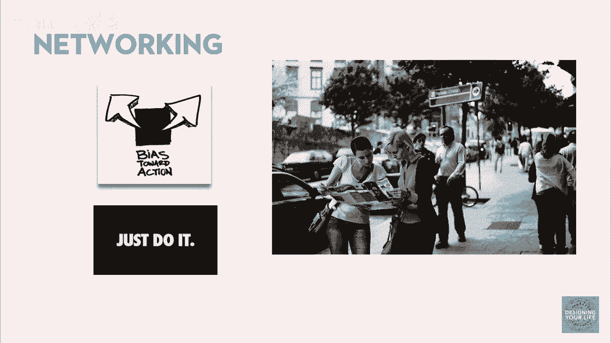
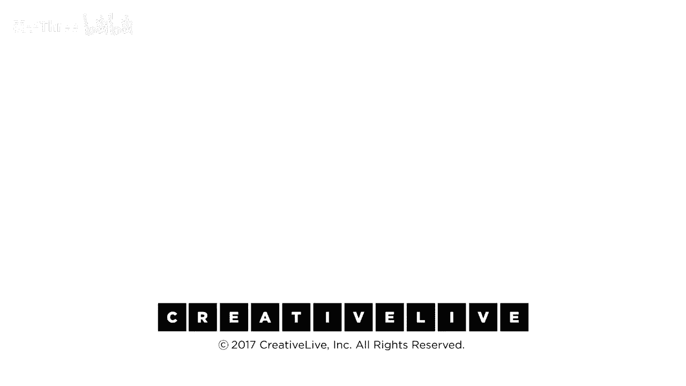

# 【公开课】斯坦福大学：人生设计课 Designing your life（21讲全）｜ 人生规划 ｜ 人生设计 - P13：13-DesigningYourLifee-EvansBurnett-NetworkingExercise-HD - 麦子Three - BV1tzDVYHEGb

他们是谁，我更喜欢与人建立联系，实际上有两个，是我看到的两倍，好的，嗯，你们中的一些人可能感觉像这个女人，我不这么认为，建立联系并不卑鄙，这不是我真正关心的事情，对吧，谁有这种感觉，我不做这种事。

我不做这种事，有什么不对的，利用别人，对吧，国王，假装，利用别人，仅仅为了自我利益，获取游戏，只是击打和逃跑，是的，这不起作用，我们需要重新定义，你完全搞错了，我们只是在寻求方向。

我想你们大多数人都住在旧金山，任何人曾经给别人指过路吗，是的，真的很好的方向，好的，保持你的手举起来，如果你曾经这样做过一次，你曾经，哦好的，在你给出这么多方向之后，你感觉如何，你感觉良好。

那真的很有趣，好的，所以提醒我，你的名字是妮可，妮可，所以妮可，你曾经给出这么多，所以告诉我，这个给出方向的事情实际上如何，所以，有人走过来说嗨，我不确定联合广场在哪里，你知道，然后你会做什么。

如果我知道它在哪里，我会告诉他们，但这就像我给了他们一份礼物，有点，有一个完全陌生的人打断你和你索要信息，然后你告诉他们信息，是的，然后发生了什么，然后他们继续他们的路，然后我继续我的路。

然后他们继续是的，你感觉如何，为了指示不使用，不，不，他们走，是的，我意思是他们只是一个陌生人，这花费了我，你和他们简短交谈，然后他们只是离开，然后你感觉有点空虚，是的，如果他们花费了我。

然后我感觉有点不，但这确实花费了你这个，这是我的观点，我意思是在你，当你多次说，你已经给了指示，是的，并且为什么你继续这样做，因为它帮助他们，并且这让我让我做了一个交换，然后有时我问指示。

并且我没有任何顾虑，因为这是一个，这让我感觉良好，这是一个人类交换，这让我感觉良好，是的，所以你像这样，当然，是的，一个公司，并且当他们离开，我意思是你得到五英镑，一瓶酒，一个圣诞节卡片列表。

你得到了什么，你得到了什么，你得到了什么并且你感觉良好，我意思是你得到了，我知道并且你感觉良好，并且你做了，你们一直在重复做这件事，我是说真的，这可以诊断出来，你们知道，你们这些家伙可以被诊断为人类。

猜猜我们喜欢互相帮助，我知道我故意挑她刺，因为我们每个人都会这样做，这完全正常，这就是网络社交的本质，你以前从未去过作者之城，你从未住在纳米技术之城，从未住在科技之城，从未住在咨询之城。

从未去过数字之城，你知道他们在云端聚集的地方，你从未去过那里，猜猜当地的人会帮助你，因为这些社区之所以壮大，是因为新来的人搬到了这里，你知道的，过来这边，欢迎来到大数据之城，我们在这里很享受。

我们有点书呆子气，但这很酷，你知道的，这就是人们在社交网络中做的事情，当你们在社交时，就是在，就是在问路和帮助彼此，帮助彼此，找到要去的地方，这是我们都需要学会的事情，事实上，我们现在就要做。

所以我希望你们现在。

可能跟原型问题有关，你刚刚在做的项目，或者坦白说，可以是任何事，任何事，你愿意和一个非常了解的人讨论，我真的很想了解更多关于，卖书的感觉，我真的很想了解更多，甚至可以是个人情趣。

我想了解更多关于亚洲融合烹饪，我不知道融合的部分是什么，你是怎么把他们焊接在一起的，但它是怎么工作的，我是说，我想了解风筝冲浪，所有关于风筝冲浪，我想了解，我想学习如何做这件事，我想做这件事，是的。

你知道嗯，实际上作为一名销售人员，我一直从事市场营销，然后我们就把它交给，销售人员实际上做了什么，我想了解如何成为一名专业销售人员，有一件事你想了解更多。

并且关于那个领域的对话对你来说是一个非常大的兴趣，这就是话题，你现在应该把它放在心上，音乐开始后不久，每个人都站起来并且每个人都来这里这个角落，我们会把这个桌子往后移一点，这将是我们的网络社交聚会区。

每个人都来这里，每个人都来这里，现在记住我们要这样做五分钟，来吧，是的，你们所有人都有权向彼此询问方向，并且你们会乐于助人，你们所做的一切都是真实的事情，顺便说一下，这些都是真实的事情，你知道。

只是后来找出那个人的名字，你可以写下来，你知道，有没有人知道关于在航空母舰上作为一名飞行外科医生意味着什么，我正在寻找了解，飞行外科医生在航空母舰上的行动速度就像你能和他们交谈一样快。

尽可能多地与这些人交谈，看看是否有人知道你所不知道的事情，或者他们知道某人，或者他们知道某人知道，并且他们知道某人知道一个家伙，谁知道一个家伙，并且你可以稍后与他们跟进，你准备好了吗，你明白了。

快速移动，尽可能多地获得联系，和推荐音乐，请，你知道，家庭，嗯，所以我们听到的技术，只是关于快速，我发现正在发生的事情，你是在做那个非常自然的人类事情，你是在和健身房交谈，这不是我们今天的目的网络。

仅仅意味着获取推荐，我想要你做的是尽可能快地移动，并且实际上，所以比尔，你知道，任何了解纳米技术事情的人，是的，我知道，实际上我正在处理伟大的事情之一，我可以稍后从那里得到它吗，绝对必须离开，好的。

你知道关于，我的意思是，我只想要推荐，我的意思是，这是撞到就跑，好的，等等等等一个问题，是的，一直被认为是女性的，那不是，那不是比尔的方式，你知道关于一个能，我稍后与你联系，是的，我感激你。

我真的必须离开，好的，非常感谢，那就是他最接近女性的方式，对不起，这说你知道，是的，嗯，它是，你知道，设计是上下文敏感的，你可以快速移动，顺便说一下，你永远不会，这永远不会发生。

实际上我们在做的是以一种合成的方式，因为要点是当你获取推荐时，你所真正想要的，那就是方向，但你会花多少时间在街道上多待20分钟，跟告诉你联合广场在哪里的人讨论方向，我不这么认为，这是很短的对话。

那就是对话，想象你们是陌生人，你们本来就是，我知道你很友好，但你从技术上讲是奇怪的，只有几对，我的意思是，字面意思，我正在寻找两到三个联系，你知道，请提醒我，你的名字很好，休息期间。

我会晚些时候写下你的电子邮件，所以这里谁知道一些事情，或者知道一些关于你对什么感兴趣的事情，这就是你现在想知道的一切，尝试在接下来的三分钟内建立三个联系，然后继续前进。

我不认为我的头发和她有一个非常好的播客，是的，我认为是这样，这是我的签到，我有点害怕，没有，有没有人想围绕一个主题做一些联系，而且他们要么得到了，他们没有得到任何东西，任何人像那样被臭鼬熏过。

我从没有人那里学到任何东西，没有人有联系，看，我知道你在太有帮助，好的，任何人你只能得到一个并希望我能有几个更多，好的，丹你在找什么，你对一个写过书的人还想知道些什么，那就是建立了他们的品牌，好的。

所以我正在寻找人了解品牌建设，特别在那边繁荣，以书籍为导向的品牌建设，品牌书籍里的其他人，就是在那里，就是在那里，所以你的一个就变成了四个，好的，还有谁会需要更多的帮助，日常vlog，日常视频。

日常视频，视频博客或日常博客，但是你知道，博主们他们去一个，我有两个，我有三个，只有两个在我后面，好的，再来一个，再给我一个，还有谁需要更多的帮助，是的。

有没有人知道有人开始自己的小蛋糕装饰或巧克力业务，好的，糖果，烘焙装饰，这就是你知道的，好的一个或，你知道的，如果有人知道有人知道那也没关系，和那些其他博主，是的，和巴纳姆，顺便说一下这引出了经典的像。

你知道的，是的，天啊，你知道的，有人知道纳米技术吗，实际上，你知道的，尽管我在斯坦福的工程学院，你知道的，我真的不知道，我真的不知道，天啊，好的，嗯，对不起，你知道你知道，可能有人知道，嗯，不。

我真的不知道，那么再来一个问题，天啊，你知道的，如果我是你，如果你故意把他们放在那里，接下来你会做什么，只是嗨，你能解决我的问题吗，不，但如果你是我，你会做什么，这涉及到同情或询问，我的意思是。

你不为我感到难过吗，给我一些帮助，如果我是你，接下来你会做什么，嗯，天啊，如果我是你，我会做什么，嗯，我现在会做什么，我猜你知道，我猜我会给汤姆打电话，我的意思是，汤姆可能认识那种人。

这就是你得到推荐信的方法，推荐信，我想我知道答案，我得知可能有人可能会和那些人交往，他们可能认为自己知道这意味着什么，你知道，你知道，我的意思是，我的意思是，你知道顺便说一句。

我在巴黎蓝带获得了糕点师证书，她还有一个关于蛋糕和饼干的博客，所以你们会得到蛋糕，我们准备好了，好的，当我请求你们帮助时，我向你们展示了什么，我们在做的事情，你们正在走向原型制作，这些对话成为原型。

但你们刚刚看到了什么，当我让你们互相帮助时，你永远不知道房间里有什么，也不知道周围有什么，你永远不知道周围有什么，顺便说一句，我们已经做了几百次，如果不是几千次，而且我从来没有在任何一组人中。

有人需要帮助，没有人不能帮助他们，帮助某人，包括与一群本科生一起工作，实际上女孩说，我真的很想见一个美国海军航空母舰上的飞行外科医生，这在斯坦福并不流行，这里并没有太多这样的事情发生。

你知道对于房间里的人来说，我不得不和东京一所预科学校的12名六年级男孩一起做这件事，只有12个人，不够，这是六年级，我不认识任何人，你知道，他们在一个文化中生活，你不应该和陌生人说话，这将以失败告终。

他们找到了原因，因为他们在网上，你知道，他们认识网上的人，资源在那里帮助你，人们愿意给你这种帮助，就像给你指路，但你必须问是，那是挑衅，是的，那不是内向的，这在内向和外向之间存在一种偏见。

这从技术上讲是一种挑衅，但你注意到你对彼此很友好，所以这里有一个激活能垒你必须克服，顺便说一下，领英大大降低了这个难度，世界现在从结构和哲学上配置了说嗨的方式，我开放做生意，你可以和我说话。

即使我不认识你，我们的一个学生进行了150次生活设计面试，通过领英发出了不到200次请求，她75%的请求都是与陌生人在重要组织中进行的面试，通过领英的冷call，深思熟虑并尊重地措辞。

你知道这是一个很高的命中率，我不确定你想要她的列表，但你知道如果他们能做到，你也可以做到，如果世界愿意进行对话，就给自己一个机会，你只需要问，请坐，干得好，我的意思是，如果你能进行那些对话。

并且你建立了联系，如果你们都这样做了，如果你们今天都跟进了你们得到的推荐，并且你们中的每个人都做了一两个原型，你们想到的，我保证，一两周内，你们中至少有一个人会有一个经历，几年后，你会回头看。

说那是改变人生的时刻，那是改变人生的时刻，你知道，我们遇到道格·阿布拉姆斯之后，我们的图书代理人，你知道我们的生活发生了变化，我们再也不会以同样的方式思考事情。

