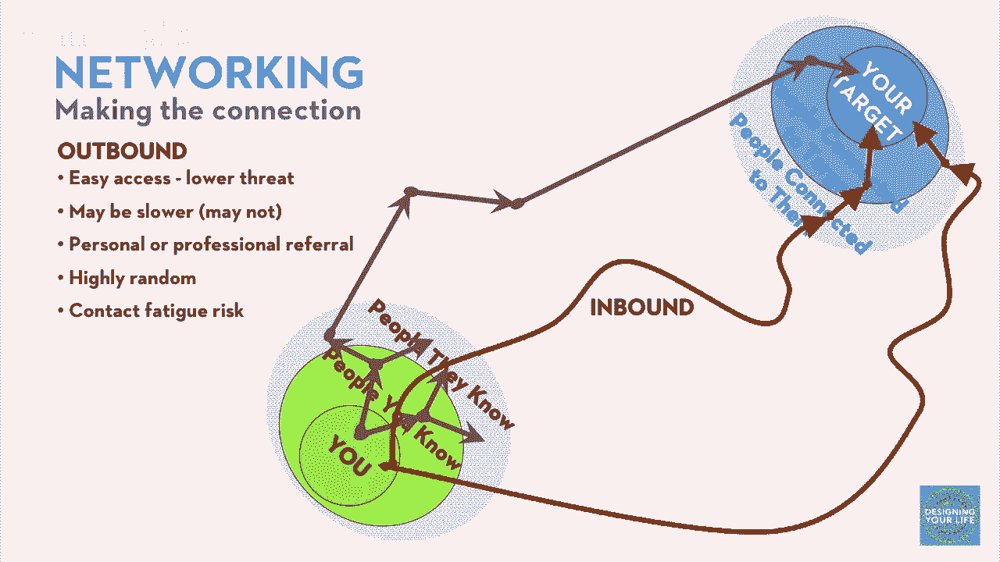

# 【公开课】斯坦福大学：人生设计课 Designing your life（21讲全）｜ 人生规划 ｜ 人生设计 - P14：14-DesigningYourLifee-EvansBurnett-OutboundAndInboundNetworking-HD - 麦子Three - BV1tzDVYHEGb

你刚刚非常出色地完成了网络建设，最后我想简要地讨论一下，而这只是网络建设的一半，98%的人都是这样做的，只完成了网络建设一半的工作，我想简要地描述给你，另一半所以您拥有完整的工具，所以网络建设意味着。

当然有你和你认识的人，和你周围的人，以及你想联系的人，比如你想联系的图书经纪人，你并不认识，在那边以及他们常去的地方，以及他们认识的人，如何把他们联系起来呢，当然传统的，你知道的，网络建设即外联。

就是你刚刚做的，大多数人认为这就是全部，我认识谁，他们认识谁，他们认识的人又认识谁，比如我爸的牙医，大学室友，高尔夫球友，实际上认识那个女人你知道的，管理着你知道的东西，这就是六度分隔理论，它非常有效。

但这只是故事的一半，从你开始，从你认识的人开始，从他们开始，不要始于你，从他们开始，所以从你试图联系的人开始，你可能甚至不知道，你想联系的人是谁，更不用说接近他们了，但可能离他们很近的人。

你可以更容易接触到，然后你就跳过了中间的所有距离，你会直接接近你想要的地方，一个我正在合作的年轻人。

他想采访一个非常著名的独立电影制作人，这个电影制作人居住在旧金山，在这里工作，但以隐居著称，从不接受采访，从不接受公众采访，真的很难联系到他，我正在交谈的年轻人非常内向，他在农场长大，没有联系。

他的人不拍电影，那不是他世界的事情，所以他被困住了，他真的被困住了，我该怎么办，戴夫，我该怎么办，我们很好，好的，让我们想想不是你的问题，而是你的导演做的事情，以及他在生活中如何度过时间。

以及发生了什么，我们想到了，你知道他在旧金山，他去哪里，以及他做什么，我们只是在想象他的生活，以及他的人们是谁，他圈子里有人，可能对我们有帮助，可以帮助我们接近，我们意识到他在旧金山拍摄，当你在城市里。

你在户外拍摄，你需要关闭街道，你需要关闭街道，你需要得到许可，你得到许可，你得去市政府，哦，是的，你知道，你在市政府得到许可，所以他去市政府，他去柜台，你填写表格关闭街道拍摄电影，因为我是电影学生。

你知道我想知道，实际户外拍摄过程的情况，这是填写表格的地方，哦，是的，填写表格，我在说，伙计，嘿，你经常这样做吗，你知道柜台后面的女人，你知道，我们叫他辛迪，哦，是的，太好了，所以你总是和这些人互动。

对吧，他说，嗯，你知道，实际上，我很害怕，我是一个内向的年轻人，我真的很想和电影行业的一些人交谈，你经常和什么人打交道，他们很好，他说，哦，是的，你真的想和那些在痤疮的人交谈，你知道你真的想和，你知道。

艾伦·阿克梅，她太棒了，你能给我她的电话号码吗，当然没问题，所以他给艾伦打电话，这是真实的故事，给阿克梅打电话，你知道，很快他就进入了旧金山的生产公司网络，在三周内。

他让编剧和导演的首席助理生产经理和他交谈，导演不跟他说话，不要和当哥说话，但这没关系，我离他只有两英尺，你知道，在三周内，我去了市政厅，内联网络的挑战是巧妙地想，那个人就在身边，不一定是。

这是一个在旧金山市政厅柜台后面的人，那就是权力玩家，就是接触，我们不需要权力，那就是执行行政人员，行政助理，总机操作员，有很多人可以帮助你，所以，给自己一个使用所有网络工具的机会。

不仅仅是一半的网络工具，他们有另一个故事，所以经常著名的人有一个执行助理，而且经常执行助理只是，你知道，她是筛选者，或者门卫，门卫，让名人远离人群，那么你会怎么做，哦，你是门卫，门卫有两个工作对吧。

不让错误的人进来，让正确的人进来，所以，既然门卫知道让谁进来，我不打给CEO，我不打给VP，我打给，他们打给总机，谁是安妮莉丝的执行助理，哦，你的意思是，约翰，是的，你需要和约翰谈谈，好的。

我打给了约翰，嗨，约翰，我是迪克，嗯，你好，戴夫，你是谁，我是有个问题想问你的人，约翰，有个东西，我觉得可能很有趣，安妮莉丝可能会感兴趣的对话，但我不确定这是否值得她花时间，但我知道她非常信任你。

理解你为她的最佳利益着想，所以我想，你能和我安排一个五分钟的电话，我可以告诉你我想和安妮莉丝谈什么，你可以评估这是否值得你的关注，你必须等两到三分钟让约翰从地上爬起来，因为没有人那样和他说话。

除了一个人经常那样和他说话，是谁，是安妮莉丝，她信任他，让他管理她的日程，因为我已经和安妮莉丝在同一水平上，因为我像她那样对待她的员工，她不喜欢，你知道，联系高管的最佳时间是早上7点，在高级助理之前。

不，那是愚蠢的，叫出高级助理的名字，老实说，如果你值得和安妮莉丝谈谈，约翰会带你进去，约翰有20次中有19次带我进去，现在，我对这个很在行，我得说，但你也能做到，15，只需拨打约翰·希瑟的电话。

这是我认为的可能，你认为安利克斯会关心吗，实际上，我不认为她会，组织中的任何人，觉得这是一个有趣的对话，嗯，比尔能帮我接通比尔吗，嗯，不，不是很，谁能，那是山姆，能帮我接通山姆吗，当然。

只要给自己一个机会，付出代价，人们愿意和你交谈，如果是一个有价值的对话，甚至是一个信息对话，关于故事，好的，所以我认为我们差不多，外联很容易做，风险很低，因为你知道，你所交谈的人都是。

如果你使用你的网络，太多。

你会感到疲惫，使用网络太多，好消息是，如果你开始，你知道在市中心或开始执行管理员，它是创造性的。

它非常有效，它不会令人疲惫，但是第一步是具有挑战性的，它需要创造力和深思熟虑，但它确实起作用，这就是关于网络和独角兽狩猎，如何破解隐藏的就业市场，现在，任何认识，洞察或特别问题，包括我们线上参与者。

我的意思是，有没有人经历过，这种情况有效，任何好的东西，任何问题，我们收到了很多关于如何做的问题，它并不真正，它仍然感觉不妥，你知道，所以关于这个过程的任何想法，我们刚刚谈论和练习，是的。

和你做过的事情，和你做过的故事，它有用或帮助，并且有效，是的，继续，我最近一直在尝试入站路径，我发现这是一个提示，我从一本书中得到的，我读过关于这个，或者基本上要求，像十九分钟的时间，因为一些人评论。

像十九抓住了他们的注意力，否则，无论什么被掠过，我说二十或三十，但是是的，我可以让它成为一个奇怪的数字，或者一些东西像留在了头脑中，然后像尝试奇怪的数字技巧，是的，嗯，它也听起来你愿意被问责。

但三十十九可能意味着十九，并且我坚持，是的，你没有想法或问题，是的，就在那里，是的，实际上我能够遇到某人我从youtube学到了很多，我最终向他们展示了我画的一幅画作为礼物，这导致了更多的对话。

我们发展了伟大的友谊，很好，这引出了一个问题，它甚至不必是一幅画，但是，我的天，哦，我的天，一张手写的便签，非常感谢您的时间，我感激，当你到达三十分钟时，看看，我想尊重您的时间，我只请求三十分钟。

如果他们说不，不 不 不，我得到了更多的时间，那很好，但那张手写的便条，一幅真正非凡的画作，那太好了，但我有一张满是人们留给我的小纸条的文件夹，而且它们确实是被我门底下滑过去的那些人。

或者我在邮件中收到，这些是特别的，一封电子邮件也很好，当然，你总是用邮件感谢某人，但是男孩，如果你能做一点更个人的事情，你会积累很多善缘，我们有一个来自在线观众的例子，我想读这个来自瓦伦蒂娜的。

她说我联系了一个人，几天前在领英，因为我在《国家报纸》上读了他们写的一篇文章，我想谈谈这个话题，我想分享一些我的想法，非常忙碌的企业家在五分钟后给我打了电话，第二天，CEO在我的办公室，哇，哇。

这起作用了，但这是你知道的，这就是领英以一种前所未有的方式连接了世界，我的意思是，你知道并且验证了这个行为，是的，完全没问题，绝对地，顺便说一句顺便说一句，你知道，如果你真的向某人发送那封邮件。

他们写了一篇文章或者一本书，你看到了，如果你没有立即收到回复，他们可能只是忙，他们只是忙，你知道，继续尝试我们的规则大约是三，你可以问三次，如果你没有得到回应，你就停止，找一个新人，我的意思是。

这件事的核心，不要拿自己举例，但你知道，这件事的核心，我的意思是，不是吗，这是关于真诚，对吧，我的意思是，我愿意和任何想打电话问我的人交谈，但如果我觉得容易，我不会做，也许那就是我自己的标准。

但我每次得到的都是通过认识某人，我从没做过简历，因为这对我来说不是个人问题，但这对我来说从来都不是问题，这不意味着对其他人来说也是真的，但对我来说，同样的事情也适用于，你知道，我站在那里的原因。

我甚至都没有说到我想说的重点，我是那么忙，在和其他人谈论他们需要的东西，是的，没错，但我认为它会回来，我们会后来解决，是的，我会的，而且我们在一个非常人为的情况下，我们试图太快，但这件事是，如果你从。

我的意思是，如果你闻起来像求职者，或者看起来这是一次安排，它就会失败，但这就是我们说的，从好奇开始，我真的对这个纳米技术感兴趣，我读了你的，我读了你写的一篇论文，或者你读了什么。

你在Facebook上发布的，你知道，我能不能只是得到，甚至，你知道，您十分钟的时间，我想问一些问题，这对我来说非常有趣，必须是真实的，但当它是真实的，它确实迅速得到回应，然后有一个回馈的事情。

有一天有人会对你的故事感兴趣，或者对你的故事感兴趣，你会参与，你花很多时间与这些人一起做这件事，这对他们来说是第一次，你知道一二一二，三岁，他们真的很想找份工作，我知道那就是我想要的，好的，我不想聊天。

我想要一份工作，你知道所以我该怎么做，我差不多就这样做了，事实证明，深呼吸，这种社会行为是，事实上，这些是如何发生的，也许你的大部分工作都来自人们，你认识的，但每个人的工作都来自人们。

无论你是否认识他们，仍然是人们，比只是一封邮件中的简历更可能，所以我们说，看看，你必须参与到对话中，如果你想参与到对话中，我能否有一个理由进行对话，嘿，问我关于你是对话点击率的55倍，然后。

你会雇佣我吗，请，所以你需要做的是坐下来，冷静下来，喝一杯酒然后说，好的，这个领域有什么，这些人有什么我会感兴趣的，能让我推迟，警察会雇我，请雇我，请，伤害我，恐慌足够长，当他们说，你想做什么。

我只想和你聊半个小时，我可以说实话，你必须去找真实的答案，在你内心深处，他们会产生真正的好奇心，在一个真诚的对话中，没有二心，你还是可以做到，你知道，抑制住恐慌，你知道明天会处理。

你知道一点时间在你这边，所以这就是你所要做的，如果你这样做，如果你想在那里工作，你认为你想在那里工作，必须有些有趣的东西，如果没有我们在做什么，这就是，但你必须到达那里，你必须得到真相。

真正的好奇心问题，我想，我只是有一个疯狂的网络故事要分享，伟大的网络是我的工作和生活的一部分，来自澳大利亚的项目合作者说，tessa，有一个女孩在牙买加你必须见到，我认为你们超级志同道合，我说。

为什么不呢，我们安排了一个skype电话，就像四或五分钟，她真的很想要来湾区，我说，如果你在附近，我很乐意接待你，一个月后她有了票，她在我的沙发上度过了一周，她在牙买加开始了一个创意设计工作室。

她现在正帮助我，把这些场景和漫画故事变成图形小说，这只是，这是一次终身的友谊，此外她还帮助了我，我也帮助了她，所以这真的是一个酷酷的随机相遇，只有在一个全球连接的世界里，有人从，你知道，你知道。

澳大利亚和新西兰和牙买加，在秘鲁我们做了一个脸书的直播，有一个来自阿塞拜疆的人加入了，我甚至不确定，我知道确切的位置，但他弄到了一个盗版的书，他想问我们问题，你知道的，也许有一天他会坐在我的沙发上。

或者在我的备用卧室睡觉，谁知道呢，我想我们今天仍然有很多人在全世界和我们一起闲逛，是的，这绝对是有效的，实际上生活在现代社会是好的，实际上，互联网就像一个非常酷的东西，我们应该适当使用它。

不仅仅是让它吃掉简历，我的意思是，互联网有其他用途，关于这些东西有评论或问题吗，好的，一个问题，我经常得到，也许你知道的是，我必须维护我的网络，我有一个网络，别人会做，我必须每六个月给那个人寄一张卡片。

或者，其他人以不同的方式说，真的很简单，不，我不认为网络需要维护，维护网络并不必要，你需要它时才使用它，我八年后给曾经只遇到过一次的人打了电话，那个高个子说话很快，我们在德克萨斯州，哦，是的，是的。

是的，是的，是的，怎么了，戴夫，好的，所以我要来，你知道的，你认识这个人吗，不，我不认识，但我有我爸爸的联系方式，我很乐意帮助你，意思是，网络，不会衰减，你不是，你不是在闲逛，你不是，你知道。

不要虚构对话，你不想为了维护网络而待在那里，这叫做烦人，这不会为你服务，你可以回到过去，他们会在那里，他们会很好，别担心，好的，让我们继续前进，这就是你在就业市场中正确做法的方式，你必须融入社区。

以便参与对话，在对话中，你只需要询问故事，别忘了，你只是在问路。

