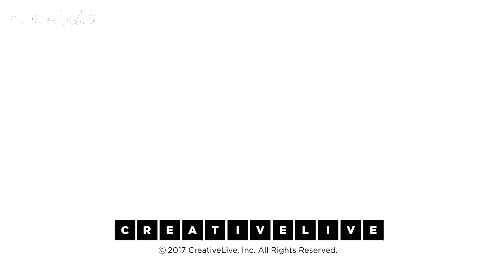

# 【公开课】斯坦福大学：人生设计课 Designing your life（21讲全）｜ 人生规划 ｜ 人生设计 - P16：16-DesigningYourLifee-EvansBurnett-DecisionModels-HD - 麦子Three - BV1tzDVYHEGb

所以学习如何做出这个决定，让决策过程为你所用，这实际上是我们今天试图传达的关键部分，关于这个有一个讨论表会发下去，我们希望你们进行讨论，我们是要成对进行还是小组进行，我们将以小组形式进行。

这些问题大致是当你看到这件事时，收集信息，创造和缩小范围，选择与放手，你哪一部分觉得很困难，或者当你看到这一点，你，也许你爱纠结，也许那是你的最爱，那是你最喜欢的部分，在你生活中哪里你经历决策，嗯。

斯坦福有一个叫做害怕错过的东西，所有斯坦福学生都想要做所有事情，时时刻刻，因为他们不想错过任何事，FOMO（害怕错过），害怕错过，这太疯狂了，这不是关于塞入更多，这是关于从你做的事情中获得更多。

提取更多，所以，但在你的生活中，你在选择过载的地方，如果幸福是得到你想要的，只是渴望你得到的，你得到的，不是你想要的，但你想要的正是你所拥有的，你对此有何感受，因为这听起来可能只是一场愚蠢的文字游戏。

你在试图听起来像一个车贴，说服自己相信不真实的事情，我最近开始做的事情之一，是专注于一次只做一件事，直接多任务处理，专注于完成某事，有一个完成的东西，然后转移到下一件事，然后转移到下一件事。

如果我有想法，我会写在一本书里，然后稍后再回来，要么划掉它们，要么嘲笑它们，你知道的，是的，这确实给你提供了把所有的东西都释放出来的机会，然后专注于任务，就像再次，我认为完成某事是最重要的事情。

刚刚完成了一个小型家庭改造，我记得我曾试图挑选一些水龙头，我去了一家商店，你知道有八十种选择，然后我和我的一个设计师朋友一起工作，我说给我三个，我只想要三个现代的，随便什么，然后五分钟内就变得很容易。

我说那个，你知道，但我完全理解选择过多的困惑，我知道我认为我们在湾区特别，有这么多事情发生，人们总是谈论旧金山的人如何不可靠，因为有这么多事情要做，你总是改变主意，有FOMO。

我想也许在这里特别作为一个外来者，我是作为一个外来者说话，是的，当我来到这里，我只是，哦我的天，有这么多事情发生，我现在就想搬到这里，那是计划之一，但一旦你到这里，有这么多事情发生，一旦你到这里。

你发现没有，我是说，是的。

