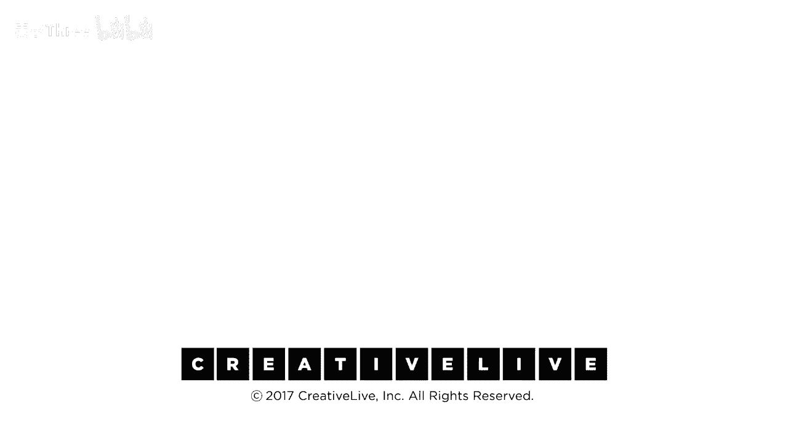

# 【公开课】斯坦福大学：人生设计课 Designing your life（21讲全）｜ 人生规划 ｜ 人生设计 - P17：17-DesigningYourLifee-EvansBurnett-WhatsTheStoryExercise-HD - 麦子Three - BV1tzDVYHEGb

所以我们经常被问到，你能帮助我们做出更好的选择吗，你会倾向于采取行动，或者你是怎么做到的，哦，顺便说一下，eq加上iq会更好，这实际上如何运作，好的，所以我们这里有一个练习。

这将有助于你同时工作在你的选择上，并带着意识将其带入其中，现在我们已经说过你知道，你大脑的情感中心不是用语言来沟通的，所以你不能让它和你一起挂出来，你知道言语中心，但你可以让你的左脑向下走。

出去和情感中心会面，这就是我们现在做的事情，我们将这样做，因为我们的朋友丹·戈德曼会说，你知道我们依赖于情感的智慧，这与想象力有很大关系，想象力是非常强大的，非常有力的工具，所以我们要发挥我们的想象力。

因为关键在于故事，我们即将给你们的前提是决策制定，当你在做我们在生活设计课程中做的那种决策制定时，这是关于竞争商品的所有决策，我猜测你正在挣扎的东西中没有一个与，好东西与坏东西之间的选择有关。

或者是显而易见的选择与愚蠢的选择有关，那不是难事，那很容易，这是善与善的对决，那才是致命的，那就是，那就是那样，我的意思是，我的意思是，这些好事中哪一件我应该去做，以及那种情况，你的生活决定。

你的生活设计决定实际上就是选择，哪段故事才是适合你的，我将争辩你没有在做决定，你只是在选择故事，因为再次，这三种版本你都记得这三种版本，事物和事物一个事物二事物三，让我们来谈谈我们的朋友艾伦。

所以实际上我正在和一些NBA的人进行对话，一次，你知道，让我们叫其中一个家伙，艾伦，一个真实的故事，真正的家伙，你知道他说，哦，这三件事对我来说并不管用，戴夫，你知道，我说，让我给你展示。

你知道它是如何工作的，你知道你想做什么，哦，我要去为一家医疗咨询公司工作，所以我要在医疗领域混，那太好了，哦，猜猜看，咨询已经结束了，艾伦，没人再做那事了，你现在做什么，哦，我的天，不，我做什么，哦。

嗯，我猜我会为一家媒体公司做战略，我想在一家大型媒体公司工作，我认为这可能很有趣，好的，艾伦，那件事，你喜欢做的事，那件你很少谈论的事，你知道我在说什么，你知道那是什么，那是什么，艾伦，我保证你。

你可以赚足够的钱，没有人会嘲笑你，真正的艾伦，真正的不，他的名字说，你保证他们不会笑，我说是的，艾伦，我保证他们不会笑，那是什么，他说，嗯，我想做精品葡萄酒分销，顺便说一句，我已经讲过很多次这个故事了。

没有人笑过，哦，那听起来很有趣，大多数人会说，所以，那是艾伦的三个版本自己，现在，问题说，好吧，这些都是艾伦真正可能的三个版本，每个都有个故事，所以艾伦，故事是怎样的，这就是我们要做的练习。

我们要做这个，故事练习，所以，例如，它的工作方式是，想象你正在实现一些你的备选计划，你已经构思了，实际上成为那些人，让我们说，第二和第三，你可以选择，我们将这样做两次。

你可以选择你工作的三个中的任何一个，但让我们想象，为了例子，这里与艾伦，他所谓的第二和第三就是他想玩的，目前，想象你已经做出了这个决定，你就是这个人，我实际上是一个策略媒体专家，艾伦。

这就是我真正的身份，或者我是实际上一个葡萄酒分销专家，你知道，五年中已经过去了两年半，我正在这五年的体验中度过一半，我正在继续前进，体验着这一切，这对我来说是有效的，我是说，好的方面，坏的方面并非完美。

不要误解，当我每次回家时，我都会做出妥协，和，你知道正在赚更多的钱，如果我在咨询，但是那没关系，你知道无论它是什么，那就是它的现实，然后，你在街上撞见了这个老朋友，他说：“嘿，艾伦”，它怎么样，你知道。

你说你知道它进展得非常顺利，艾伦说进展得很顺利，然后朋友说甜的，故事的情节是什么，嘿，艾伦，故事的情节是什么，然后艾伦回答了问题，所以，在这种情况下，好的，所以，假设我是艾伦，我正在做媒体咨询。

并向埃伦说嗨，甜的故事是什么，那么这个井的故事呢，故事，你知道我得告诉你，我是说，我与那些完全掌握整个事情的人一起工作，你知道数字社区这个东西真的很流行，媒体这个东西真的发生了。

在线世界正在以惊人的速度发展，我只是觉得我在乘着海啸，现在以每小时一千英里的速度前进，现在能够在快速移动的东西的前沿真的很有趣，我真的很喜欢，你知道，我与不同类型的人一起工作，我真的很享受。

工作时间非常长，我得告诉你，因为，你知道总是有截止日期，你知道它发展得如此之快，我们一直在生产，但那感觉很棒，我们上传东西如此之快，我非常高效，那是他的声音，哦，那很酷，你知道，不，不，不，不，对不起。

不，不，这是你的葡萄酒分销，所以我花五分钟，我想象我现在生活的地方，我现在住在一个不同的地方，我看到不同的人观看我的生活，真的像调了一年，我遇到比尔，你好吗，我很好，甜心，告诉我你的故事，什么故事。

你知道我得告诉你，你知道我有一个NBA，我花了一半的时间在外面，那有多酷，我每天都穿牛仔裤，我与酿酒商交谈，我与分销商打交道，我们代表主要是非常富有的人进行私人购买，他们拥有惊人的酒窖。

我处理最令人惊叹的社会经济人群，你知道从，你知道，你知道，移民工人在田间，从富人风险投资家，和卡车司机，和各种，真的很有趣，我得告诉你，你知道，并且有一件事，给人们的生活带来一点快乐，成为一个好杯子。

一瓶红酒，这真的是一件很甜蜜的事情，我有时会想，这真的重要吗，我没有教任何人阅读或任何事，但你知道我的意思，有人必须这样做，我有点觉得荣幸，我得到，所以他只是编造故事，在这个过程中。

然后你持有那个故事并思考我，我们会给你一些关于如何处理那个故事的提示，在你构建它之后，但这就是我们要做的，因为到最后，艾伦可以成为这三个人中的任何一个，快乐，如果他真正选择进入。

然后那个故事告诉他那种生活实际上是什么样子的，有意义吗，很好，好的，让我们这样做，获取你的奥德赛计划，作弊，不是那个能量的东西，转过来，你还不需要那个，是的，别担心能量，奥德赛计划来得太早，是的。

奥德赛计划，奥德赛计划，上面有所有那些东西，希望如果背面是空白的，你将在那里写你的故事，如果它不是空白的，Kesey会给你一张纸，你需要纸，举起你的手或在你的日记本上做，如果你有一本日记本。

你就是一个记日记的人，那是做这件事的最佳场所，所以第一步非常简单，我们选择要做两次，这样你可以有两个计划在后面被叙述，你做所有的计划，做更多的计划，所以选择两个计划，你想为选择做故事，你选择做哪个计划。

好的，现在就选择一个，我们在进行引导想象，想象你就是那个人，我正过着那种生活，我不会过那种生活，我正过着那种生活，我已经过了两年半，现在是2019年底，你正在考虑为别人买圣诞节礼物。

并迫不及待地迎接2020年的新年庆祝活动，你正在过着这样的生活，你正在从事这项工作，你看到了什么，你的生活方式是怎样的，你什么时候起床，你是否有通勤，如果是这样，你一天中遇到的问题是什么。

你最喜欢的一周是哪一天，你生活中的那些琐事是什么，你在这种生活中遇到的问题，你的关系如何，你担心钱，你的钱够用吗，钱够用吗，你就是那个人，你知道，然后你遇到了你，你在街上遇到了一个旧大学室友，哦。

我的天，哦，我的天，弗朗索瓦，我多年未见你，哦，你怎么样，德里克，你好吗，伙计，情况还不错，故事是什么，你有一分钟或三分钟的时间在你的日记中记录你的回应，故事是什么，你已经写下了你的简要回应。

现在我们只是再做一遍，好的，所以稍微扭动一下，所以我得到了那个故事，现在选另一个，你的其他计划是什么，跳到页面下方，或者翻到你的日记的页面，或者拿另一张纸，随便，现在可能你的头脑清晰了。

你又变成了一个普通的架子，现在我选择了计划，另一个第二计划，是2020年，我正在回顾，是的，那看起来不错，那可能是生活，也许你住在同一个地方，也许那种生活方式非常相似，只是换了个工作。

也许那是完全不同的你，你知道我的妻子克劳德，我和，在2016年春天做了两场演出后，纽约说，你知道我们要搬家，比尔，他和他的妻子从门洛帕克搬到了纽约，我们要搬到纽约，所以我们的孩子卖掉了狗，必须得走。

你知道，那可能是完全不同，生活方式是什么，那些人是谁，再一次，把自己想象成那个场景，差不多闭上眼睛，在那里待一会儿，然后，当乔纳森走过来说，哦，你怎么样，故事是什么，我发现的是。

一旦我把你放入这个想象的练习中，砰，你们开始写，你们拒绝等我第二次给你想象的时刻，因为你直接跳入故事中写作，而我没有看到一次笔停过，显然你对这些生活很了解，你必须给自己一个机会讲述那个故事，现在。

我想要你做的是再读一遍你刚写的东西，作为想象某人，你不仅仅是写了这个，想象你是弗朗索瓦，或者你知道的任何人，当你阅读时，你在读什么，你刚刚写的，并且问你自己那个问题。

我们在小组里之前就一直在问的那个问题，你看到了什么，或者什么在向你跳出来，关于你已经说过的这些生活，只需给自己一个机会，注意到你刚刚写了什么，我们不打算具体讨论这些结果。

这些是你曾经紧紧抓住的、非常个人的故事，你知道，但实际上给自己一个机会，让自己成为故事中的角色，可以是有启发性的，不一定是决定性的，我们曾经与一群学生做过类似的练习，在一次想象故事中，我们的一名学生说。

我们说，你是从哪里得到这个想法的，她说，你知道，我在四处告诉每个人，你知道，我很高兴我没有去法学院，她讲述了这个故事，她讲述了这个故事，她讲述了这个故事，她正在申请法学院，嗯，你知道，因为那是计划A。

她打算去法学院，她正在谈论计划B，在这个角色扮演练习中，我们做了，你知道，最后她说，你知道，我试了五次，你在这段时间里和五个人交谈了，这场模拟的聚会，我们有，你知道，到了第五次。

我说我很高兴我没有去法学院，我真的不认为我想去法学院，你知道，我们说好吧，好的，那是一个它，我们不太确定如果我今天取消申请，我可以只是等待母亲的电话，你知道，但这无论如何可以是一个洞察点。

你知道你可以听到自己在说话，你知道实际上我们作为一个整体会做什么，现在他说你在巴黎，但你知道我们会做，让我们这样做，你知道什么，这个想法对你有效吗，你知道我注意到你值得故事，很快，你从中得到了什么见解。

这有帮助吗，是的，你注意到了什么，当你问的时候，你注意到了什么，你注意到了什么类型的事情，是的，我对我的结果有点惊讶，因为我做了我的第二和第三，一个是更疯狂的想法，另一个是一个重要的服务原因。

这是一个对我有个人兴趣的重要服务原因，因为我写了它，真正出来的是这里将要发生的重量，以及如果我走那条路我将承担的责任，而我的第三个选择是一个更疯狂的想法，它仍然有一个服务组件。

但它有一种轻快的感觉去做它，是的，还有一些能量，这有点出乎你的意料，是的，你不知道你知道没有，但你确实知道，是的，其他人是的，我有点类似，当我做我的二和三时，是的，所以我当我做我的二，这有点像，哦。

我刚完成物理治疗学校，所以这很好，你知道，UCSF很有趣哦，再次进入程序，帮助人们，当我为我的计划三写我的第三个故事后，我像，哦天啊，我刚买了这些财产，我们正在使用集装箱建造一切，一切都很好。

有一只狗在四处奔跑，所以我有机会遇到这个人，这么多，是的，有这么多热情与社区合作，当我在南美时，就像那样，就像那样，它就像，这很奇怪，这很奇怪，是的，好的，我等，我甚至不在那里，没有很多思考和答案。

你知道这不是，这不是，你知道，这不是上帝之声的哑剧，我正在这里尝试做，但它试图给你提供进入你其他声音的途径，是的，是的，我想它最初只是打开你的想法，在你之内有一个广阔的多元宇宙，你可以触及它。

然后你可以基本上将这些想法投射到自己身上，就像，好吧，嗯，我可以过这种生活，我可以过那种生活，这一切都是可能的，可能的，这一切都是可能的，关于想象力的事情是，它是，你知道，如果我们将某人放入扫描仪。

我们说想象做这项活动，然后然后然后他们实际上做了这项活动，有一些事情我们可以让他们在扫描仪中实际做，大脑模式是相同的，你正在想象自己在这个世界中是真的，这在你的大脑中是真的，你的大脑会相信它。

你会有轻盈或沉重的生理反应，你会，你会感到兴奋，或者你会感到恐惧，有时人们会写一个关于这些经历的故事，这真的很吓人，想象有一些东西，当你做得很好时，我们训练设计师拥有非常强大的想象力。

所以他们可以想象那些从未存在的东西，但如果我们看看你大脑的两次扫描，它们是相同的，几乎一样，所以你在2020年活着，就像墨西哥的一个人，你做这些事情，你当时在那里，顺便说一下，你越擅长这种视觉化。

它变得越真实，关于这一点，有一个问题，你知道，关于，我不知道那是什么，几年前耶鲁大学的一个研究，关于写下你的目标，那些发生的可能性，再次，这是一种锻炼，旨在拉伸想象力。

还是它实际上认识到你有真正想做的事情，它让你能够接触到第二，如果你愿意，所以，我不是在试图让你做一件事或另一件事，我们正在尝试，我们正在尝试构建想法和工具，让你能够接触到你，让我们非常清楚，戴夫和比尔。

不知道你，我们没有你生活的答案，我们不是秘密，聪明的家伙，我们提出了一系列的想法和工具，这将，这将帮助你访问你自己的资源，你非常容量，聪明的人，你值得在这里，你里面有很多东西，你需要更好的工具来获取它。

所以我们刚刚给你的这个想象工具是让你能够做到的一种方式，我正在，我正在欺骗你的左脑，有意识的语言思维，故事是完整的，你能够快速写作的原因是因为这个生活的体验，经验，存在，情感现实是可用的。

到你的无意识思维和你的情感价值，然后你的叙事思维很高兴地跳进来并说，我会为你写下来，这就是A Q I Q组合，你知道，这个理解的结果是完全取决于你的，顺便说一下，想象有可能只是创造一个白日梦，一个幻想。

是的，是的，我们有时会活在幻想中，你可以把自己谈成一个幻想工具，这不是真的，是的，我认为它实际上是，如果你有什么想法，并且你认为它是有效的，然后使用一些其他的，你知道。

然后原型化到那里去看看那是否是真的，但是请小心，你知道有可能有一个白日梦或一个幻想，是的，你可以过度或欠做这个，顺便说一下，回到循环回到IQ，让我们说，我不想做出一个好的坚实的客观决定，伟大的第三遍。

这是额外的作业，回去通过关注你的故事并注意到那些故事是组织的，可能稍微不同，一个是另一个对吧，你的故事背后隐藏着什么，是标准，是的，当我讲艾伦的故事时，在很多人那里引起了共鸣，所以显然你知道在技术边缘。

快速增长是有价值的，高生产率，推出很多产品，所以我喜欢这种生活，因为它科技先进，我在学习很多东西，我高度高效，我喜欢这种生活，因为我对社会有认识，在人类经验的广泛范围内，有标准，不错，客观列出，列清单。

可量化，Excel电子表格，筛选标准，隐藏在你的故事中，如果你喜欢列表，在故事之后获取你的列表，然后你可以将两者结合，看看它们如何融入，所以开个会，让你的智商和情商坐下来。

进行一次对话并帮助你做出一个好决定，关于选择还有任何其他要点或者关于整个选择过程的任何其他疑问，是的，是的，我发现我给了这种锻炼和思考，而且我有一个几年的叙述，我发现当我把我的叙述与人分享，是的，它是。

它正在成为现实，因为人们倾听，他们告诉我他们可以帮助我，因此，仅仅通过把它放在那里，尽管它不存在，对的正在发生，是的，绝对地，我的意思是，一旦你大致确定了一个可能的路径并且有了这个。

特别是如果你试图围绕你的想法组织人们，你必须成为讲故事的高手，在我们的设计程序中，有一个完整的模块是关于讲故事的，仅仅有一个好主意是不够的，你必须将那个主意带入未来，让人们渴望它，是的，讲述故事的方式。

以便将人们、服务和资源吸引到你的事业中，那是很棒的，而且，越真实的故事讲述方式，人们就越愿意帮助你，是的，故事越真实，人们就越愿意帮助你，这也是一种方式，可以看到你的生活如何可能全部联系起来，是的。

通过各种方式连接起来，不仅仅是一种方式，你看到连接的点越多，你在生活中体验到的意义就越多，你与自己的对话真的很重要，现在，你不想欺骗自己，你知道，现实最终是掌握在你手中的，但你的故事由你决定，所以。

选择好，为自己设定成功的道路，你知道的，不要纠结，放手，继续前进。

