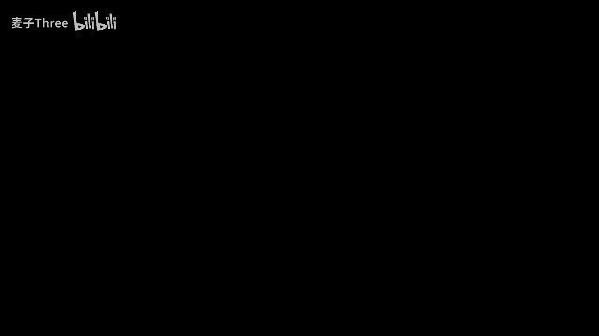
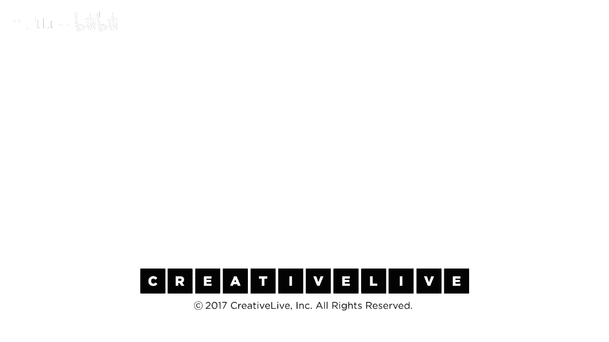

# 【公开课】斯坦福大学：人生设计课 Designing your life（21讲全）｜ 人生规划 ｜ 人生设计 - P18：18-DesigningYourLifee-EvansBurnett-EnergyAssessment-HD - 麦子Three - BV1tzDVYHEGb

对于一个体重约180磅的人来说，这是一个非常有趣的事情，在你的身体里有一个重约三磅的软绵绵的东西，那就是你的大脑，它只占你体重的约3%，你可能会想，3%的体重消耗3%的能量来运行，不对，实际上。

人类的大脑每天消耗大约2000卡路里，而我的平均饮食，至少在美国，是2000卡路里，我一直在吃大约2400卡路里，你需要在这方面下功夫，但在那2000卡路里中，有550卡路里用于运行你的大脑。

你的大脑每天消耗你总能量的25%，你主要是为了保持大脑的运转而进食，所以，很有趣，这个只占你体重3%的小东西，却消耗了你每天25%的能量，它真的很小，你知道的，只占你体重的3%。

但它消耗了你每天25%的能量，所以我们关注的地方，我们所投入的注意力，我们的大脑能量实际上是我们如何体验一天的方式，我们有一个非常简单的工具，你有，你有工作表，它是一个工作表，看起来像这样。

事情可以是积极的能量体验，它们可以是负面能量的，这是主观的，就像我们的第一个仪表盘一样，如果我做某事，当我完成它时，我比开始时更有活力，去教课，那么，这将是我们的课堂，那么它是一个高能量的事情。

如果我做它，并且在结束时，我感到精疲力尽，或者我感到非常低落，那么它是一个低能量的活动，所以在那张垫子上，在那，我们要你列出，通常我会看我的日程表或手机上的日历，我去，我一周中做的所有事情。

每周我都有活动，有些是重复的，或者如果这不起作用，做更长的事情，做一个月，写下能量的事情，写下你每天做的活动，一些是重复的，或者如果这不起作用，做更长的事情，做一个月，写下能量的事情。

写下你每天做的活动，然后我会让你把他们映射出来，但首先只是把他们写下来，我把这些写下来了，我每周上一次艺术课，我有一个预算会议，因为我必须管理这个团队，我有两个预算，我进行办公时间，锻炼，教学，你懂的。

这些都是我几乎每周或每两周做的事情，它们只是活动，所以我想让你写下你做的活动，那些是相当重要的，在你一周或一个月里花费一定的时间，找出六到八个，没有评判，还没有，你只需要知道，你做的事情。

我必须要和我的妻子有一个约会之夜，每两周一次，我指导我的研究生，你做什么，你的，你的一周或一个月，看起来这是一个非常简单的评估工具，你可以在任何时间做这个，当你感到惊讶时，感觉有些失衡。

每周结束时我感觉精疲力尽，我精疲力尽，项目结束时我感觉精疲力尽，我精疲力尽，这是什么幻灯片，发生了什么，是的，所以假设你有那些列表，我可以一边说话，你一边做笔记，我希望你把它放在时间轴上，这基本上不是。

这不是真正的时间轴，这只是，你知道，发生的事件，但实际上，所以我把它放在里面，这实际上是好的，如果你按照它发生的顺序来整理，所以我每周一晚上都有艺术课，每周一晚上，我去mission区的一个小工作室。

我画裸体人三个小时，这太棒了，这太令人惊叹了，我从未，我从未上过人体绘画课，这是我想挑战自己的事情，太棒了，很多关于预算的会议，我讨厌预算会议，他们很无聊，我喜欢和我的学生交谈，你知道。

我和一些顶尖的机器人专家和医学触觉专家一起工作，和一些世界上最顶尖的计算机科学家，我们在谈论那些东西，这太棒了，当我们召开教职员会议，有人忘记写下在复印机上复印了多少份，因为我们的复印机数量不对。

这是浪费时间，所以这有点正负之分，我喜欢我的运动，我喜欢教学，我讨厌家务，浪漫约会之夜，这很有趣，导师辅导，我的博士生，我录取的研究生，我每周和他们讨论他们的论文项目，我发现，这对我来说是一种打击。

你也做同样的事情，能量的尺度是大于小的，许多负面因素低于少于，仅仅主观地将那些放在一个尺度上，大致按照顺序，在其中它们发生，在你的生活和地图中，积极的一面，负面的，中立的，别为此烦恼，只是让他们在那里。

是的，再次，你可以每月进行一次评估，就像快速的，你知道这是一个十分钟的练习来理解，你生活中的能量是如何流动的，你的五百卡路里大脑的注意力是如何燃烧的，所有的能量，它花费时间在做什么。

所以它感觉更充满活力还是更少，所以下一个部分是，你对这些能量模式有什么观察，然后我们知道我们能对他们做什么，如果我们看到一些我们不喜欢的东西，所以我注意到的一件事是，当然，我的艺术课是最高能量的事情。

我发现自己在心流状态，现在，这是种技术术语，有一位名叫米哈里·契克森米哈伊的心理学家，他研究了这种心流，那就是你在做某事，并且你真正投入的状态，并且你完全投入，时间似乎静止了，你会从中获得大量的能量。

你抬头一看，心想，哇，凌晨一点，发生了什么，你知道，这对我来说在工作室里会发生，或者在绘画课上，课程结束了，我甚至还没有准备好停下来，所以心流状态是值得寻找的，如果你发现自己处于心流状态。

你通常会体验到一些有意义的事情，预算会议很糟糕，它总是如此，另一个让我有点感兴趣的是，我为什么不喜欢我的研究生，我的意思是，这些是我所录取的学生，我们在一起工作，我觉得我们的项目很棒。

那是我最喜欢的事情，那是我最喜欢的事情，但这是我最喜欢的事情，这对我来说是一个很大的打击，所以你知道当你我想要你看那些东西并注意到发生了什么，然后你必须问自己的问题，它是什么，什么是相对容易改变的。

无论是关于事情本身，还是你如何做，所以有两种方式，有两种方法，你可以在你的能量图做一个非常简单的改变，例如，我发现我的预算会议总是很消极，但我是这个项目的执行董事，我必须每周做预算。

大学想知道我们花了多少钱，那不是我能说'我不做那个'的事情，我不能把这个任务委派给别人，所以我现在做的是，所以我现在做的是，我将我的预算会议总是安排在我锻炼和上课之间。

因为我已经把一个负面的事情包围在两个正面的事情中间，它们基本上在周末的时候相互抵消，我不记得预算会议，我记得我和一个学生有一场精彩的互动，所以只有一种排序，排序是一种改变地图的方式，另一个是导师指导。

所以我应该真的很喜欢这个，然后我意识到，哦，你知道我们在做什么吗，在录音室，我们在斯坦福有一个录音室，叫做阁楼，那是一个疯狂的地方，所有的学生都在那里放他们的东西，到处都是，但那是他们的空间。

而且非常吵，而且这真的很让人分心，我在尝试在他们的阁楼空间里指导他们，但这没起作用，我不想把他们带到我的办公室，因为我现在进入了我的空间，这样我们就不能作为同事进行对话，所以我做了Dave做的事情。

咖啡店外面的有一个露台，我们去那里，我给他买了一杯咖啡，我们有一场对话，现在，大师的指导几乎进入了心流状态，因为我正在和我最好的学生合作，在一个对我们所有人都有效的环境中，对我们两个人都有效。

他们更喜欢这种方式，而且，顺便说一下，所以你可以改变顺序，你也可以改变地点，所以看一下你的图表，看看相对较小的变化，无论是顺序还是位置，你可能能做些什么，可以把一个负面变成正面，或者让你在周末结束时。

有更多的能量，花几分钟时间思考一下，我们正在寻找非常容易实现的事情，是的，低门槛，容易改变，现在你想要把我分成小组吗，所以和你旁边的人谈谈，如果你之前和那人一组，没问题，一个人应该去和别人讨论你的地图。

如果你找到了解决你问题的方法，也许可以和其他人分享，但如果你在地图上有一个问题，你可能会说，我不知道该怎么做，也许那个人有主意，是的，所以合作吧，比较你们的能量地图，看看有什么想法，好的。

我的三个主要能量消耗者，我想的是当我做自由职业者咨询时，我必须做我自己的生意，行政工作，而我讨厌这些事情，这与我的热情相悖，我想到的是，我需要更规律地去做，因为这样实际上会减轻一些压力，因为如果不做。

是的，是的，实际上更规律地去做，有助于正常化，正常化它，还有给自己奖励的想法，每次做完后，比如每次我做行政工作，我会给自己买一个冰淇淋，你知道的，边做边吃冰淇淋，哦，是的，做账，然后你需要改变你的位置。

好了，去冰淇淋店，然后家务清洁，嗯，也许几个月请一次家政清洁，就像一个专业人士一样，嗯，就像深度清洁，是的，我会进行深度清洁，就像我定期清洁，但我真的没有真正获胜，是的，确实。

他们可以清洁所有四角和下面的地方，我下面床的东西，我不去清洁，是的，是的，一些工作，管理类工作，我不喜欢，但最终，我可能会到达一个我可以委派出去的地方，那样就好了，那样很好，是的，那就是我，哦。

我最大的负面或耗能事情是成本和实际上的项目管理，你的工作就像项目管理，文档控制，就像模板和输入，还有团队管理，你知道，就像处理，就像人们之间的小争吵和事情，所以我的想法是，如果，我在做成本。

或者像文档控制，类型的事情，可能就像你说的，无论我，你知道，和我的高管交谈，或者在家做，或者在一个地方，嘿，我只想，你知道，我在海滩，是的，我去的很多的咖啡店，那就是要叫我，我可以跳上公共汽车。

我会马上回来，或者，然后，团队管理事情，我认为，更多的，好吧，让我们去吃午饭，进行我们的员工会议，或者让我们去吃晚饭，进行我们的员工会议，或者早餐，而不是说，嘿，让我们去会议室，是的，我会像运行。

你知道，一个行动的电子表格，你知道，而且就像，我也注意到你知道，我的执行，他喜欢只是发送列表说嘿，这里有每个人要做的事情，我们将讨论它，而不是像只是，也许制作工具，就像，嗯，因为那是耗能的，哦我的天。

是的，你一直告诉我，就像嘿，你没有做这件事让我管理你的工作，这像是，是的，好吧嘿，看这里，这里有团队要做的事情，让我们谈谈它们，让我们看看谁最适合，或者谁想要做，是的，然后从那里开始并且像。

在午餐时谈论它，而不是像只是在正确的，就像扔到你，是的，关于以这种方式管理你的能量有任何问题，或者观察，你发现的方法来移动某事，对你有用，任何收获，是的，收获或我们的问题，是的，我咨询，我自由职业。

我有自己的业务，我真的被商业，行政耗尽，所以想法是实际上，也许更定期地做它，而不是拖延，实际上会帮助小块，所以小块，然后也像奖励自己一个冰淇淋在它的结尾，或者类似那样的在最后，很好不过。

现在关于那一个冒着一定的风险，我将分享一个我们客户的例子，实际上我正在做一个总结，他们做了这个练习，所以我做了这件事，我发现有很多行政工作，我必须要做，这是一个在大公司工作的人。

而她的工作一部分是写报告，你知道的，而我只是讨厌那件事，我和一个朋友分享，和一个同事，我说我讨厌这件事，我不知道该怎么做，你能给我一些提示吗，同事说，你为什么不干脆不做，她说好吧，我不能，那是我的工作。

他说，确定试试，她原型，只是两周不写任何报告，没有人抱怨，她继续一个月不写报告，没有人抱怨，然后她问，你介意我不写没人看的报告吗，他说好吧，我不能保证那管用，但有时你知道你得发出你的账单，是的。

那种事情是真的，还有其他想法或问题吗，我不喜欢做的事情，如果我和别人一起做，如果那绝对可能，那就好多了，和别人搭档做会更有趣，是的，和某人搭档保持能量，即使你只是想创造一个更社交的过程，是的。

那是个好主意，让他们去做，是的，我的最大能量消耗之一是打电话回家，所以回拨到澳大利亚，你可以得到两周的坏消息，或者只是，你知道，生活人们只是想谈论你，所以我说，你能把它和积极的事情结合起来吗，所以是。

如果我在锻炼，如果我在探索旧金山四处走动，我能在最后说哇，我走了四公里的路处理家里的问题，所以这是你知道，你可以仍然在那里支持一个家庭，但同时有积极的感觉你做对了，你知道你是好的，好的，好的，嗯我做。

你知道再次，时间和注意力花在什么上，和你一天结束时的感觉有很大的关系，这不仅仅是，这不是像戴上玫瑰色的眼镜，一切都会好，有些事情你必须做，有些事情你必须完成，但如果你看你的一天和周的能量流入流出。

会给你一个更好的感觉你的参与度高，还是低，事情的顺序很重要，你也做的事情的地方很重要，我们非常小心地设置这个空间，以便我们能创造，能量参与和高度相关注意力，和意义你实际上花费你的时间。

你所关注的实际上是你现实的体验，我知道大多数在线用户，当然会这样做，你知道，一个模块，你有，但对于那些和我们一起度过了一整天的人，我们非常故意地做了能量评估工具，我们最后做的事情。

这不是一天结束时最逻辑的事情，但你知道，当我们清理我们的课程我们开发这些东西，我们不仅仅是看逻辑，我们不仅仅是看实用性，我们的最终清洁，在我们课程开发中称之为，并且能量是什么，这些都是人类。

也许我们最后要做的事情是像，一天结束时的激发乐趣的事情，所以整个要点是，你知道你是，你是一个动物并且你消耗和使用能量。

