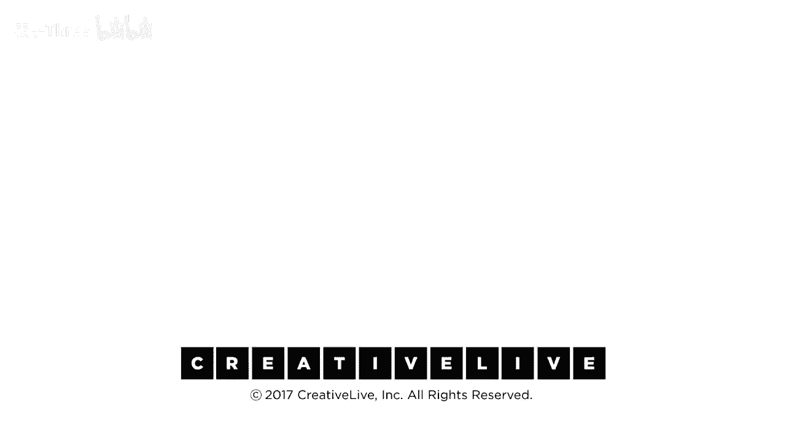

# 【公开课】斯坦福大学：人生设计课 Designing your life（21讲全）｜ 人生规划 ｜ 人生设计 - P1：01-DesigningYourLifee-EvansBurnett-IntroductionToWorkshop-HD - 麦子Three - BV1tzDVYHEGb

谢谢大家，见到你们真好，见到你们来到我的另一边这里，所以，伙计们，我知道你们有很多事情要做，在开始之前，我有一个快速的问题，正如我所提到的，你已经教给了学生，你已经教给了企业环境中的人，退休人员。

这个主题之所以普遍，是因为什么，每个人都想了解更多关于如何设计自己的人生，这个主题是什么，嗯，我们知道斯坦福大学，有一个非常受欢迎的课程，因为我们教授了世界上最受欢迎的主题，因为你知道。

每个人都认为他们的生活很有趣，因为这个问题对我来说很重要，是的，正是如此，你知道，人们会问自己这个问题，我想成为什么，当我长大后，你知道，这是一个常见的问题，我们想重新定义，你应该永远不会长大。

但问题是你希望成为什么，这是一个每个人都想讨论的问题，每个人都想看到，现在在家观看的每个人，这将是非常互动的，我们有很多练习将在这里进行，当你在家观看时，我们希望你跟着做，做所有的练习。

这将是互动的，这将是有趣的，这将是有点混乱的，这将是好的，我们将做一些工作，我们将到达某个地方，嗯，我会让你们接管，非常感谢，谢谢，好的，克里斯，很好，好的，欢迎来设计你的生活。

而且如果你像之前所有我们合作的人一样，你首先想到的会是几个问题，你知道你可能会在想，比如这个课程，是不是真的适合我，我是不是在正确的房间，我应该在线吗，好的，我们有一些这些问题的答案，嗯。

如果你听起来像这样，如果你听起来像任何人说这样的话，我正在转型，我需要一些工具，你知道我正在疑惑，也许该是改变的时候了，嘿，生活很好，但我希望它能更好，我不确定该怎么做，你知道我只是想有所行动。

但我不知道如何开始，如果你听起来像这样，你在正确的地方，你处于什么情况，如果你看起来像这样的人，如果你刚毕业，你刚刚开始，你职业生涯早期，还不确定下一步是什么，如果你正处于，我是如何来到这里的。

你知道你在思考你的职业生涯，下一步我会做什么，如果你这些人之一，你在正确的房间，那意味着什么，如果你任何人想要回答这个问题，我如何构建一个真正适合我的生活，你在正确的房间，好的现在dave，这真的。

这真的对每个人都合适，这公平吗，这是真的吗，是的，因为我们都在回答同一个问题，谁将如何度过我剩下的疯狂而珍贵的生活，谁将如何度过我剩下的疯狂而珍贵的生活，谁将如何度过我剩下的疯狂而珍贵的生活，正如诗人。

Tess mary oliver所说，我们最近在纽约举行了一场会议，焦点是一位来自1953年的年轻女性，87岁，她笔记本准备好了，准备记录，她说我有这么多想法，我不知道从哪里开始。

每个人都认为他们的余生对他们很重要，你可能也这么认为，这就是为什么这个东西适用于每个人，我们都有同样的问题，无论我们是否处于相同的情况，我们都有同样的工具来处理同样的问题，那么问题是什么，我们需要等等。

我们不需要什么，我们不需要什么，我们不需要再多一个激励性的演讲，你知道我们不需要另一个诊断工具来告诉你，你怎么了，你可能不需要另一个过于简化的公式，一二三，一切将会很好，为什么。

因为生活并不总是那么简单，而且当你做这些事情时，你往往会回到起点，你知道这些都是好事，灵感很好，诊断很好，公式在起作用时很好，但它们本身并不足以，因为需要一些你可以使用的东西。

你需要一些你可以使用的东西，基于你在成为这方面的专业知识，所以我们给你工具和想法，就是这样，你回家时已经有了一堆想法，和一堆工具，通过将它们组织在一个框架中，你知道该去哪里，拿起勺子，知道去哪里拿叉子。

你只是知道它们在哪里，抓住合适的工具，为了在生活中和职业生涯中前进，你需要进行方向定位，我们都在边做边学，这就是方向定位的含义，我们只是想在这方面变得更好，没有人知道正确的答案。

但你可以边做边学变得越来越好，这些工具就是为了做到这一点而设计的，这是一个巨大的挑战，而且结果表明有一个问题，比尔，问题出在哪里，嗯，大卫，人们有很多我们称之为功能失调的信念，任何人，任何人卡住了。

观众卡在某件事情上，我认为我们卡住了，我经常卡住，设计师选择从事他们从未做过的事情，每一天我们都会遇到新的问题，所以我们卡住了，但这些功能失调的信念是它们存在的方式，某种程度上。

社会或宏大的元叙事已经教会了我们，有些事情根本就不是真的，这不有用，我们并不喜爱的一个大家伙，是问题吗，你的热情是什么，有多少人被询问过，你上周的热情是什么，我是像嗯，这里是情况，你知道。

我们来自斯坦福，我们喜欢基于证据的东西，我们不能随便编造，你知道在一个研究型大学，所以你得有些数据，关于这一点的数据，来自我们研究中心的同事们的研究，调查显示，只有大约百分之二十的人。

有一个明确的激情或事物来组织他们的生活，大多数人当我们和他们交谈时，说，我有五件事让我感到兴奋，或者我没有一件事，那就是，你知道，驱使我前进，而且这也是真的，研究显示激情是一种结果。

它是你通过努力工作而发现的东西，然后你发现嘿，这真的是我的爱好，所以这是一个起点，如果你有热情那太棒了，如果你一直想成为一名医生，从你两岁开始，现在你是一名外科医生太棒了，你可以重新设计你的生活。

让它成为一个更好的外科医生，但这种热情让十个人中的八个人脱离了讨论，这是一个开始另一个功能障碍的信念的坏地方，而且这在我们的社会中很常见，你知道现在你应该知道你在做什么，如果你到现在还不知道你在做什么。

你已经晚了，我不知道当我这一代人时，'现在'是什么，我五九，大约二十五岁，你应该已经有了，你知道，也许有了一段关系，也许你结婚了，也许你开始了你的职业生涯，我的学生，我的年轻学生说，哦，三十三十。

那是因为三十对他们来说似乎很远，但是有一个，有一个，在你的脑海里有一个声音，对，在某个时候，如果你还没有把事情弄清楚，生活，关系，职业，你的人生的意义，如果你到那时还没有弄清楚，你就已经晚了，嗯。

那是荒谬的信念，因为我们知道从一些长期的研究中，我们知道大多数人甚至不到他们的三十多岁，甚至不是完全形成他们的成人自我，直到他们的中年，有时直到他们的四十岁，你可以重新塑造自己，一次又一次。

你不是只有一个版本，所以这一说法你晚了，这给你带来了内疚感，你做错了什么，这是完全不健康的，所以我们想打破这两个神话，激情的神话和你晚了的神话，因为生活不是一个问题，你不能解决你的生活，生活是一场冒险。

我们要重新定义这一点，我们的大任务是，这是一个冒险，不要试图解决它，它是，这是一个冒险，不要试图解决它，让我们设计一些能帮助你前进的东西，设计你的生活。

