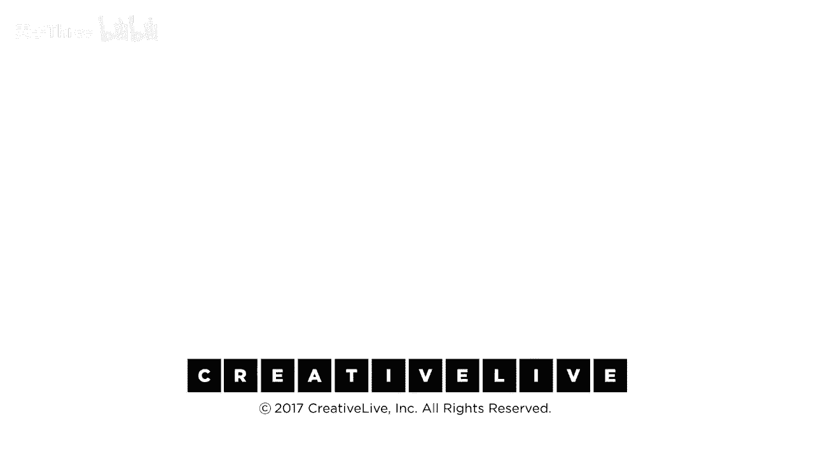

# 【公开课】斯坦福大学：人生设计课 Designing your life（21讲全）｜ 人生规划 ｜ 人生设计 - P20：20-DesigningYourLifee-EvansBurnett-WrapUpFinalTakeaways-HD - 麦子Three - BV1tzDVYHEGb

你知道今天你学到了什么重要的东西吗，如果你有一个最后的疑问，现在问吧，因为这是我们要做的最后一件事，你有问题吗，包括在线社区的，一旦你决定继续前进，并适应你的选择，所以，你知道，真正让自己自由，是的。

现实是一个很酷的地方，最好就保持这样，对，是的，轻松识别重力问题，重力，好的，很好，是的，挑战重力，很有趣，我本来想说，哦对不起，力量的力量，和你的直觉，是的，是的，哦，关于这一点我有个小建议。

我忘了提到，有多少人经历过，如果你走近，你有一个生活伴侣，你有一个很好的朋友，一个亲密的同事，然后你说，你知道，我终于做出了决定，终于做出了决定，你知道我们要，我们要卖掉海滨别墅，或者你知道我们要。

我们要，我们要，我们要养拉布拉多，你知道，无论什么，你知道，最后，我已经知道你会这样做三周了，你知道地狱，他们经历过那里的情况，然后你走了，你是什么，你不能知道，我的意思是，我只是做出了这个决定，山羊。

是的，你刚刚在一个月前做出了这个决定，发生了什么，你在广播，什么，你的等知知道那个智慧中心知道的东西在你身上很明显，和你的行为，和你谈论它的方式，但你的左脑不给它许可说。

但你的左脑终于想出了一个合理的理由，赶上了你，你的情绪大脑在做的，所以，如果你想知道如何，你知道，当你知道，去记住告诉我你的人，哦我知道你做了，哦黛安，我知道三周前，去找那些人，去记住那个时间。

你告诉我关于我的事情，我不知道，关于我，你是怎么知道的他们可以给你提示，你是如何广播的，你已经思考的事情，所以边栏，今天还有其他亮点吗，是的，我本来要说我的关键收获是，想象你的未来很重要，并想大。

并采取逐步步骤到达，是的，你知道下一个里程碑，是的，是的，并转向，当你不能立即成功，那是一个伟大的计数，想大并采取小步骤，好公司，我也有几个来自在线观众的，凯伦说，我对我们从网络部分学到的真的很兴奋。

我将开始付诸行动，尽快，这是对网络营销的一个全新的视角，我以前从未听说过，凯莉说，凯莉·哈维，我学到的是，有无限个版本的我，我不必为选择其中一个而焦虑，并坚持它，我喜欢你用的那个短语，大卫。

你将给我们提供工具，以便，对你来说，如何才能接触到你，我认为所有这些工具都是为了这个，我得到了，你知道，探索你自己不同维度，那些你不通常愿意谈论的之一，我们收到了一个非常好的评论。

有个人在亚马逊上评论有声书说，你知道，作者们显然尊重读者的自主权，我们不是在告诉你我们知道的任何事情，我们只是在告诉你如何自己找出答案，我认为这就是原因，为什么，这不是励志演讲，这不是评估。

这只是你需要一些指导，以便找到那些你已经知道的东西，那么，非常感谢，你可以做到，我们所知道的每一个人，你都能做到。

