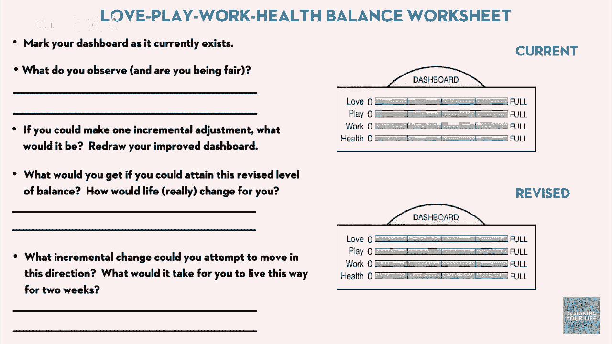
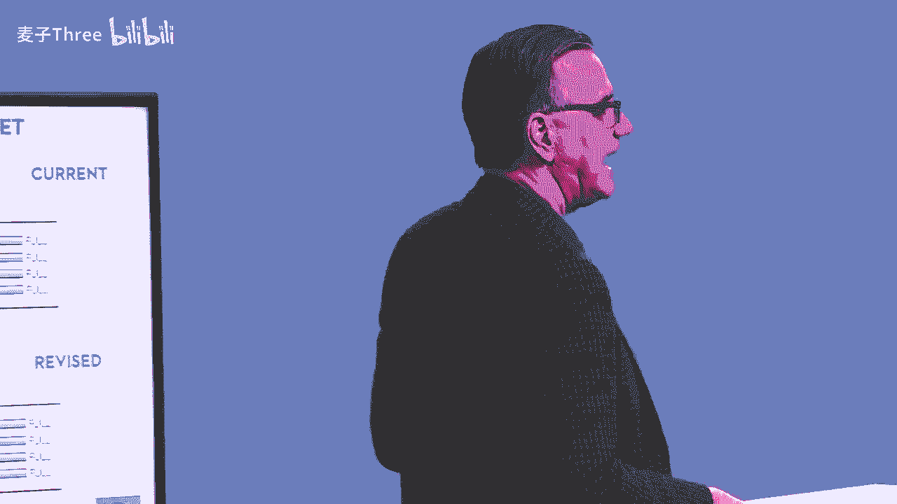
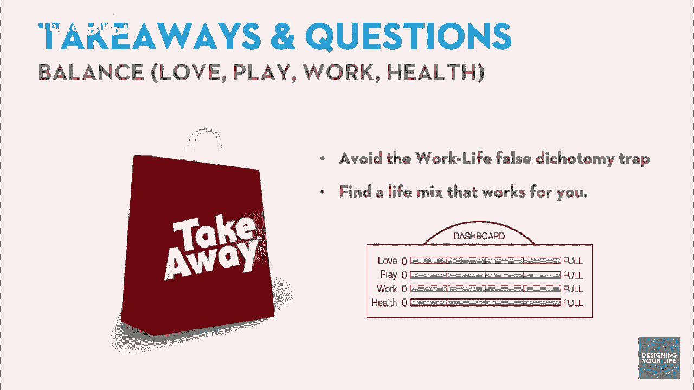
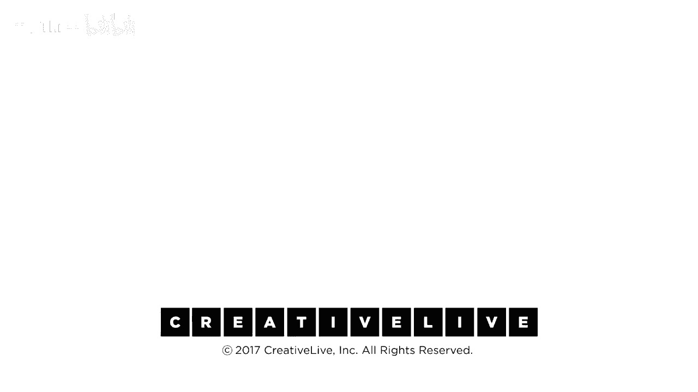

# 【公开课】斯坦福大学：人生设计课 Designing your life（21讲全）｜ 人生规划 ｜ 人生设计 - P3：03-DesigningYourLifee-EvansBurnett-BalanceLovePlayWorkHealth-HD - 麦子Three - BV1tzDVYHEGb

有多少人曾经为工作与生活的平衡问题而挣扎，工作与生活的平衡，你知道，如果你需要太多的压力来工作，尤其是在山谷这里，我认为人们工作很多时间，然后他们也在组建家庭，试图过自己的生活，你知道，每个人都说。

我想要完美的星期天，我想要，我想要里面的酸奶，我想要坚果，我喜欢，我想要浆果，所有的都在里面，所有的都在正确的地方，我的生活总是完全平衡，在每个时刻都是平衡的，它尝起来很好而且不会改变。

而且这是完全不可能的，无论你在生活中做什么，无论你在生活中做什么，抚养孩子总是很忙，很难保持平衡，时间，抚养孩子，加上我自己的时间，工作和孩子，两个职业，以及人们在我们现代社会中面临的其他挑战。

平衡这一想法是那些你知道，几乎功能失调的信念，就像如果不完美，那就有问题，这更糟糕因为它被设定为一种二分法，我可以有工作和我有生活，如果我有更多的工作，我就有更少的生活，我有更多的生活。

我就有更少的工作，对，我们认为这实际上是一种虚假的二分法，因为那不是你世界的一切，于是我们回到了积极心理学的研究者那里，我们问他们，什么能让人蓬勃发展，什么能让人感到快乐，觉得生活保持平衡。

结果发现不是两件事，而是四件事，我们将其分为这四件事，因为我们认为如果你，如果你首先打破虚假的二元对立，它是一种平衡，更多的是，它是四件事，这基本上是一些东西的组合，它们可以在一周内改变。

它们可以在一年内改变，这是一种更生成性的方式来看待它，首先，爱，你知道关于过上有意义生活的每一项研究，过着蓬勃发展的生活，你必须有人际关系，你必须有对你来说重要的人，那些把你视为重要人物的人。

在一个充满爱的关系中扮演着重要角色，我们在这里做的还不够，在硅谷，玩耍被定义为你做的事情，仅仅是为了乐趣去做它们，如果你有一个爱好，如果你如果你玩，你知道打网球或高尔夫，或一些不计分的事情。

不是为了打败对手，而是享受做它的过程，当然，我们在生活中有很多工作，然后健康，健康包括心理健康，身体健康，大致上的精神健康，那些让你感到扎根的事情，以及那些让你感到，我从一个强大的地方开始。

如果你没有感到强大，就很难有其他事情，如果你不觉得自己健康，所以我们把这个变成一个非常简单的练习，你设想就像一个，这是您汽车的仪表盘，生命，驾驶汽车，仪表盘上有这四个仪表，你知道，爱玩耍，工作和健康。

你在这里放一个条，说嘿，很多人我爱，很多人，我有很多伟大的关系，很多人爱我，我觉得我是社区的一部分，我完全投入到玩耍中，我不为玩耍而做任何事情，这是我在书中的仪表盘，我不为玩耍而做任何事情。

我不为玩耍而做任何事情，我不为玩耍而做任何事情，我完蛋了，我只是一直在工作，工作达到了120%，你知道红色指示灯在闪烁，我的健康状况很好，你知道我可能需要减减肥，我可能需要锻炼更多。

我没有冥想或正念练习，所以我给它打了50分，这是我打分的方式，这些都是完全主观的，完全自我报告的，但你会发现你在这方面可能很好，所以我希望你做，有一个工作表正在路上，好的。

第一份工作表即将在仪表板上出现，爱玩工作健康平衡工作表，所以现在你要做的就是，我会带你走遍这些工作表，我们会一步一步教你怎么做，如果有什么不明白的，举手，这个部分的第一件事是，你知道，我已经解释了。

大概，你知道，关于爱情，生活中的关系，你知道，玩是那些你为了乐趣做的事情，不是为了名利，工作是你做的事情，希望为了意义，但也为了钱，然后是你的身心健康，所以第一项任务是，看看你的仪表板，只是在那里。

放一个条形图，为你所感，公平对待自己，花点时间观察，我在爱情、玩耍、工作和健康方面在哪里，不要过度思考，只是标记一下，根据你的想法，不是你的伴侣，不是你的老板，快速标记，根据你的想法，不是伴侣。

不是老板，不会添加，是的，这就是你的评价，好的，如果你已经做了，如果你有了一种主观的分析，那么接下来的问题是，你知道，如果你能做出一个渐进的调整，那会是什么。

你会对改进仪表板和下面的那一个在下面的修订部分做什么，我做的是，我说你知道我需要更多的玩耍，你知道我需要做一些事情来确保我有玩耍，仪表板上的担忧让你担心，你能在仪表板上做一个渐进的调整。

你会把哪个表盘放在不同的位置，快速决定仪表板上的关键事情，当一个条目移动，其他的不需要，工作和生活之间的平衡让你的大脑处于两难境地，这让它摇摇欲坠，一切都在上升，一些东西在下降零和游戏，你不是零和游戏。

你是一个人，你可以移动一个条目而其他保持不变，这不是零和游戏，好的，所以每个人都对如何改进有一个想法只有一点点现在，我们认为你首先设定一个很低的标准，清除它，然后接受另一个挑战。

清除它并建立你的信心你有能力改变，所以我的问题是，如果你能实际上，如果他们实际上能做出那个改变，如果我能实际上把我的玩耍条目提高一点，我会得到什么，在我的生活中会发生什么，对我会有什么改变。

如果这是真的，如果我能实现这是真的，假设我能做出那个改变，在我的生活中会质变，它会有什么不同，写一张小纸条给自己，想象它已经发生了，你成功了干得好，有没有办法让这个改变变得可行，有没有一个渐进的改变。

你可以在你的行为上做一些事情，你的一天里有些事情，能让你像这样生活两周，仅仅两周，我会告诉你我做了什么，玩耍就像有更多的爱好，更有趣的事情要做，我报名参加了活字印刷课，太棒了，我要去学习印刷。

我报名参加了编织课。

我正在完成我的第一条围巾，我非常兴奋，你知道我喜欢那些事情，我报名参加了丝网印刷课，因为我从未，我从未做过丝网印刷，但对我来说，这些都是创造性的有趣的事情要做，你能做什么，你能报名参加课程吗。

你能找到一些事情，仅仅两周，或者仅仅两周的改变，这不是生活方式的改变，这是两周，我能，或者在两周后我能这样做，选择一个简单的事情，渐进的事情你可以做，这将实际上移动仪表板，再次。

如果你卡住了，你可以过来和你一起头脑风暴，每个人都做了一些事情，好的，这是我们第一次在小组里做某事，记住我们支持层中的一件事情是社区，嗯，这是我们接下来的六到八个小时的社区，这些小组。

桌子的集群是你的本地社区，所以现在我们希望你做，只是我们会这样做，只是我们转向你旁边的人，那是你的搭档，但我们想做一件事，所以过来，戴夫，是的，像我们都是大，我们都是大猩猩，是的，所以我们像这样交谈。

嘿，戴夫，你带来了什么，我不知道，我不太确定该做什么，是的，这不好，但是，但是如果是嘿，你带来了关于改变的想法，你知道，我买了一台意式浓缩咖啡机，每天只花几分钟时间，只是捣鼓着做一杯浓缩咖啡。

这太有趣了，是的，这也是危险的地方，现在他喝那么多意式浓缩咖啡，你不能，你不能和他好好相处，所以转过你们的椅子，所以你们实际上是面对面的，这就是我们要求你们做的，然后我们会给你们调酒，他说了很多。

我们会见面分享，好的，这是我的仪表盘，这是我的变化，这是我如何实验的想法，接下来的两周，给你几分钟，感觉还好吗，我对生活中的大多数事情感觉真的很好，工作部分并没有那么吸引人，但我觉得。

我能做出什么增量变化，所以我咨询了，所以，我猜测我需要和潜在客户进行更多的对话，我必须继续获取客户，以及不同的项目和所有，所以我必须去，我们去设计研讨会，像建筑师一样，虽然我们是建造者，没错。

因为他们是创造就业机会的人，他们会去参加房地产活动，虽然我认为这不属于房地产领域，总之，我们会在每个小环节结束时这样做，我们真的很好奇，因为你能参与到这场对话中，我们在这里，我们没有机会听到。

我们比较好奇，你知道我们有一些问题，你对这个有什么疑问，这个不是二选一的概念，你可以有四个东西，你可以优化所有这四个，你关于这个有什么想法，做一个小的，但是有用，渐进式改变，所以有任何问题，或者，是的。

我们的一个问题几乎在排名中，你的意思是什么，是满足感，还是实际上是时间，有趣的是我们每个人稍微不同，对我来说，我听到更多的是，你知道，红色的工作，百分之一百二十的红色，我花费多少时间在每个事情上。

激进的是更多，满足感是她排名的事情，嗯，是的，我的意思是，那是一个好的，那实际上是一个很好的问题，让我看看还有其他问题，我们将所有的问题都放在一起，这与那个迷你琼发布的类似，说。

你应该在所有四个仪表板上追求一个完整的刻度，当你被两个四个小时限制，好的，同一个问题的另一个角度，是的，我们会处理这个问题，我们什么意思平衡，这是一个好的看仪表，看起来像什么你还有其他问题，是的。

平等与数量，好的，这就是你的意思，是的，这有点像她的问题，好的，是的，我们是在看我花在这些事情上的时间还是质量，我先拿前两个，看质量，在，你知道，它应该看起来怎么样，你知道，什么是足够的，什么是不够的。

你知道，坦率地说，称之为平衡，我们某种程度上接受了文化谈论这个问题的方式，总是，它真的不是平衡，它真是关于繁荣，这是一个，这是一个项目集，项目集是，你知道，一个平衡的项目集是你想要的，就像投资一样。

你知道你的风险回报倾向，你喜欢买什么，你是愿意做什么，所以，你的项目集可能与我的不同，没有正确答案，因此平衡并不意味着某种完美的形状，它意味着对我现在的生活来说，什么有效，你知道。

我姐姐在她50多岁的时候，一边全职工作一边获得了博士学位，我在洛杉矶一边全职工作一边获得了博士学位，我在弗雷斯诺，她六年来只工作，她六年来只有不到6小时的空闲时间，严重不平衡。

这正是那段时间的正确项目集，你找出答案，它是你所定义的，你知道在生命中，繁荣的感觉是怎样的，这取决于你所处的季节，关于数量，关于，关于正确的形状问题，这取决于你是谁，你对此的价值观，我们没有正确答案。

你是专家，质量怎么样，是的，质量，我认为很多时候并不是那么重要，但你的满足感，我有足够的玩耍时间吗，我有足够的爱吗，你知道当我年轻的时候，我做了各种各样的运动和玩耍，当我们结婚并有了孩子后。

我的玩耍就是和孩子们在一起，但这很好，这是很好的玩耍，你知道去公园乱逛，你知道，我的孩子们和两个设计师父母一起长大，所以我们没给他们买玩具，但他们在四岁时就有一个热熔枪和一个精确刀。

你知道在他们烧伤自己一两次后，是的，他们学会了，和他们一起玩耍和我的生活现在不一样，现在更多的是关于，你知道，我的爱好，以及我和妻子一起做的事情，所以我认为这是一种定性评估，不仅仅是我们自己。

但在书中绝对是真的，我们谈论了一个在初创公司的人，他说，我要在初创公司工作，我知道我要工作九十个小时一周，所以，但我不会让我的家人失望，所以我会确保我的家人有足够的爱，我不会不健康。

因为实际上一个成功的企业家的特征之一是，他们是健康的，他们可以努力工作，但你知道工作将会是百分之一百二十玩耍将会是零，这对我现在来说是好的，因为关于这一点是真的如果你做出决定，你喜欢这个形状。

你会对它感到满意，我们将会谈论很多关于如何改变决策，甚至在你生物化学中，当你决定，这就是你想要的形状，戴夫喜欢说我们不做，不应该对自己开枪，我们不会向你开枪，是的，我们不会向你开枪，你知道你的生命。

你知道现在对你有效的是什么，所以这是一个定性评估，有任何收获吗，有任何快速的见解吗，你知道我对这一点很感兴趣，我对此很感兴趣，在我的仪表板上，嗯，例如，爱很满，但有些关键领域我是这样想的。

哦但我希望那是不同的，所以我想专注于它，但当我看了整个仪表板，我想但实际上我会逐步改变的是玩，所以注意到我在我身上的这种紧张很有趣，哦我想专注于爱，但天啊，如果我专注于玩会发生什么，对吧，很好。

那真是个伟大的工作，认识到，你知道，只迈出一步，我不能，你可以总是做得更好，那不是重点，我们试图成为真实的，凡人，活在现实中，实时生活，干得好，是的，小的渐进变化。

成功建立在成功之上是改变行为的最佳方式，所以我们的收获是，这是一个虚假的二元论，不要落入我们的生活陷阱之一，我忘了是哪个喜剧演员说的，不是工作生活，就是生活生活，是的，保拉·庞斯顿是生活生活。

我有生活，我有生活，我在工作中有生活，我在家里有生活，我有和孩子们在一起的生活，我有和同事在一起的生活。

所以不要陷入那个陷阱，但找到适合你的组合，时不时检查一下说嗨，有什么变化吗，如果你开始感到不适，或者感觉有些不对劲，回到仪表板，看看缺少了什么，记住，与他人的联系，以及与外界的联系，积极心理学家说。

这是你生活的最高指标，一个有用的生活，有意义，有目的，无论你在寻找什么。

