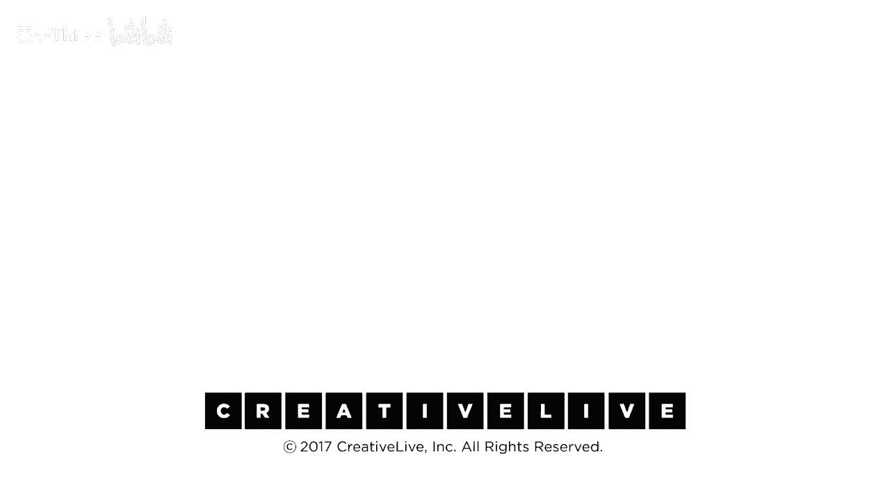

# 【公开课】斯坦福大学：人生设计课 Designing your life（21讲全）｜ 人生规划 ｜ 人生设计 - P6：06-DesigningYourLifee-EvansBurnett-WorkLifeBalanceDebrief-HD-1 - 麦子Three - BV1tzDVYHEGb

我们现在将发给你们一张纸，在你们的桌子上展示给观众看，你们在家与你的朋友进行对话，这里有一些问题，这些问题与材料中我们最近几分钟讨论的部分有关，所以这对你来说哪个更容易工作，生活观，这是一个有趣的问题。

这不是问题，大多数人都这样做，通常我们不会听到，哦，我刚打印了我的，当我收到家庭作业时，我已经完成了所有的，很少会发生这种情况，你知道，在写这些东西和谈论这些事情之后，也许听了丹·平的想法。

你知道你在想什么，对你来说会有什么影响，并且你是否从这些联系中获益，我们正在声称如果你能够阐明这些事情并关联这些事情，我们正在声称如果你能够阐明这些事情并关联这些事情。

并且有人解释给我听你的价值观和你当前的经历如何与你的能力相协调，我们正在声称如果你能够阐明这些事情并关联这些事情，并且有人解释给我听你的价值观和你当前的经历如何与你的能力相协调。

我们正在声称如果你能够阐明这些事情并关联这些事情，所有六个人一起跳进来进行对话，这里有一些问题来引导你，我们将给你们大约五分钟的时间让你们彼此检查，关于这些事情，开始吧，我认为这对我来说。

写工作视图对我来说更容易，因为我最近一直在思考生活视图，但它仍然是一个年轻的想法，如果你愿意，但是工作这个东西，哦，让我告诉你关于工作的事情，是的，你知道，所以我不知道这有点酷，你做什么。

一家总承包商的项目经理，生活感觉难以全面思考，但有时候工作这是一个更具体的东西，我们可以看看和谈论更容易，所以我认为这有点容易，是的，再一次，模块结束时，你从中获得了什么重要的收获或亮点。

以及你对此有任何疑问，以及任何浮现出的问题，你想让我们解答，或者你希望提及的高光时刻，我最喜欢的工作经历是与我的生活最契合的，就像你，因此我最享受的项目是那些与我的生活紧密相关的。

即使我在工作中花费了大量时间，也不会感到疲惫，因为我在做自己喜欢的事情，这是一次协调一致的体验，因此这感觉就像你正在做正确的事情，回顾过去，我觉得这很有道理，我意识到这很有意义，是的，是的，回顾过去。

实际上我比想象中过得更好，因此，我们今天所讨论的，帮助您，在生活和职业导航方面培养自觉能力，这就是我们今天正在做的事情，如果我们从教育角度来讨论，你会意识到，当你真正与价值观保持一致时，你会过得更好。

你可以主动在每周进行自我检查，比如，本周我的价值观如何，你可以主动在每周进行自我检查，比如，本周我的价值观如何，你可以主动在每周进行自我检查，比如，本周我的价值观如何，哦，是的，我过得很好，你知道的。

你可以主动在每周进行自我检查，你可以主动在每周进行自我检查，你知道的，哦，我又一次做到了，是的，我们注意到这里，有趣的是，我和我的朋友注意到我们更关注生活的部分，这个模块的生活观部分。

而其他人则更关注工作的部分，这可能与生活阶段有关，我认为我们两人都超过五十岁了，基本上，我想起了荣格的一件事，他谈到了四十到五十岁，这个年龄段，你专注于构建你的 ego，大约四十到五十岁。

你专注于构建你的 ego，正确，然后，你会开始关注给予他人，那就是我从那听到的，很高兴听到，也值得期待，是的，如果你还没有做到，是的，谈论你刚才说的有趣的事情是，在我们桌子旁我们正在谈论。

像生命的先天性，你和很多人一样，无论年龄大小，更容易接受生命观而不是工作观，所以我认为这是非常有趣的，并且我们讨论的另一件事，即使考虑这些事情的可能性，并且能够考虑这些事情的特权对我们来说是巨大的。

这是一个巨大的恩赐，是的，所以就像承认那样，我想你们之前提到过你们在很多地方做这种工作，是的，在2007年夏天，那是我们第一次做这件事，在2007年春天，我和比尔共进午餐。

我以为这将是一系列长达一年的对话的开始，五分钟后，比尔说，这是一个好主意，我们将在秋天做，我们将在夏天进行原型设计，让我们这样做，你知道，在15年的，在销售和营销15年后，我还没准备好成交，尽管如此。

我们仍然做到了，我们的第一个原型是在那个夏天，两个星期三晚上，从晚上8点到10点，我们有几个练习，我们当场想出来的，我们全部尝试了，它们很糟糕，房间里有8名前学生，4名前研究生，4名前本科生。

在第二个晚上的末尾，我们说，将近10点，你知道，我想是时候走了，其中一个年轻人说，不，我们不会走，我们好，我认为我们是，他说，我们没有地方进行这次对话，我们听说过那句话，我们没有地方进行这次对话。

很多次，你刚才说的话，你知道我们在进行这次，无论一天中的哪个时间，这次对话对你来说真的很有启发，我们只是不创造这种空间，我们试图做的大部分是为了你创造一个空间，以生成性的方式进行这次对话。

我真的很高兴这对你有帮助，我们很荣幸处于一个地方，我们有工作和生活，你注意到人们已经开始提供帮助，他们在听你说话，他们不会像检查短信那样，你知道，因为人们真的很关心彼此，你们彼此不认识。

当你们一起来到这里时，你知道你，你不需要让你最好的朋友这样做，你只需要在相同的页面上，关于，是的，我想对我的生活寻求帮助，也，我甚至愿意关注你的，我们有来自网上的评论吗，我们在家也有人在做这个。

所以这是来自简妮斯玛丽的评论，她说她花了一段时间才让我的生活观开始，但工作观很快来了，这很讽刺，因为我不再做传统的工作，但看到生活观和工作观之间的重要联系很棒。

